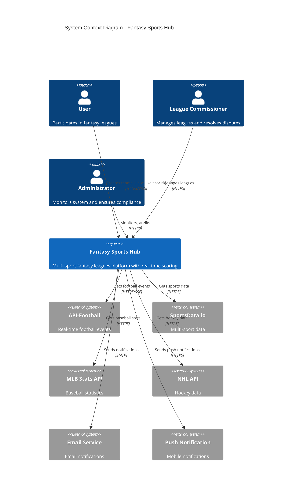
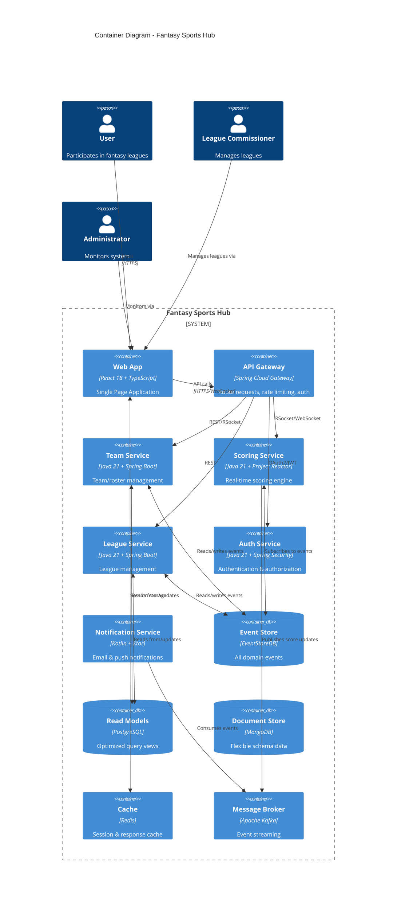
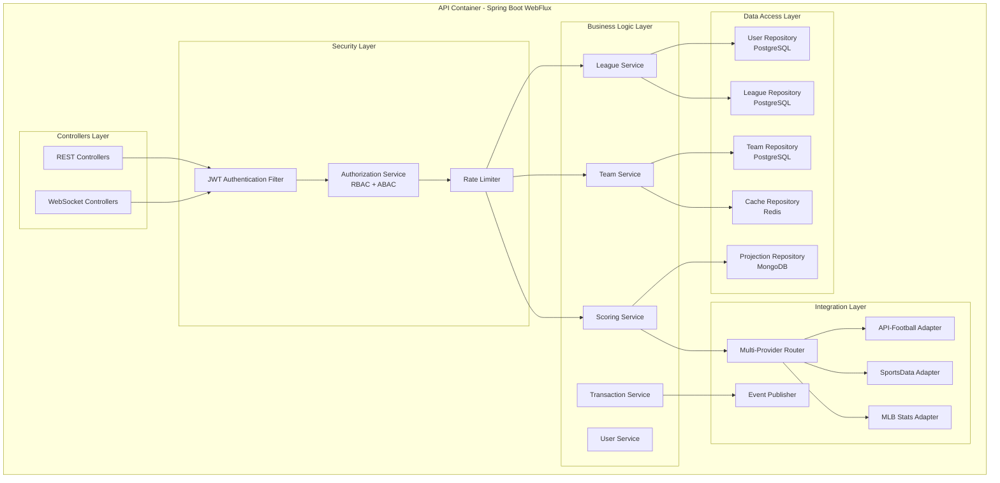
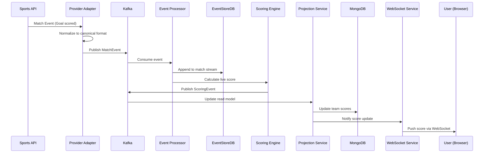
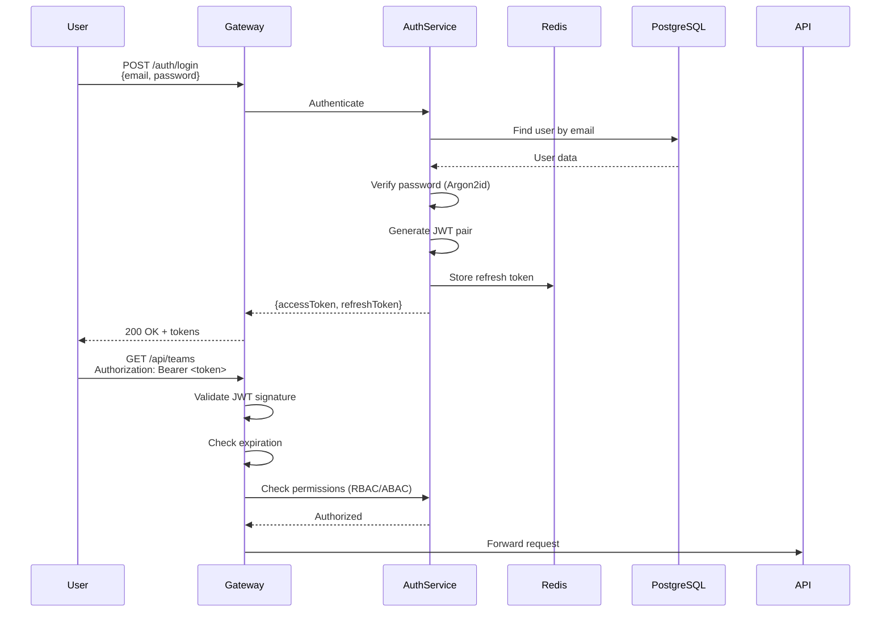
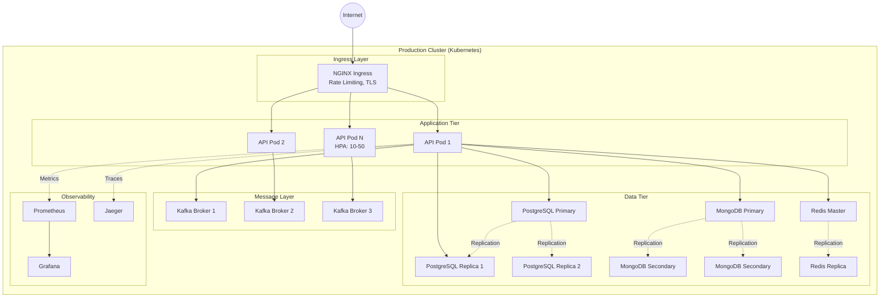

# Architecture Overview - Fantasy Sports Hub

> **Multi-Sport Fantasy Leagues Platform with Event Sourcing and Reactive Architecture**

---

## 🎯 Overview

Fantasy Sports Hub is a scalable, multi-sport fantasy leagues platform designed to support 100K+ concurrent users with real-time scoring, resilient integration with multiple sports APIs, and full GDPR/CCPA compliance.

### Key Features

- ✅ **Multi-Sport**: Plugin-based architecture to support 5+ sports simultaneously
- ✅ **Customizable Scoring**: Flexible rules engine supporting both simple and complex rules
- ✅ **Real-Time**: WebSocket streaming for live scoring during matches
- ✅ **Event Sourcing**: Complete audit trail, time travel, and multiple projections
- ✅ **Resilient**: Circuit breakers, retries, and fallback to multiple providers
- ✅ **Secure**: JWT, RBAC/ABAC, encryption, fraud detection
- ✅ **Compliant**: GDPR/CCPA data rights, consent management, breach notification

---

## 📐 C4 Diagram - Level 1: System Context



---

## 📦 C4 Diagram - Level 2: Container Diagram



---

## 🏗️ C4 Diagram - Level 3: Component Diagram (API Container)



---

## 🔄 Event Flow Architecture



---

## 🎨 Architectural Patterns

### 1. Plugin Architecture (Strategy Pattern)

**Problem**: Support multiple sports with different rules without massive `if/else` statements.

**Solution**:
- Generic sport-agnostic core
- Each sport = Plugin with `SportScoringConfig`
- Dynamic plugin registry

```java
public interface SportScoringConfig {
    String sportId();
    List<LiveRule> liveRules();
    List<PostMatchRule> postMatchRules();
    List<Position> positions();
}

// Dynamic registry
@Bean
public SportRegistry sportRegistry(List<SportScoringConfig> configs) {
    return new SportRegistry(configs);
}
```

### 2. Event Sourcing + CQRS

**Problem**: Need for complete audit trail, time travel, and multiple data views.

**Solution**:
- **Event Sourcing**: Store all changes as events
- **CQRS**: Separate read and write operations
- **Projections**: Optimized views for queries

```java
// Command (write)
@CommandHandler
public void handle(UpdateScoreCommand cmd) {
    // Validate
    // Emit event
    eventStore.append(
        cmd.matchId(),
        Collections.singletonList(
            new GoalScored(
                cmd.matchId(),
                cmd.playerId(),
                cmd.teamId(),
                cmd.timestamp(),
                cmd.isOwnGoal()
            )
        )
    );
}

// Query (read)
@QueryHandler
public ScoreProjection handle(GetScoreQuery query) {
    return mongoTemplate.findById(
        query.matchId(),
        ScoreProjection.class
    );
}
```

### 3. Anti-Corruption Layer (ACL)

**Problem**: Each sports API has a different structure.

**Solution**:
- Adapters that convert external models to canonical model
- System immune to changes in external APIs

```java
// API-Football returns this
ApiFootballGoal →
    // Adapter converts to canonical model
    PlayerScored(playerId, matchId, timestamp, ...)
```

### 4. Circuit Breaker + Retry + Rate Limiting

**Problem**: External APIs fail, are slow, or have rate limits.

**Solution**: Resilience4j
- **Circuit Breaker**: Stops calls to failed services
- **Retry**: Retries with exponential backoff
- **Rate Limiter**: Respects API rate limits
- **Bulkhead**: Isolation of thread pools

### 5. Reactive Streams (Backpressure)

**Problem**: 10K events/second can saturate system.

**Solution**: Project Reactor
- Producer respects consumer capacity
- Smart buffering
- Automatic flow control

---

## 📊 Data Architecture

### Write Model (PostgreSQL)

**ACID Transactions for:**
- Users, Teams, Leagues
- Roster transactions
- League configurations

**Normalized Schema**:
```
users → teams → leagues
teams → roster (players)
leagues → scoring_config
```

### Event Store (EventStoreDB + Kafka)

**Append-Only Log for:**
- Match events (goals, assists, cards)
- Scoring events (points calculated)
- Audit events (security, fraud)

**Characteristics**:
- Immutable
- Ordered by timestamp
- Versioned by aggregate

### Read Model (MongoDB)

**Denormalized Projections for:**
- Live leaderboards
- Player statistics
- Weekly team scores

**Optimized for Queries**:
- Pre-calculated aggregations
- Embedded documents
- Indexes on query fields

### Cache (Redis)

**Hot Data with TTL:**
- Active sessions (30 min TTL)
- Live match state (2 hours TTL)
- Leaderboards (10 sec TTL)
- Rate limiting counters (1 hour TTL)

---

## 🔐 Security Architecture

### Authentication Flow



### Authorization Layers

1. **Role-Based (RBAC)**:
   - `USER`: Basic operations
   - `COMMISSIONER`: League management
   - `ADMIN`: System administration

2. **Attribute-Based (ABAC)**:
   - Can modify team? → `team.ownerId == userId`
   - Can view lineup? → `isOwner || afterDeadline`
   - Can change league settings? → `isCommissioner && !midSeason`

---

## ⚡ Performance Characteristics

### Latency Targets (P95)

| Operation                     | Target | Strategy |
|-------------------------------|--------|----------|
| REST API call                 | < 100ms| Multi-level cache, connection pooling |
| Live score update (WebSocket) | < 500ms| Reactive streaming, batch updates |
| Leaderboard query             | < 200ms| Redis cache + MongoDB projection |
| Transaction validation        | < 1s   | Async fraud detection, optimistic locking |

### Throughput Targets

| Metric                | Target | Strategy |
|-----------------------|--------|----------|
| Concurrent users      | 100K+  | Horizontal scaling (10-50 pods) |
| API requests/sec      | 10K    | Rate limiting, caching, load balancing |
| Events/sec            | 10K    | Kafka partitioning, Streams parallelism |
| WebSocket connections | 50K    | Session affinity, connection pooling |

### Scalability Strategy

```
LOAD INCREASE → Metrics (Prometheus) → HPA → Scale Pods → Load Balancer redistributes
                                      ↓
                                  Also scale:
                                  - Kafka partitions
                                  - MongoDB replicas
                                  - Redis cluster nodes
```

---

## 🚀 Deployment Architecture



---

## 📈 Observability Stack

### Metrics (Prometheus)

- **Application Metrics**: Request rate, latency, errors
- **JVM Metrics**: Heap, GC, threads
- **Business Metrics**: Active users, scores calculated, events processed
- **Infrastructure Metrics**: CPU, memory, disk, network

### Tracing (OpenTelemetry + Jaeger)

- **Distributed Traces**: Request flow across services
- **Span Attributes**: Match ID, user ID, sport ID
- **Performance Analysis**: Identify bottlenecks
- **Error Debugging**: Stack traces in context

### Logging (Structured JSON)

```json
{
  "timestamp": "2025-11-08T10:23:45Z",
  "level": "INFO",
  "logger": "ScoringEngine",
  "message": "Score calculated",
  "matchId": "match-123",
  "playerId": "player-456",
  "points": 10,
  "traceId": "abc123",
  "spanId": "def456"
}
```

---

## 🎯 Quality Attributes

| Attribute           | Target              | Mechanism |
|---------------------|---------------------|-----------|
| **Availability**    | 99.9%               | Multi-AZ deployment, health checks, auto-restart |
| **Performance**     | P95 < 200ms         | Caching, reactive programming, database optimization |
| **Scalability**     | 100K users          | Horizontal scaling, partitioning, stateless services |
| **Security**        | OWASP Top 10        | JWT, encryption, input validation, rate limiting |
| **Maintainability** | < 1 day for bug fix | Clean architecture, comprehensive tests, CI/CD |
| **Compliance**      | 100% GDPR/CCPA      | Data rights APIs, consent management, audit logging |
| **Reliability**     | < 1 incident/month  | Monitoring, alerting, circuit breakers, retries |
| **Testability**     | 80% code coverage   | Unit tests, integration tests, E2E tests |

---

## 📚 Technology Stack Summary

| Layer           | Technology                | Justification                                         |
|-----------------|---------------------------|-------------------------------------------------------|
| Language        | Java 21                   | Virtual threads, pattern matching, records            |
| Framework       | Spring Boot 3.2 + WebFlux | Reactive, production-ready, ecosystem                 |
| API             | REST + WebSocket          | Standard + real-time                                  |
| Event Streaming | Kafka 3.6                 | High throughput, event sourcing                       |
| Event Store     | EventStoreDB              | Purpose-built for event sourcing                      |
| Write DB        | PostgreSQL 16             | ACID, relational integrity                            |
| Read DB         | MongoDB 7                 | Denormalized queries, flexibility                     |
| Cache           | Redis 7                   | In-memory speed, pub/sub                              |
| Security        | Spring Security + JWT     | Industry standard                                     |
| Testing         | JUnit 5 + TestContainers  | Comprehensive, realistic                            |
| Observability   | Prometheus + Grafana      | Metrics visualization                                 |
| Tracing         | OpenTelemetry + Jaeger    | Distributed tracing                                   |
| Deployment      | Kubernetes + Helm         | Orchestration, scaling                                |
| CI/CD           | GitHub Actions            | Automation, integration                               |

---

## 🔮 Future Roadmap

### Phase 1 (Completed - Design)
- ✅ Architecture design
- ✅ Component specifications
- ✅ Security model
- ✅ Testing strategy

### Phase 2 (Next 3 months)
- [ ] Core implementation (1 sport)
- [ ] Basic scoring engine
- [ ] PostgreSQL + Redis
- [ ] REST API

### Phase 3 (Months 4-6)
- [ ] Add 4 more sports
- [ ] Event Sourcing implementation
- [ ] WebSocket live scoring
- [ ] Fraud detection

### Phase 4 (Months 7-9)
- [ ] Production deployment
- [ ] GDPR compliance
- [ ] Performance optimization
- [ ] Advanced analytics

---

## 📞 References

- [Architecture Decision Records](02_ADR_INDEX.md)
- [Plugin Architecture Details](03_PLUGIN_ARCHITECTURE.md)
- [Scoring Engine Specification](04_SCORING_ENGINE.md)
- [Event Sourcing Guide](05_EVENT_SOURCING_CQRS.md)
- [Database Schema](07_DATABASE_SCHEMA.md)
- [API Specification](19_REST_API_SPEC.md)

---
