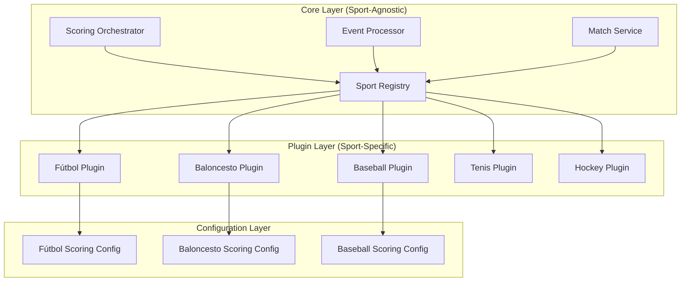

# Plugin Architecture - Sport-Agnostic Core

> **Extensible Design**: Supports N sports without modifying the core system

---

## 🎯 Objective

Create an architecture that allows adding new sports to the system without modifying the core code, maintaining isolation between sports and enabling independent testing.

---

## 🏗️ General Architecture



---

## 📐 Plugin Contracts

### SportScoringConfig Interface

```java
package com.fantasy.core.plugin;

import java.util.List;

/**
 * Main contract that each sport must implement.
 * Defines scoring rules and sport-specific configuration.
 */
public interface SportScoringConfig {

    /**
     * Unique identifier for the sport (e.g., "SOCCER", "BASKETBALL")
     */
    String sportId();

    /**
     * Scoring rules that apply in real-time during the match.
     * Examples: GOAL=10 points, ASSIST=5 points
     */
    List<LiveRule> liveRules();

    /**
     * Bonus rules that require full match context.
     * Examples: Hat-trick in playoffs = +50 points
     */
    List<PostMatchRule> postMatchRules();

    /**
     * Valid positions for this sport.
     * Examples: GOALKEEPER, DEFENDER, MIDFIELDER, FORWARD
     */
    List<Position> positions();

    /**
     * Player limits per position in a team.
     * Examples: {GOALKEEPER: 1, DEFENDER: 4, MIDFIELDER: 4, FORWARD: 2}
     */
    Map<Position, Integer> rosterLimits();

    /**
     * Statistics tracked for this sport.
     * Examples: goals, assists, cards, minutes played
     */
    List<StatisticType> trackedStatistics();

    /**
     * Sport-specific lineup validator.
     * Allows custom logic (e.g., valid 4-4-2 formation)
     */
    LineupValidator lineupValidator();
}
```

---

### LiveRule - Real-Time Rules

```java
package com.fantasy.core.plugin;

import java.util.function.Predicate;

/**
 * Scoring rule that is applied instantly when an event occurs.
 */
public record LiveRule(
    String ruleId,
    String description,
    EventType eventType,
    int points,
    Predicate<MatchEvent> condition
) {
    /**
     * Evaluates if this rule applies to the given event.
     */
    public boolean applies(MatchEvent event) {
        return event.type() == eventType && condition.test(event);
    }

    /**
     * Factory method for simple rules without conditions.
     */
    public static LiveRule simple(String ruleId, String description,
                                  EventType eventType, int points) {
        return new LiveRule(ruleId, description, eventType, points, e -> true);
    }

    /**
     * Factory method for conditional rules.
     */
    public static LiveRule conditional(String ruleId, String description,
                                      EventType eventType, int points,
                                      Predicate<MatchEvent> condition) {
        return new LiveRule(ruleId, description, eventType, points, condition);
    }
}
```

**Usage Examples**:
```java
// Simple rule: any goal is worth 10 points
LiveRule.simple("goal_basic", "Goal", EventType.GOAL, 10);

// Conditional rule: defender goal is worth more
LiveRule.conditional(
    "defender_goal",
    "Goal scored by defender",
    EventType.GOAL,
    15,
    event -> event.player().position() == Position.DEFENDER
);

// Conditional rule: red card penalty
LiveRule.conditional(
    "red_card",
    "Red card",
    EventType.CARD,
    -5,
    event -> event.metadata().get("cardType").equals("RED")
);
```

---

### PostMatchRule - Post-Match Rules

```java
package com.fantasy.core.plugin;

import java.util.function.BiPredicate;
import java.util.function.Function;

/**
 * Bonus rule that is evaluated after the match.
 * Requires access to full context: match result, tournament phase, etc.
 */
public record PostMatchRule(
    String ruleId,
    String description,
    int priority,  // Higher number = higher priority
    BiPredicate<PlayerMatchContext, MatchContext> condition,
    Function<PlayerMatchContext, Bonus> bonusCalculator
) implements Comparable<PostMatchRule> {

    /**
     * Evaluates if this rule applies to the player in the match context.
     */
    public boolean applies(PlayerMatchContext playerCtx, MatchContext matchCtx) {
        return condition.test(playerCtx, matchCtx);
    }

    /**
     * Calculates the bonus to apply.
     */
    public Bonus calculateBonus(PlayerMatchContext playerCtx) {
        return bonusCalculator.apply(playerCtx);
    }

    @Override
    public int compareTo(PostMatchRule other) {
        return Integer.compare(other.priority, this.priority);  // DESC
    }
}
```

**Usage Examples**:
```java
// Hat-trick in playoff phase
new PostMatchRule(
    "hat_trick_playoff",
    "Hat-trick in playoff phase",
    10,  // High priority
    (playerCtx, matchCtx) ->
        playerCtx.eventCount(EventType.GOAL) >= 3
        && matchCtx.match().winner().equals(playerCtx.teamId())
        && matchCtx.tournament().phase() == Phase.PLAYOFF,
    playerCtx -> new Bonus(50, "Hat-trick in playoff phase")
);

// Goalkeeper with no goals conceded
new PostMatchRule(
    "clean_sheet",
    "Portero sin goles recibidos en victoria",
    5,
    (playerCtx, matchCtx) ->
        playerCtx.player().position() == Position.PORTERO
        && matchCtx.match().goalsAgainst(playerCtx.teamId()) == 0
        && matchCtx.match().winner().equals(playerCtx.teamId()),
    playerCtx -> new Bonus(10, "Portería a cero")
);
```

---

## 🏀 Ejemplo Completo: Fútbol Plugin

```java
package com.fantasy.plugins.futbol;

import com.fantasy.core.plugin.*;
import org.springframework.stereotype.Component;
import java.util.List;
import java.util.Map;

@Component
public class FutbolScoringConfig implements SportScoringConfig {

    @Override
    public String sportId() {
        return "FUTBOL";
    }

    @Override
    public List<LiveRule> liveRules() {
        return List.of(
            // Goles básicos
            LiveRule.simple("gol", "Gol", EventType.GOL, 10),

            // Gol de defensa vale más
            LiveRule.conditional(
                "gol_defensa",
                "Gol de defensa",
                EventType.GOL,
                15,
                event -> event.player().position() == Position.DEFENSA
            ),

            // Gol de portero (muy raro, mucho valor)
            LiveRule.conditional(
                "gol_portero",
                "Gol de portero",
                EventType.GOL,
                20,
                event -> event.player().position() == Position.PORTERO
            ),

            // Asistencias
            LiveRule.simple("asistencia", "Asistencia", EventType.ASISTENCIA, 5),

            // Penalizaciones
            LiveRule.simple("tarjeta_amarilla", "Tarjeta amarilla",
                EventType.TARJETA_AMARILLA, -2),

            LiveRule.simple("tarjeta_roja", "Tarjeta roja",
                EventType.TARJETA_ROJA, -5),

            // Autogol (penalización)
            LiveRule.simple("autogol", "Autogol", EventType.AUTOGOL, -3),

            // Penalti fallado
            LiveRule.simple("penalti_fallado", "Penalti fallado",
                EventType.PENALTI_FALLADO, -3),

            // Penalti atajado (para porteros)
            LiveRule.conditional(
                "penalti_atajado",
                "Penalti atajado",
                EventType.PENALTI_ATAJADO,
                5,
                event -> event.player().position() == Position.PORTERO
            )
        );
    }

    @Override
    public List<PostMatchRule> postMatchRules() {
        return List.of(
            // Hat-trick (3+ goles)
            new PostMatchRule(
                "hat_trick",
                "Hat-trick (3 o más goles)",
                8,
                (playerCtx, matchCtx) ->
                    playerCtx.eventCount(EventType.GOL) >= 3,
                playerCtx -> new Bonus(20, "Hat-trick")
            ),

            // Hat-trick en playoff (bonus adicional)
            new PostMatchRule(
                "hat_trick_playoff",
                "Hat-trick en playoff ganado",
                10,
                (playerCtx, matchCtx) ->
                    playerCtx.eventCount(EventType.GOL) >= 3
                    && matchCtx.match().winner().equals(playerCtx.teamId())
                    && matchCtx.tournament().phase() == Phase.PLAYOFF,
                playerCtx -> new Bonus(50, "Hat-trick en playoff ganado")
            ),

            // Portero imbatido
            new PostMatchRule(
                "clean_sheet",
                "Portero sin goles recibidos",
                5,
                (playerCtx, matchCtx) ->
                    playerCtx.player().position() == Position.PORTERO
                    && matchCtx.match().goalsAgainst(playerCtx.teamId()) == 0
                    && matchCtx.match().minutesPlayed(playerCtx.playerId()) >= 60,
                playerCtx -> new Bonus(10, "Portería a cero")
            ),

            // Victoria del equipo (bonus para todos)
            new PostMatchRule(
                "team_victory",
                "Victoria del equipo",
                3,
                (playerCtx, matchCtx) ->
                    matchCtx.match().winner().equals(playerCtx.teamId())
                    && matchCtx.match().minutesPlayed(playerCtx.playerId()) >= 45,
                playerCtx -> new Bonus(5, "Victoria del equipo")
            ),

            // MVP del partido (jugador con más puntos)
            new PostMatchRule(
                "mvp",
                "Jugador MVP del partido",
                15,
                (playerCtx, matchCtx) ->
                    matchCtx.isTopScorer(playerCtx.playerId()),
                playerCtx -> new Bonus(15, "MVP del partido")
            )
        );
    }

    @Override
    public List<Position> positions() {
        return List.of(
            new Position("PORTERO", "POR", "Goalkeeper"),
            new Position("DEFENSA", "DEF", "Defender"),
            new Position("CENTROCAMPISTA", "MED", "Midfielder"),
            new Position("DELANTERO", "DEL", "Forward")
        );
    }

    @Override
    public Map<Position, Integer> rosterLimits() {
        return Map.of(
            Position.PORTERO, 1,
            Position.DEFENSA, 4,
            Position.CENTROCAMPISTA, 4,
            Position.DELANTERO, 2
        );
    }

    @Override
    public List<StatisticType> trackedStatistics() {
        return List.of(
            StatisticType.GOLES,
            StatisticType.ASISTENCIAS,
            StatisticType.TARJETAS_AMARILLAS,
            StatisticType.TARJETAS_ROJAS,
            StatisticType.MINUTOS_JUGADOS,
            StatisticType.PENALTIS_ATAJADOS,
            StatisticType.GOLES_RECIBIDOS
        );
    }

    @Override
    public LineupValidator lineupValidator() {
        return new FutbolLineupValidator();
    }
}
```

---

## 🏀 Ejemplo: Baloncesto Plugin

```java
package com.fantasy.plugins.baloncesto;

@Component
public class BaloncestoScoringConfig implements SportScoringConfig {

    @Override
    public String sportId() {
        return "BALONCESTO";
    }

    @Override
    public List<LiveRule> liveRules() {
        return List.of(
            // Puntos según tipo de canasta
            LiveRule.simple("free_throw", "Tiro libre",
                EventType.FREE_THROW, 1),

            LiveRule.simple("two_pointer", "Canasta de 2 puntos",
                EventType.TWO_POINTER, 2),

            LiveRule.simple("three_pointer", "Triple",
                EventType.THREE_POINTER, 4),  // Vale más en fantasy

            // Estadísticas
            LiveRule.simple("rebound", "Rebote", EventType.REBOUND, 1),
            LiveRule.simple("assist", "Asistencia", EventType.ASSIST, 2),
            LiveRule.simple("steal", "Robo", EventType.STEAL, 3),
            LiveRule.simple("block", "Tapón", EventType.BLOCK, 3),

            // Penalizaciones
            LiveRule.simple("turnover", "Pérdida", EventType.TURNOVER, -1),
            LiveRule.simple("foul", "Falta personal", EventType.FOUL, -0.5)
        );
    }

    @Override
    public List<PostMatchRule> postMatchRules() {
        return List.of(
            // Double-double (10+ en dos categorías)
            new PostMatchRule(
                "double_double",
                "Double-double",
                8,
                (playerCtx, matchCtx) ->
                    playerCtx.categoriesAbove10() >= 2,
                playerCtx -> new Bonus(10, "Double-double")
            ),

            // Triple-double (10+ en tres categorías)
            new PostMatchRule(
                "triple_double",
                "Triple-double",
                10,
                (playerCtx, matchCtx) ->
                    playerCtx.categoriesAbove10() >= 3,
                playerCtx -> new Bonus(30, "Triple-double")
            ),

            // 30+ puntos
            new PostMatchRule(
                "thirty_points",
                "30 o más puntos anotados",
                7,
                (playerCtx, matchCtx) ->
                    playerCtx.totalPoints() >= 30,
                playerCtx -> new Bonus(15, "30+ puntos")
            )
        );
    }

    @Override
    public List<Position> positions() {
        return List.of(
            new Position("POINT_GUARD", "PG", "Base"),
            new Position("SHOOTING_GUARD", "SG", "Escolta"),
            new Position("SMALL_FORWARD", "SF", "Alero"),
            new Position("POWER_FORWARD", "PF", "Ala-pívot"),
            new Position("CENTER", "C", "Pívot")
        );
    }

    @Override
    public Map<Position, Integer> rosterLimits() {
        return Map.of(
            Position.POINT_GUARD, 2,
            Position.SHOOTING_GUARD, 2,
            Position.SMALL_FORWARD, 2,
            Position.POWER_FORWARD, 2,
            Position.CENTER, 2
        );
    }
}
```

---

## 🔧 Sport Registry

```java
package com.fantasy.core.plugin;

import org.springframework.stereotype.Component;
import java.util.*;
import java.util.concurrent.ConcurrentHashMap;

/**
 * Registro central de todos los plugins de deportes.
 * Auto-detecta plugins mediante Spring component scanning.
 */
@Component
public class SportRegistry {

    private final Map<String, SportScoringConfig> plugins;

    public SportRegistry(List<SportScoringConfig> configs) {
        this.plugins = new ConcurrentHashMap<>();
        configs.forEach(config ->
            plugins.put(config.sportId(), config)
        );

        log.info("Registered {} sport plugins: {}",
            plugins.size(), plugins.keySet());
    }

    /**
     * Obtiene el plugin para un deporte específico.
     */
    public Optional<SportScoringConfig> getPlugin(String sportId) {
        return Optional.ofNullable(plugins.get(sportId));
    }

    /**
     * Obtiene el plugin o lanza excepción si no existe.
     */
    public SportScoringConfig getPluginOrThrow(String sportId) {
        return getPlugin(sportId)
            .orElseThrow(() -> new SportNotSupportedException(sportId));
    }

    /**
     * Verifica si un deporte está soportado.
     */
    public boolean isSupported(String sportId) {
        return plugins.containsKey(sportId);
    }

    /**
     * Obtiene todos los deportes soportados.
     */
    public Set<String> getSupportedSports() {
        return Collections.unmodifiableSet(plugins.keySet());
    }

    /**
     * Registra un nuevo plugin dinámicamente (útil para testing).
     */
    public void registerPlugin(SportScoringConfig config) {
        plugins.put(config.sportId(), config);
        log.info("Dynamically registered sport plugin: {}", config.sportId());
    }
}
```

---

## 🎯 Uso desde el Core

```java
package com.fantasy.core.scoring;

@Service
public class ScoringOrchestrator {

    private final SportRegistry sportRegistry;

    /**
     * Calcula puntuación live usando el plugin del deporte.
     */
    public Mono<PlayerScoreUpdate> calculateLiveScore(MatchEvent event) {
        // 1. Obtener plugin del deporte
        var plugin = sportRegistry.getPluginOrThrow(event.sportId());

        // 2. Aplicar reglas live del plugin
        return Flux.fromIterable(plugin.liveRules())
            .filter(rule -> rule.applies(event))
            .reduce(0, (total, rule) -> total + rule.points())
            .map(points -> new PlayerScoreUpdate(
                event.playerId(),
                event.matchId(),
                points,
                event.type(),
                Instant.now(),
                false  // not a bonus
            ));
    }

    /**
     * Calcula bonos post-partido usando el plugin.
     */
    public Mono<List<Bonus>> calculatePostMatchBonuses(
        UUID matchId,
        PlayerMatchContext playerCtx,
        MatchContext matchCtx
    ) {
        var plugin = sportRegistry.getPluginOrThrow(matchCtx.sportId());

        return Flux.fromIterable(plugin.postMatchRules())
            .sort()  // Por prioridad
            .filter(rule -> rule.applies(playerCtx, matchCtx))
            .map(rule -> rule.calculateBonus(playerCtx))
            .collectList();
    }
}
```

---

## 🧪 Testing de Plugins

```java
package com.fantasy.plugins.futbol;

class FutbolScoringConfigTest {

    private FutbolScoringConfig config;

    @BeforeEach
    void setup() {
        config = new FutbolScoringConfig();
    }

    @Test
    void shouldHaveCorrectSportId() {
        assertThat(config.sportId()).isEqualTo("FUTBOL");
    }

    @Test
    void shouldAward10PointsForGoal() {
        var event = MatchEvent.builder()
            .type(EventType.GOL)
            .player(Player.builder().position(Position.DELANTERO).build())
            .build();

        var points = config.liveRules().stream()
            .filter(rule -> rule.applies(event))
            .mapToInt(LiveRule::points)
            .sum();

        assertThat(points).isEqualTo(10);
    }

    @Test
    void shouldAward15PointsForDefenderGoal() {
        var event = MatchEvent.builder()
            .type(EventType.GOL)
            .player(Player.builder().position(Position.DEFENSA).build())
            .build();

        var points = config.liveRules().stream()
            .filter(rule -> rule.applies(event))
            .mapToInt(LiveRule::points)
            .sum();

        assertThat(points).isEqualTo(15);
    }

    @Test
    void shouldAwardHatTrickBonus() {
        var playerCtx = PlayerMatchContext.builder()
            .eventCount(EventType.GOL, 3)
            .build();

        var matchCtx = MatchContext.builder()
            .sportId("FUTBOL")
            .build();

        var bonuses = config.postMatchRules().stream()
            .filter(rule -> rule.applies(playerCtx, matchCtx))
            .map(rule -> rule.calculateBonus(playerCtx))
            .toList();

        assertThat(bonuses)
            .anyMatch(bonus ->
                bonus.description().contains("Hat-trick")
                && bonus.points() == 20
            );
    }

    @Test
    void shouldHave4Positions() {
        assertThat(config.positions()).hasSize(4);
    }

    @Test
    void shouldRequireExactly1Goalkeeper() {
        assertThat(config.rosterLimits().get(Position.PORTERO))
            .isEqualTo(1);
    }
}
```

---

## 📝 Guía para Agregar Nuevo Deporte

### Paso 1: Crear Package

```
src/main/java/com/fantasy/plugins/
└── tenis/
    ├── TenisScoringConfig.java
    ├── TenisLineupValidator.java
    ├── TenisPosition.java
    └── TenisEventType.java
```

### Paso 2: Implementar SportScoringConfig

```java
@Component
public class TenisScoringConfig implements SportScoringConfig {
    @Override
    public String sportId() {
        return "TENIS";
    }

    // Implementar todos los métodos...
}
```

### Paso 3: Definir Reglas

```java
@Override
public List<LiveRule> liveRules() {
    return List.of(
        LiveRule.simple("ace", "Ace", EventType.ACE, 3),
        LiveRule.simple("winner", "Winner", EventType.WINNER, 2),
        LiveRule.simple("double_fault", "Doble falta",
            EventType.DOUBLE_FAULT, -1)
    );
}
```

### Paso 4: Testing

```java
@SpringBootTest
class TenisScoringConfigTest {
    @Autowired
    private SportRegistry registry;

    @Test
    void shouldRegisterTenisPlugin() {
        assertThat(registry.isSupported("TENIS")).isTrue();
    }
}
```

### Paso 5: Deploy

El plugin se auto-registra al arrancar la aplicación gracias a Spring component scanning.

---

## 🎨 Beneficios de Esta Arquitectura

### ✅ Extensibilidad
- Agregar deporte nuevo = nuevo plugin
- Sin modificar core
- Sin impacto en otros deportes

### ✅ Aislamiento
- Bugs en un deporte no afectan otros
- Testing independiente
- Deployment independiente (futuro)

### ✅ Configurabilidad
- Reglas externalizadas
- Fácil ajustar puntuaciones
- A/B testing de reglas

### ✅ Mantenibilidad
- Código organizado por deporte
- Responsabilidad clara
- Fácil onboarding para nuevos devs

---

## 🔮 Evolución Futura

### Fase 1: Static Plugins (Actual)
Plugins compilados con la aplicación.

### Fase 2: Dynamic Loading
Plugins como JARs separados, cargados dinámicamente.

### Fase 3: Hot Reload
Actualizar reglas sin reiniciar aplicación.

### Fase 4: Plugin Marketplace
Comunidad puede crear y compartir plugins de deportes.

---