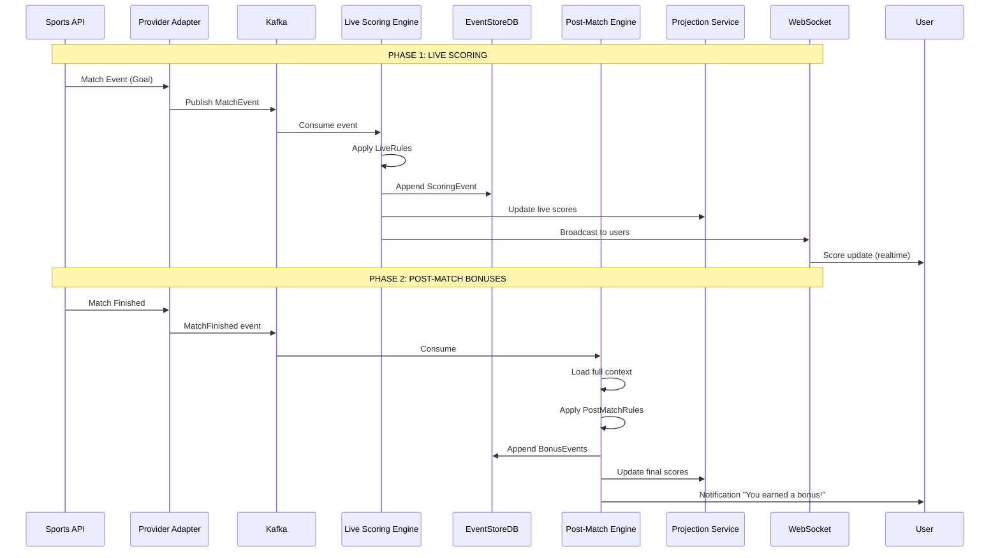

# Scoring Engine

> **Live Scoring + Post-Match Bonuses**: Two-phase scoring system balancing UX and precision

---

## 🎯 Engine Architecture



---

## ⚡ Phase 1: Live Scoring Engine

### Architecture

```java
@Service
public class LiveScoringEngine {

    private final SportRegistry sportRegistry;
    private final Sinks.Many<PlayerScoreUpdate> scoringSink;
    private final PlayerScoreRepository scoreRepo;

    /**
     * Processes match events in real-time.
     * Applies only LiveRules (simple, context-free).
     */
    public Flux<PlayerScoreUpdate> processMatchLive(String matchId) {
        return matchEventStream(matchId)  // Flux<MatchEvent> from Kafka
            .flatMap(this::applyLiveRules)
            .doOnNext(scoringSink::tryEmitNext)  // WebSocket broadcast
            .doOnNext(this::persistScore);
    }

    private Mono<PlayerScoreUpdate> applyLiveRules(MatchEvent event) {
        var plugin = sportRegistry.getPluginOrThrow(event.sportId());

        return Flux.fromIterable(plugin.liveRules())
            .filter(rule -> rule.applies(event))
            .reduce(0, (total, rule) -> total + rule.points())
            .map(points -> new PlayerScoreUpdate(
                UUID.randomUUID(),
                event.playerId(),
                event.matchId(),
                points,
                event.type(),
                Instant.now(),
                false,  // isBonus = false
                event.providerId()
            ));
    }

    private void persistScore(PlayerScoreUpdate update) {
        scoreRepo.save(update).subscribe();
    }
}
```

### Example Flow

```
Minute 23: Messi scores a goal
    ↓
MatchEvent { type=GOAL, player=messi, minute=23 }
    ↓
Applicable LiveRules:
  - "goal" → +10 points
  - "forward_goal" → NO (Messi is not a forward)
    ↓
PlayerScoreUpdate { playerId=messi, points=10 }
    ↓
WebSocket → User sees: "Messi: +10 pts (Goal)"
```

---

## 🎁 Phase 2: Post-Match Bonus Engine

### Architecture

```java
@Service
public class PostMatchBonusEngine {

    private final SportRegistry sportRegistry;
    private final MatchContextBuilder contextBuilder;
    private final BonusRepository bonusRepo;
    private final NotificationService notificationService;

    /**
     * Calculates post-match bonuses when the match ends.
     * Requires full context: result, statistics, tournament.
     */
    public Mono<MatchBonusResult> calculateBonuses(String matchId) {
        return contextBuilder.buildContext(matchId)
            .flatMap(matchCtx -> {
                var plugin = sportRegistry.getPluginOrThrow(matchCtx.sportId());

                return Flux.fromIterable(matchCtx.playerContexts())
                    .flatMap(playerCtx ->
                        applyPostMatchRules(playerCtx, matchCtx, plugin)
                    )
                    .collectList()
                    .map(bonuses -> new MatchBonusResult(matchId, bonuses));
            })
            .doOnSuccess(this::notifyUsers);
    }

    private Mono<List<Bonus>> applyPostMatchRules(
        PlayerMatchContext playerCtx,
        MatchContext matchCtx,
        SportScoringConfig plugin
    ) {
        return Flux.fromIterable(plugin.postMatchRules())
            .sort()  // By priority (highest first)
            .filter(rule -> rule.applies(playerCtx, matchCtx))
            .map(rule -> rule.calculateBonus(playerCtx))
            .collectList()
            .doOnNext(bonuses -> {
                if (!bonuses.isEmpty()) {
                    persistBonuses(playerCtx.playerId(), bonuses);
                }
            });
    }

    private void notifyUsers(MatchBonusResult result) {
        result.bonuses().forEach(bonus ->
            notificationService.sendBonusNotification(
                bonus.playerId(),
                bonus.points(),
                bonus.description()
            )
        );
    }
}
```

### Example Flow

```
Match ends: Real Madrid 3 - 1 Barcelona
    ↓
MatchContext {
    winner: Real Madrid,
    phase: PLAYOFF,
    playerContexts: [
        { player: Benzema, goals: 3, team: Real Madrid },
        { player: Courtois, position: GOALKEEPER, team: Real Madrid, goals_conceded: 1 }
    ]
}
    ↓
PostMatchRules for Benzema:
  ✅ "hat_trick" (3 goals) → +20 pts
  ✅ "hat_trick_playoff" (3 goals + playoff win) → +50 pts
  ✅ "team_victory" (team won) → +5 pts
    ↓
Total bonuses for Benzema: +75 pts
    ↓
Notification: "Benzema earned 75 bonus points!"
```

---

## 🔧 Context Builders

### MatchContext

```java
/**
 * Contexto completo del partido para evaluación de reglas post-match.
 */
public record MatchContext(
    UUID matchId,
    String sportId,
    Match match,
    Tournament tournament,
    List<PlayerMatchContext> playerContexts
) {
    public boolean isTopScorer(UUID playerId) {
        return playerContexts.stream()
            .max(Comparator.comparing(PlayerMatchContext::totalPoints))
            .map(top -> top.playerId().equals(playerId))
            .orElse(false);
    }
}

/**
 * Builder que construye el contexto completo desde Event Store.
 */
@Service
public class MatchContextBuilder {

    private final MatchEventStore eventStore;
    private final MatchRepository matchRepo;
    private final TournamentRepository tournamentRepo;

    public Mono<MatchContext> buildContext(String matchId) {
        return Mono.zip(
            matchRepo.findById(matchId),
            tournamentRepo.findByMatchId(matchId),
            buildPlayerContexts(matchId)
        ).map(tuple -> new MatchContext(
            UUID.fromString(matchId),
            tuple.getT1().sportId(),
            tuple.getT1(),  // Match
            tuple.getT2(),  // Tournament
            tuple.getT3()   // PlayerContexts
        ));
    }

    private Mono<List<PlayerMatchContext>> buildPlayerContexts(String matchId) {
        // Reconstruir desde Event Store
        return eventStore.readStream(matchId)
            .filter(event -> event instanceof PlayerEvent)
            .groupBy(event -> ((PlayerEvent) event).playerId())
            .flatMap(group ->
                group.reduce(
                    new PlayerMatchContext(group.key()),
                    (ctx, event) -> ctx.applyEvent(event)
                )
            )
            .collectList();
    }
}
```

### PlayerMatchContext

```java
/**
 * Contexto agregado de un jugador en un partido específico.
 * Se construye aplicando todos los eventos del jugador.
 */
public class PlayerMatchContext {
    private final UUID playerId;
    private final Map<EventType, Integer> eventCounts;
    private int totalPoints;
    private UUID teamId;
    private Player player;

    public PlayerMatchContext applyEvent(MatchEvent event) {
        eventCounts.merge(event.type(), 1, Integer::sum);
        return this;
    }

    public int eventCount(EventType type) {
        return eventCounts.getOrDefault(type, 0);
    }

    public int categoriesAbove10() {
        // Para baloncesto: double-double, triple-double
        return (int) eventCounts.values().stream()
            .filter(count -> count >= 10)
            .count();
    }
}
```

---

## 🎨 Reglas Complejas - Ejemplos Reales

### Ejemplo 1: Hat-trick en Playoff Ganado

```java
new PostMatchRule(
    "hat_trick_playoff_victory",
    "Hat-trick en partido de playoff ganado",
    10,  // Máxima prioridad
    (playerCtx, matchCtx) -> {
        // Condición 1: 3+ goles
        boolean hasHatTrick = playerCtx.eventCount(EventType.GOL) >= 3;

        // Condición 2: Equipo ganó
        boolean teamWon = matchCtx.match()
            .winner()
            .equals(playerCtx.teamId());

        // Condición 3: Es playoff
        boolean isPlayoff = matchCtx.tournament().phase() == Phase.PLAYOFF;

        return hasHatTrick && teamWon && isPlayoff;
    },
    playerCtx -> new Bonus(50, "Hat-trick en playoff ganado")
)
```

### Ejemplo 2: Portero Imbatido con 60+ Minutos

```java
new PostMatchRule(
    "goalkeeper_clean_sheet",
    "Portero sin goles recibidos (mínimo 60 min)",
    5,
    (playerCtx, matchCtx) -> {
        boolean isGoalkeeper = playerCtx.player().position() == Position.PORTERO;
        boolean noGoalsAgainst = matchCtx.match()
            .goalsAgainst(playerCtx.teamId()) == 0;
        boolean playedEnough = matchCtx.match()
            .minutesPlayed(playerCtx.playerId()) >= 60;

        return isGoalkeeper && noGoalsAgainst && playedEnough;
    },
    playerCtx -> new Bonus(10, "Portería a cero")
)
```

### Ejemplo 3: Comeback Victory (Victoria Remontada)

```java
new PostMatchRule(
    "comeback_victory",
    "Victoria remontando desventaja de 2+ goles",
    7,
    (playerCtx, matchCtx) -> {
        boolean teamWon = matchCtx.match()
            .winner()
            .equals(playerCtx.teamId());

        boolean wasBehindBy2 = matchCtx.match()
            .maxGoalDeficit(playerCtx.teamId()) >= 2;

        boolean playerContributed = playerCtx.totalPoints() >= 15;

        return teamWon && wasBehindBy2 && playerContributed;
    },
    playerCtx -> new Bonus(20, "Victoria remontada")
)
```

### Ejemplo 4: Triple-Double (Baloncesto)

```java
new PostMatchRule(
    "triple_double",
    "Triple-double (10+ en 3 categorías)",
    10,
    (playerCtx, matchCtx) -> {
        // Cuenta categorías con 10+
        long categories = playerCtx.eventCounts().values().stream()
            .filter(count -> count >= 10)
            .count();

        return categories >= 3;
    },
    playerCtx -> new Bonus(30, "Triple-double")
)
```

---

## 📊 Performance Optimization

### Batching de Eventos

```java
@Service
public class BatchedLiveScoringEngine {

    /**
     * Agrupa eventos en ventanas de 500ms para reducir
     * writes a DB y WebSocket messages.
     */
    public Flux<List<PlayerScoreUpdate>> processBatched(String matchId) {
        return matchEventStream(matchId)
            .flatMap(this::applyLiveRules)
            .window(Duration.ofMillis(500))  // Batch window
            .flatMap(window ->
                window.collectList()
                    .filter(list -> !list.isEmpty())
            )
            .doOnNext(this::persistBatch)
            .doOnNext(this::broadcastBatch);
    }

    private void persistBatch(List<PlayerScoreUpdate> updates) {
        scoreRepo.saveAll(updates).subscribe();
    }

    private void broadcastBatch(List<PlayerScoreUpdate> updates) {
        webSocketService.broadcastBatch(updates);
    }
}
```

### Caching de Reglas

```java
@Service
public class CachedScoringEngine {

    private final LoadingCache<String, List<LiveRule>> ruleCache;

    public CachedScoringEngine(SportRegistry registry) {
        this.ruleCache = Caffeine.newBuilder()
            .maximumSize(100)
            .expireAfterWrite(1, TimeUnit.HOURS)
            .build(sportId ->
                registry.getPluginOrThrow(sportId).liveRules()
            );
    }

    public Mono<PlayerScoreUpdate> applyLiveRules(MatchEvent event) {
        var rules = ruleCache.get(event.sportId());

        return Flux.fromIterable(rules)
            .filter(rule -> rule.applies(event))
            .reduce(0, (total, rule) -> total + rule.points())
            .map(points -> createUpdate(event, points));
    }
}
```

---

## 🧪 Testing del Scoring Engine

### Unit Test: Live Rules

```java
@Test
void shouldCalculate10PointsForGoal() {
    var event = MatchEvent.builder()
        .sportId("FUTBOL")
        .type(EventType.GOL)
        .playerId(PLAYER_ID)
        .build();

    StepVerifier.create(liveScoringEngine.applyLiveRules(event))
        .assertNext(update -> {
            assertThat(update.points()).isEqualTo(10);
            assertThat(update.isBonus()).isFalse();
        })
        .verifyComplete();
}
```

### Integration Test: Post-Match Bonuses

```java
@Test
void shouldAwardHatTrickBonusInPlayoff() {
    // Setup: Partido de playoff con 3 goles de un jugador
    var matchId = createPlayoffMatch();
    publishGoalEvent(matchId, PLAYER_ID, 23);
    publishGoalEvent(matchId, PLAYER_ID, 45);
    publishGoalEvent(matchId, PLAYER_ID, 78);
    publishMatchFinished(matchId, teamWinner = PLAYER_TEAM);

    // When
    var bonuses = postMatchEngine.calculateBonuses(matchId).block();

    // Then
    assertThat(bonuses.getBonusesFor(PLAYER_ID))
        .anyMatch(bonus ->
            bonus.description().contains("Hat-trick en playoff")
            && bonus.points() == 50
        );
}
```

### Performance Test: Throughput

```java
@Test
void shouldProcess1000EventsPerSecond() {
    var events = generateMatchEvents(10000);

    var start = Instant.now();

    Flux.fromIterable(events)
        .flatMap(liveScoringEngine::applyLiveRules)
        .blockLast();

    var duration = Duration.between(start, Instant.now());
    var throughput = 10000.0 / duration.toSeconds();

    assertThat(throughput).isGreaterThan(1000);  // >1K events/sec
}
```

---

## 📈 Monitoring Metrics

```java
@Component
public class ScoringEngineMetrics {

    private final Counter eventsProcessed;
    private final Timer scoringLatency;
    private final DistributionSummary pointsDistribution;

    public ScoringEngineMetrics(MeterRegistry registry) {
        this.eventsProcessed = Counter.builder("scoring.events.processed")
            .description("Total scoring events processed")
            .tag("phase", "live")
            .register(registry);

        this.scoringLatency = Timer.builder("scoring.latency")
            .description("Time to calculate score")
            .publishPercentiles(0.5, 0.95, 0.99)
            .register(registry);

        this.pointsDistribution = DistributionSummary.builder("scoring.points")
            .description("Distribution of points awarded")
            .baseUnit("points")
            .register(registry);
    }

    public void recordEvent(int points, Duration latency) {
        eventsProcessed.increment();
        scoringLatency.record(latency);
        pointsDistribution.record(points);
    }
}
```

---
