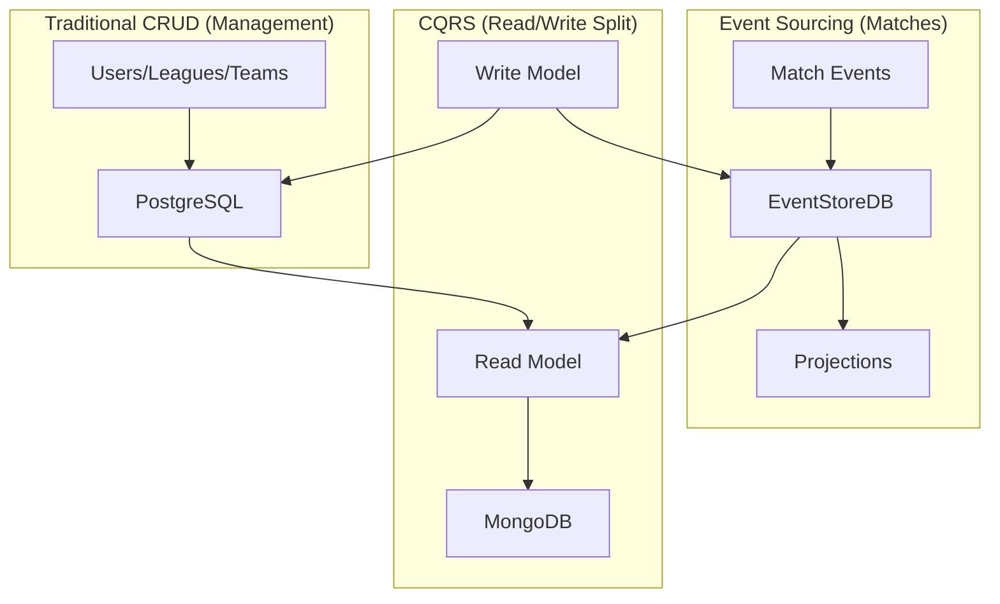

# Event Sourcing + CQRS - Event Architecture

> **Hybrid Approach**: Event Sourcing ONLY for matches + CQRS for read/write separation

---

## 🎯 Hybrid Strategy

### Why Hybrid?



**Rationale**:
- **Event Sourcing**: Matches require full audit, replay, and temporal analysis
- **CRUD**: Users/leagues change through direct updates, not cumulative events
- **CQRS**: Optimizes reads (frequent queries) separate from writes (transactions)

---

## 📦 EventStoreDB - Match Events

### Stream Naming Convention

```plaintext
match-{matchId}           → All events for a specific match
player-{playerId}-{date}  → Player events on a specific date
league-{leagueId}-week-{weekId} → League matchday events
```

### Event Types

```java
/**
 * Match event taxonomy.
 * Each event is immutable and represents a historical fact.
 */
public sealed interface MatchEvent permits
    GoalScored, AssistMade, YellowCard, RedCard, Substitution,
    MatchStarted, MatchEnded, PeriodEnded,
    FreeThrowMade, Rebound, Block, Steal,
    HomeRun, Strikeout, StolenBase, Walk {

    UUID eventId();
    UUID matchId();
    Instant timestamp();
    String sportId();
    String providerId();
}

/**
 * Example: Goal event in football.
 */
public record GoalScored(
    UUID eventId,
    UUID matchId,
    Instant timestamp,
    String sportId,
    String providerId,
    UUID playerId,
    UUID teamId,
    int minute,
    boolean isPenalty,
    UUID assistPlayerId  // nullable
) implements MatchEvent {}
```

### Event Schema Versioning

```java
/**
 * Support for schema evolution.
 * Allows migrating old events to new versions.
 */
public interface EventUpgrader<T extends MatchEvent> {
    int fromVersion();
    int toVersion();
    T upgrade(Map<String, Object> oldEvent);
}

@Component
public class GoalScoredUpgrader implements EventUpgrader<GoalScored> {

    @Override
    public int fromVersion() { return 1; }

    @Override
    public int toVersion() { return 2; }

    /**
     * V1 → V2: Added "assistPlayerId" field.
     */
    @Override
    public GoalScored upgrade(Map<String, Object> oldEvent) {
        return new GoalScored(
            UUID.fromString((String) oldEvent.get("eventId")),
            UUID.fromString((String) oldEvent.get("matchId")),
            Instant.parse((String) oldEvent.get("timestamp")),
            (String) oldEvent.get("sportId"),
            (String) oldEvent.get("providerId"),
            UUID.fromString((String) oldEvent.get("playerId")),
            UUID.fromString((String) oldEvent.get("teamId")),
            (Integer) oldEvent.get("minute"),
            (Boolean) oldEvent.get("isPenalty"),
            null  // V1 didn't have assists
        );
    }
}
```

---

## 🔧 Event Store Repository

### Write Operations

```java
@Repository
public class MatchEventStore {

    private final EventStoreDBClient client;
    private final ObjectMapper objectMapper;

    /**
     * Appends an event to a match stream.
     * Uses optimistic concurrency with expected version.
     */
    public Mono<WriteResult> appendEvent(
        String matchId,
        MatchEvent event,
        long expectedVersion
    ) {
        var streamName = "match-" + matchId;

        return Mono.fromCallable(() -> {
            var eventData = EventData.builderAsJson(
                event.getClass().getSimpleName(),
                objectMapper.writeValueAsBytes(event)
            )
            .eventId(event.eventId())
            .build();

            return client.appendToStream(
                streamName,
                ExpectedRevision.expectedRevision(expectedVersion),
                eventData
            ).get();
        });
    }

    /**
     * Appends multiple events in a batch (transactional).
     */
    public Mono<WriteResult> appendEvents(
        String matchId,
        List<MatchEvent> events
    ) {
        var streamName = "match-" + matchId;

        return Mono.fromCallable(() -> {
            var eventDataList = events.stream()
                .map(event -> {
                    try {
                        return EventData.builderAsJson(
                            event.getClass().getSimpleName(),
                            objectMapper.writeValueAsBytes(event)
                        )
                        .eventId(event.eventId())
                        .build();
                    } catch (JsonProcessingException e) {
                        throw new RuntimeException(e);
                    }
                })
                .collect(Collectors.toList());

            return client.appendToStream(
                streamName,
                ExpectedRevision.any(),
                eventDataList.iterator()
            ).get();
        });
    }
}
```

### Read Operations

```java
/**
 * Lectura de eventos desde EventStoreDB.
 */
public Flux<MatchEvent> readStream(String matchId) {
    var streamName = "match-" + matchId;

    return Flux.create(sink -> {
        try {
            var stream = client.readStream(
                streamName,
                ReadStreamOptions.get()
                    .forwards()
                    .fromStart()
            ).get();

            stream.getEvents().forEach(resolvedEvent -> {
                var eventType = resolvedEvent.getEvent().getEventType();
                var eventData = resolvedEvent.getEvent().getEventData();

                try {
                    var event = deserializeEvent(eventType, eventData);
                    sink.next(event);
                } catch (Exception e) {
                    sink.error(e);
                }
            });

            sink.complete();
        } catch (Exception e) {
            sink.error(e);
        }
    });
}

/**
 * Lectura desde versión específica (para catch-up subscriptions).
 */
public Flux<MatchEvent> readStreamFrom(String matchId, long fromVersion) {
    var streamName = "match-" + matchId;

    return Flux.create(sink -> {
        try {
            var stream = client.readStream(
                streamName,
                ReadStreamOptions.get()
                    .forwards()
                    .fromRevision(fromVersion)
            ).get();

            stream.getEvents().forEach(resolvedEvent -> {
                var event = deserializeEvent(
                    resolvedEvent.getEvent().getEventType(),
                    resolvedEvent.getEvent().getEventData()
                );
                sink.next(event);
            });

            sink.complete();
        } catch (Exception e) {
            sink.error(e);
        }
    });
}
```

### Subscriptions

```java
/**
 * Catch-up subscription para procesamiento de eventos.
 * Procesa eventos históricos y luego continúa en real-time.
 */
public Flux<MatchEvent> subscribeToStream(String matchId) {
    var streamName = "match-" + matchId;

    return Flux.create(sink -> {
        var subscription = client.subscribeToStream(
            streamName,
            new SubscriptionListener() {
                @Override
                public void onEvent(
                    Subscription subscription,
                    ResolvedEvent resolvedEvent
                ) {
                    var event = deserializeEvent(
                        resolvedEvent.getEvent().getEventType(),
                        resolvedEvent.getEvent().getEventData()
                    );
                    sink.next(event);
                }

                @Override
                public void onError(Subscription subscription, Throwable throwable) {
                    sink.error(throwable);
                }

                @Override
                public void onCancelled(Subscription subscription) {
                    sink.complete();
                }
            }
        );

        sink.onDispose(() -> subscription.stop());
    });
}
```

---

## 🔄 CQRS - Read/Write Segregation

### Write Model (Command Side)

```java
/**
 * Write Model: Optimizado para transacciones y validación.
 * Escribe en PostgreSQL + EventStoreDB.
 */
@Service
public class MatchCommandService {

    private final MatchEventStore eventStore;
    private final MatchRepository matchRepo;
    private final Validator validator;

    /**
     * Procesa comando de inicio de partido.
     */
    public Mono<MatchStartedEvent> startMatch(StartMatchCommand cmd) {
        return validator.validate(cmd)
            .then(matchRepo.findById(cmd.matchId()))
            .flatMap(match -> {
                if (match.status() != MatchStatus.SCHEDULED) {
                    return Mono.error(new IllegalStateException(
                        "Match already started or finished"
                    ));
                }

                var event = new MatchStarted(
                    UUID.randomUUID(),
                    match.id(),
                    Instant.now(),
                    match.sportId(),
                    cmd.providerId(),
                    match.homeTeamId(),
                    match.awayTeamId()
                );

                return eventStore.appendEvent(
                    match.id().toString(),
                    event,
                    ExpectedRevision.ANY
                )
                .thenReturn(event);
            });
    }

    /**
     * Procesa comando de gol.
     */
    public Mono<GoalScored> recordGoal(RecordGoalCommand cmd) {
        return validator.validate(cmd)
            .then(Mono.defer(() -> {
                var event = new GoalScored(
                    UUID.randomUUID(),
                    cmd.matchId(),
                    Instant.now(),
                    cmd.sportId(),
                    cmd.providerId(),
                    cmd.playerId(),
                    cmd.teamId(),
                    cmd.minute(),
                    cmd.isPenalty(),
                    cmd.assistPlayerId()
                );

                return eventStore.appendEvent(
                    cmd.matchId().toString(),
                    event,
                    ExpectedRevision.ANY
                )
                .thenReturn(event);
            }));
    }
}
```

### Read Model (Query Side)

```java
/**
 * Read Model: Optimizado para consultas rápidas.
 * Lee desde MongoDB (proyecciones).
 */
@Service
public class MatchQueryService {

    private final MongoTemplate mongoTemplate;

    /**
     * Obtiene estado actual del partido (proyección).
     */
    public Mono<MatchProjection> getMatchState(UUID matchId) {
        return Mono.fromCallable(() ->
            mongoTemplate.findById(
                matchId.toString(),
                MatchProjection.class,
                "match_projections"
            )
        );
    }

    /**
     * Obtiene mejores jugadores de la semana (proyección).
     */
    public Flux<PlayerWeeklyStats> getTopPlayersOfWeek(
        String leagueId,
        int weekNumber
    ) {
        var query = Query.query(Criteria
            .where("leagueId").is(leagueId)
            .and("weekNumber").is(weekNumber)
        )
        .with(Sort.by(Sort.Direction.DESC, "totalPoints"))
        .limit(10);

        return Flux.from(
            mongoTemplate.find(
                query,
                PlayerWeeklyStats.class,
                "player_weekly_stats"
            )
        );
    }
}
```

---

## 📊 Projection Engine

### Projection Definition

```java
/**
 * Proyección: convierte eventos en modelos de lectura optimizados.
 */
public interface Projection<T> {
    String projectionName();
    Class<T> projectionType();
    T initialState();
    T apply(T currentState, MatchEvent event);
    void save(T state);
}

/**
 * Proyección: Estado actual del partido.
 */
@Component
public class MatchStateProjection implements Projection<MatchProjection> {

    private final MongoTemplate mongoTemplate;

    @Override
    public String projectionName() { return "match_state"; }

    @Override
    public Class<MatchProjection> projectionType() { return MatchProjection.class; }

    @Override
    public MatchProjection initialState() {
        return new MatchProjection();
    }

    @Override
    public MatchProjection apply(MatchProjection state, MatchEvent event) {
        return switch (event) {
            case GoalScored goal -> {
                state.addGoal(goal.teamId(), goal.playerId(), goal.minute());
                yield state;
            }
            case MatchEnded ended -> {
                state.setStatus(MatchStatus.FINISHED);
                state.setEndTime(ended.timestamp());
                yield state;
            }
            default -> state;
        };
    }

    @Override
    public void save(MatchProjection state) {
        mongoTemplate.save(state, "match_projections");
    }
}
```

### Projection Runner

```java
/**
 * Ejecuta proyecciones en tiempo real desde eventos.
 */
@Service
public class ProjectionRunner {

    private final MatchEventStore eventStore;
    private final List<Projection<?>> projections;

    /**
     * Suscribe a eventos y actualiza proyecciones.
     */
    public void start() {
        projections.forEach(projection -> {
            eventStore.subscribeToAll()
                .subscribe(event -> {
                    try {
                        updateProjection(projection, event);
                    } catch (Exception e) {
                        log.error("Projection {} failed for event {}",
                            projection.projectionName(), event.eventId(), e);
                    }
                });
        });
    }

    private <T> void updateProjection(Projection<T> projection, MatchEvent event) {
        var currentState = loadCurrentState(projection, event.matchId());
        var newState = projection.apply(currentState, event);
        projection.save(newState);
    }

    /**
     * Rebuilding: Reconstruye proyección desde cero.
     */
    public <T> Mono<T> rebuildProjection(
        Projection<T> projection,
        String matchId
    ) {
        return eventStore.readStream(matchId)
            .reduce(
                projection.initialState(),
                (state, event) -> projection.apply(state, event)
            )
            .doOnSuccess(projection::save);
    }
}
```

---

## 🧪 Event Sourcing Testing

### Event Store Tests

```java
@SpringBootTest
class MatchEventStoreTest {

    @Autowired
    private MatchEventStore eventStore;

    @Test
    void shouldAppendAndReadEvents() {
        var matchId = UUID.randomUUID().toString();

        var event1 = new GoalScored(
            UUID.randomUUID(), UUID.fromString(matchId),
            Instant.now(), "FUTBOL", "api-football",
            UUID.randomUUID(), UUID.randomUUID(), 23, false, null
        );

        var event2 = new GoalScored(
            UUID.randomUUID(), UUID.fromString(matchId),
            Instant.now(), "FUTBOL", "api-football",
            UUID.randomUUID(), UUID.randomUUID(), 45, true, null
        );

        // Append
        eventStore.appendEvent(matchId, event1, ExpectedRevision.NO_STREAM).block();
        eventStore.appendEvent(matchId, event2, ExpectedRevision.STREAM_EXISTS).block();

        // Read
        var events = eventStore.readStream(matchId).collectList().block();

        assertThat(events).hasSize(2);
        assertThat(events.get(0)).isInstanceOf(GoalScored.class);
        assertThat(((GoalScored) events.get(0)).minute()).isEqualTo(23);
    }

    @Test
    void shouldRejectConcurrentWrites() {
        var matchId = UUID.randomUUID().toString();

        var event = new GoalScored(
            UUID.randomUUID(), UUID.fromString(matchId),
            Instant.now(), "FUTBOL", "api-football",
            UUID.randomUUID(), UUID.randomUUID(), 30, false, null
        );

        // Primera escritura
        eventStore.appendEvent(matchId, event, ExpectedRevision.NO_STREAM).block();

        // Segunda escritura con misma versión esperada → debe fallar
        StepVerifier.create(
            eventStore.appendEvent(matchId, event, ExpectedRevision.NO_STREAM)
        )
        .expectError(WrongExpectedVersionException.class)
        .verify();
    }
}
```

### Projection Tests

```java
@SpringBootTest
class MatchStateProjectionTest {

    @Autowired
    private MatchStateProjection projection;

    @Test
    void shouldBuildMatchStateFromEvents() {
        var matchId = UUID.randomUUID();

        var state = projection.initialState();
        state.setMatchId(matchId);

        // Evento 1: Gol local
        var goal1 = new GoalScored(
            UUID.randomUUID(), matchId, Instant.now(),
            "FUTBOL", "api-football",
            UUID.randomUUID(), UUID.randomUUID(), 15, false, null
        );
        state = projection.apply(state, goal1);

        // Evento 2: Gol visitante
        var goal2 = new GoalScored(
            UUID.randomUUID(), matchId, Instant.now(),
            "FUTBOL", "api-football",
            UUID.randomUUID(), UUID.randomUUID(), 30, false, null
        );
        state = projection.apply(state, goal2);

        // Evento 3: Fin del partido
        var ended = new MatchEnded(
            UUID.randomUUID(), matchId, Instant.now(),
            "FUTBOL", "api-football"
        );
        state = projection.apply(state, ended);

        assertThat(state.getHomeScore()).isEqualTo(1);
        assertThat(state.getAwayScore()).isEqualTo(1);
        assertThat(state.getStatus()).isEqualTo(MatchStatus.FINISHED);
    }
}
```

---

## 📈 Performance Optimization

### Snapshot Strategy

```java
/**
 * Snapshots: evita replay de miles de eventos.
 * Guarda estado cada N eventos.
 */
@Service
public class SnapshotService {

    private static final int SNAPSHOT_FREQUENCY = 100;

    private final MongoTemplate mongoTemplate;

    /**
     * Guarda snapshot del estado actual.
     */
    public void saveSnapshot(String matchId, MatchProjection state, long version) {
        var snapshot = new MatchSnapshot(
            matchId,
            version,
            Instant.now(),
            state
        );

        mongoTemplate.save(snapshot, "match_snapshots");
    }

    /**
     * Carga último snapshot + aplica eventos posteriores.
     */
    public Mono<MatchProjection> loadWithSnapshot(
        String matchId,
        MatchEventStore eventStore,
        Projection<MatchProjection> projection
    ) {
        return Mono.fromCallable(() -> {
            // 1. Buscar último snapshot
            var query = Query.query(Criteria.where("matchId").is(matchId))
                .with(Sort.by(Sort.Direction.DESC, "version"))
                .limit(1);

            var snapshot = mongoTemplate.findOne(
                query,
                MatchSnapshot.class,
                "match_snapshots"
            );

            if (snapshot == null) {
                // Sin snapshot → replay completo
                return eventStore.readStream(matchId)
                    .reduce(
                        projection.initialState(),
                        (state, event) -> projection.apply(state, event)
                    )
                    .block();
            }

            // 2. Con snapshot → solo eventos posteriores
            return eventStore.readStreamFrom(matchId, snapshot.version())
                .reduce(
                    snapshot.state(),
                    (state, event) -> projection.apply(state, event)
                )
                .block();
        });
    }
}
```

### Caching Strategy

```java
/**
 * Cache de proyecciones en Redis para lecturas ultra-rápidas.
 */
@Service
public class CachedQueryService {

    private final RedisTemplate<String, MatchProjection> redisTemplate;
    private final MatchQueryService queryService;

    /**
     * Get con cache-aside pattern.
     */
    public Mono<MatchProjection> getMatchState(UUID matchId) {
        var cacheKey = "match:state:" + matchId;

        return Mono.fromCallable(() ->
            redisTemplate.opsForValue().get(cacheKey)
        )
        .switchIfEmpty(
            queryService.getMatchState(matchId)
                .doOnSuccess(state ->
                    redisTemplate.opsForValue().set(
                        cacheKey,
                        state,
                        Duration.ofMinutes(5)
                    )
                )
        );
    }
}
```

---

**Document Version**: 1.0.0
**Last Updated**: 2025-11-08
**Status**: Final
