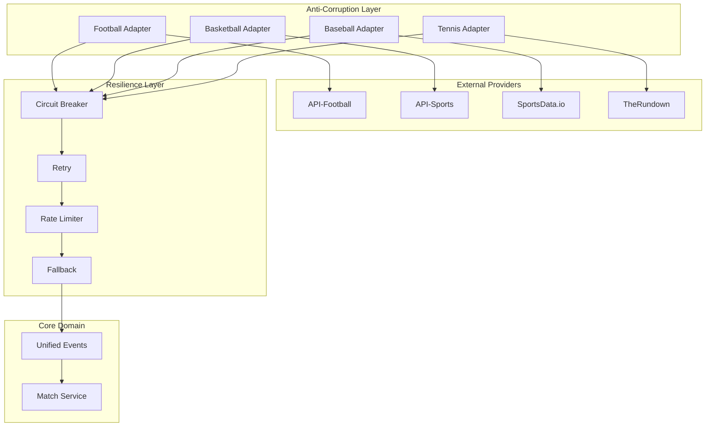

# Multi-Provider Integration - Sports APIs Integration

> **Anti-Corruption Layer + Resilience Patterns**: Multiple providers with automatic fallback

---

## 🎯 Multi-Provider Architecture



---

## 📦 Provider Configuration

### Provider Registry

```java
/**
 * Provider registry with metadata and priorities.
 */
public record ProviderConfig(
    String providerId,
    String name,
    String baseUrl,
    String apiKey,
    Set<String> supportedSports,
    int priority,              // 1 = highest priority
    RateLimitConfig rateLimit,
    CircuitBreakerConfig circuitBreaker,
    boolean enabled
) {}

/**
 * Rate limiting configuration per provider.
 */
public record RateLimitConfig(
    int requestsPerSecond,
    int requestsPerMinute,
    int requestsPerDay,
    Duration timeout
) {}

/**
 * Circuit breaker configuration per provider.
 */
public record CircuitBreakerConfig(
    int failureThreshold,       // Consecutive failures to open
    Duration waitDurationInOpenState,
    int permittedCallsInHalfOpenState,
    float slowCallRateThreshold,
    Duration slowCallDurationThreshold
) {}
```

### Configuration File

```yaml
# application.yml
providers:
  api-football:
    name: "API-Football"
    base-url: ${API_FOOTBALL_URL:https://v3.football.api-sports.io}
    api-key: ${API_FOOTBALL_KEY:}
    priority: 1
    enabled: true
    supported-sports: ["soccer"]
    rate-limit:
      requests-per-second: 10
      requests-per-minute: 60
      requests-per-day: 1000
      timeout: 10s
    circuit-breaker:
      failure-threshold: 5
      wait-duration-in-open-state: 30s
      permitted-calls-in-half-open-state: 3
      slow-call-rate-threshold: 0.5
      slow-call-duration-threshold: 2s

  api-sports:
    name: "API-Sports"
    base-url: "https://api-sports.io"
    api-key: "${API_SPORTS_KEY}"
    supported-sports: ["basketball", "soccer"]
    priority: 2
    enabled: true
    rate-limit:
      requests-per-second: 5
      requests-per-minute: 300
      requests-per-day: 5000
      timeout: 30s
    circuit-breaker:
      failure-threshold: 5
      wait-duration: 60s
      permitted-calls-half-open: 3
      slow-call-rate-threshold: 0.5
      slow-call-duration-threshold: 5s

  sportsdata-io:
    name: "SportsData.io"
    base-url: "https://api.sportsdata.io"
    api-key: "${SPORTSDATA_KEY}"
    supported-sports: ["baseball", "basketball"]
    priority: 1
    enabled: true
    rate-limit:
      requests-per-second: 2
      requests-per-minute: 120
      requests-per-day: 2000
      timeout: 30s
    circuit-breaker:
      failure-threshold: 3
      wait-duration: 120s
      permitted-calls-half-open: 2
      slow-call-rate-threshold: 0.6
      slow-call-duration-threshold: 10s
```

---

## 🔧 Anti-Corruption Layer (ACL)

### Generic Provider Adapter

```java
/**
 * Generic interface for provider adapters.
 * Converts external models → domain events.
 */
public interface ProviderAdapter {

    String providerId();

    Set<String> supportedSports();

    /**
     * Gets matches for a specific date.
     */
    Flux<Match> getMatchesByDate(String sportId, LocalDate date);

    /**
     * Streams live match events.
     */
    Flux<MatchEvent> streamLiveMatchEvents(String sportId, String externalMatchId);

    /**
     * Gets final match statistics.
     */
    Mono<MatchStatistics> getMatchStatistics(String sportId, String externalMatchId);

    /**
     * Provider health check.
     */
    Mono<ProviderHealth> checkHealth();
}
```

### Football Adapter (API-Football)

```java
/**
 * Adapter para API-Football.
 * Convierte respuestas de API-Football → eventos de dominio.
 */
@Component
public class APIFootballAdapter implements ProviderAdapter {

    private final WebClient webClient;
    private final ObjectMapper objectMapper;

    public APIFootballAdapter(
        ProviderConfig config,
        WebClient.Builder webClientBuilder
    ) {
        this.webClient = webClientBuilder
            .baseUrl(config.baseUrl())
            .defaultHeader("X-RapidAPI-Key", config.apiKey())
            .defaultHeader("X-RapidAPI-Host", "api-football-v1.p.rapidapi.com")
            .build();
    }

    @Override
    public String providerId() { return "api-football"; }

    @Override
    public Set<String> supportedSports() { return Set.of("FUTBOL"); }

    @Override
    public Flux<Match> getMatchesByDate(String sportId, LocalDate date) {
        return webClient.get()
            .uri(uriBuilder -> uriBuilder
                .path("/fixtures")
                .queryParam("date", date.format(DateTimeFormatter.ISO_DATE))
                .build())
            .retrieve()
            .bodyToMono(APIFootballFixturesResponse.class)
            .flatMapMany(response -> Flux.fromIterable(response.response()))
            .map(this::convertToMatch);
    }

    @Override
    public Flux<MatchEvent> streamLiveMatchEvents(
        String sportId,
        String externalMatchId
    ) {
        // Polling cada 30 segundos (API-Football no tiene WebSocket)
        return Flux.interval(Duration.ofSeconds(30))
            .flatMap(tick -> fetchMatchEvents(externalMatchId))
            .distinctUntilChanged(event -> event.eventId());
    }

    private Flux<MatchEvent> fetchMatchEvents(String externalMatchId) {
        return webClient.get()
            .uri("/fixtures/events?fixture={fixtureId}", externalMatchId)
            .retrieve()
            .bodyToMono(APIFootballEventsResponse.class)
            .flatMapMany(response -> Flux.fromIterable(response.response()))
            .map(this::convertToMatchEvent);
    }

    /**
     * Conversión: APIFootballFixture → Match (dominio).
     */
    private Match convertToMatch(APIFootballFixture fixture) {
        return Match.builder()
            .externalId(String.valueOf(fixture.fixture().id()))
            .providerId(providerId())
            .sportId("FUTBOL")
            .homeTeamName(fixture.teams().home().name())
            .awayTeamName(fixture.teams().away().name())
            .scheduledTime(Instant.ofEpochSecond(fixture.fixture().timestamp()))
            .status(convertStatus(fixture.fixture().status().short_()))
            .build();
    }

    /**
     * Conversión: APIFootballEvent → MatchEvent (dominio).
     */
    private MatchEvent convertToMatchEvent(APIFootballEvent event) {
        return switch (event.type()) {
            case "Goal" -> new GoalScored(
                UUID.randomUUID(),
                null,  // matchId se asigna después
                Instant.now(),
                "FUTBOL",
                providerId(),
                extractPlayerId(event.player()),
                extractTeamId(event.team()),
                event.time().elapsed(),
                "Penalty".equals(event.detail()),
                extractAssistId(event.assist())
            );
            case "Card" -> createCardEvent(event);
            case "subst" -> createSubstitutionEvent(event);
            default -> null;
        };
    }

    private MatchStatus convertStatus(String apiStatus) {
        return switch (apiStatus) {
            case "NS" -> MatchStatus.SCHEDULED;
            case "1H", "HT", "2H", "ET", "P" -> MatchStatus.LIVE;
            case "FT", "AET", "PEN" -> MatchStatus.FINISHED;
            case "CANC", "PST", "ABD" -> MatchStatus.CANCELLED;
            default -> MatchStatus.SCHEDULED;
        };
    }

    @Override
    public Mono<ProviderHealth> checkHealth() {
        return webClient.get()
            .uri("/status")
            .retrieve()
            .bodyToMono(APIFootballStatusResponse.class)
            .map(response -> new ProviderHealth(
                providerId(),
                true,
                response.requests().remaining(),
                response.requests().limit()
            ))
            .onErrorReturn(new ProviderHealth(providerId(), false, 0, 0));
    }
}
```

### Basketball Adapter (API-Sports)

```java
/**
 * Adapter para API-Sports Basketball.
 */
@Component
public class APISportsBasketballAdapter implements ProviderAdapter {

    private final WebClient webClient;

    public APISportsBasketballAdapter(
        ProviderConfig config,
        WebClient.Builder webClientBuilder
    ) {
        this.webClient = webClientBuilder
            .baseUrl(config.baseUrl() + "/basketball")
            .defaultHeader("x-apisports-key", config.apiKey())
            .build();
    }

    @Override
    public String providerId() { return "api-sports"; }

    @Override
    public Set<String> supportedSports() { return Set.of("BALONCESTO"); }

    @Override
    public Flux<MatchEvent> streamLiveMatchEvents(
        String sportId,
        String externalMatchId
    ) {
        return Flux.interval(Duration.ofSeconds(15))
            .flatMap(tick -> fetchGameEvents(externalMatchId))
            .distinctUntilChanged(event -> event.eventId());
    }

    private Flux<MatchEvent> fetchGameEvents(String gameId) {
        return webClient.get()
            .uri("/games/statistics?id={gameId}", gameId)
            .retrieve()
            .bodyToMono(APISportsGameResponse.class)
            .flatMapMany(this::convertToMatchEvents);
    }

    /**
     * Conversión: APISportsGameStats → MatchEvents (dominio).
     */
    private Flux<MatchEvent> convertToMatchEvents(APISportsGameResponse response) {
        var events = new ArrayList<MatchEvent>();

        for (var teamStats : response.response()) {
            for (var playerStat : teamStats.players()) {
                // Free throws
                if (playerStat.freeThrows().made() > 0) {
                    events.add(new FreeThrowMade(
                        UUID.randomUUID(),
                        null,
                        Instant.now(),
                        "BALONCESTO",
                        providerId(),
                        UUID.fromString(playerStat.player().id()),
                        UUID.fromString(teamStats.team().id())
                    ));
                }

                // Three pointers
                if (playerStat.threePointers().made() > 0) {
                    events.add(new ThreePointerMade(
                        UUID.randomUUID(),
                        null,
                        Instant.now(),
                        "BALONCESTO",
                        providerId(),
                        UUID.fromString(playerStat.player().id()),
                        UUID.fromString(teamStats.team().id())
                    ));
                }

                // Rebounds
                for (int i = 0; i < playerStat.totReb(); i++) {
                    events.add(new Rebound(
                        UUID.randomUUID(),
                        null,
                        Instant.now(),
                        "BALONCESTO",
                        providerId(),
                        UUID.fromString(playerStat.player().id()),
                        UUID.fromString(teamStats.team().id())
                    ));
                }
            }
        }

        return Flux.fromIterable(events);
    }
}
```

---

## 🛡️ Resilience Layer (Resilience4j)

### Circuit Breaker

```java
/**
 * Circuit Breaker por proveedor.
 * Evita llamadas a proveedores caídos.
 */
@Configuration
public class CircuitBreakerConfiguration {

    @Bean
    public CircuitBreakerRegistry circuitBreakerRegistry(
        List<ProviderConfig> configs
    ) {
        var registry = CircuitBreakerRegistry.ofDefaults();

        configs.forEach(config -> {
            var cbConfig = CircuitBreakerConfig.custom()
                .failureRateThreshold(50)
                .slowCallRateThreshold(config.circuitBreaker().slowCallRateThreshold())
                .slowCallDurationThreshold(config.circuitBreaker().slowCallDurationThreshold())
                .waitDurationInOpenState(config.circuitBreaker().waitDurationInOpenState())
                .permittedNumberOfCallsInHalfOpenState(
                    config.circuitBreaker().permittedCallsInHalfOpenState()
                )
                .build();

            registry.circuitBreaker(config.providerId(), cbConfig);
        });

        return registry;
    }
}

/**
 * Wrapper con circuit breaker para llamadas a proveedores.
 */
@Service
public class ResilientProviderClient {

    private final CircuitBreakerRegistry circuitBreakerRegistry;

    public <T> Mono<T> execute(
        String providerId,
        Supplier<Mono<T>> operation
    ) {
        var circuitBreaker = circuitBreakerRegistry.circuitBreaker(providerId);

        return Mono.defer(operation)
            .transformDeferred(CircuitBreakerOperator.of(circuitBreaker));
    }
}
```

### Retry Policy

```java
/**
 * Retry con backoff exponencial.
 */
@Configuration
public class RetryConfiguration {

    @Bean
    public RetryRegistry retryRegistry(List<ProviderConfig> configs) {
        var registry = RetryRegistry.ofDefaults();

        configs.forEach(config -> {
            var retryConfig = RetryConfig.custom()
                .maxAttempts(3)
                .waitDuration(Duration.ofSeconds(1))
                .intervalFunction(IntervalFunction.ofExponentialBackoff(
                    Duration.ofSeconds(1),
                    2.0  // Multiplier
                ))
                .retryExceptions(
                    IOException.class,
                    TimeoutException.class,
                    WebClientResponseException.ServiceUnavailable.class
                )
                .ignoreExceptions(
                    WebClientResponseException.BadRequest.class,
                    WebClientResponseException.Unauthorized.class
                )
                .build();

            registry.retry(config.providerId(), retryConfig);
        });

        return registry;
    }
}

@Service
public class ResilientProviderClient {

    private final RetryRegistry retryRegistry;

    public <T> Mono<T> executeWithRetry(
        String providerId,
        Supplier<Mono<T>> operation
    ) {
        var retry = retryRegistry.retry(providerId);

        return Mono.defer(operation)
            .transformDeferred(RetryOperator.of(retry));
    }
}
```

### Rate Limiter

```java
/**
 * Rate limiter por proveedor.
 */
@Configuration
public class RateLimiterConfiguration {

    @Bean
    public RateLimiterRegistry rateLimiterRegistry(List<ProviderConfig> configs) {
        var registry = RateLimiterRegistry.ofDefaults();

        configs.forEach(config -> {
            var rlConfig = RateLimiterConfig.custom()
                .limitForPeriod(config.rateLimit().requestsPerSecond())
                .limitRefreshPeriod(Duration.ofSeconds(1))
                .timeoutDuration(config.rateLimit().timeout())
                .build();

            registry.rateLimiter(config.providerId(), rlConfig);
        });

        return registry;
    }
}

@Service
public class ResilientProviderClient {

    private final RateLimiterRegistry rateLimiterRegistry;

    public <T> Mono<T> executeWithRateLimit(
        String providerId,
        Supplier<Mono<T>> operation
    ) {
        var rateLimiter = rateLimiterRegistry.rateLimiter(providerId);

        return Mono.defer(operation)
            .transformDeferred(RateLimiterOperator.of(rateLimiter));
    }
}
```

---

## 🔄 Provider Orchestration

### Multi-Provider Service

```java
/**
 * Orquestación de múltiples proveedores con fallback automático.
 */
@Service
public class MultiProviderService {

    private final List<ProviderAdapter> adapters;
    private final ResilientProviderClient resilientClient;
    private final ProviderHealthService healthService;

    /**
     * Obtiene partidos con fallback automático.
     * Intenta proveedor primario → si falla, intenta secundario.
     */
    public Flux<Match> getMatchesByDate(String sportId, LocalDate date) {
        var providers = getProvidersBySport(sportId);

        return Flux.fromIterable(providers)
            .concatMap(provider -> {
                if (!healthService.isHealthy(provider.providerId())) {
                    return Flux.empty();  // Skip unhealthy providers
                }

                return resilientClient.execute(
                    provider.providerId(),
                    () -> provider.getMatchesByDate(sportId, date)
                        .collectList()
                        .flatMapMany(Flux::fromIterable)
                )
                .onErrorResume(error -> {
                    log.warn("Provider {} failed, trying next", provider.providerId(), error);
                    return Flux.empty();
                });
            })
            .next()  // Take first successful result
            .flatMapMany(Flux::just);
    }

    /**
     * Stream de eventos con provider selection automático.
     */
    public Flux<MatchEvent> streamLiveMatchEvents(
        String sportId,
        String externalMatchId
    ) {
        var provider = selectBestProvider(sportId);

        return resilientClient.execute(
            provider.providerId(),
            () -> provider.streamLiveMatchEvents(sportId, externalMatchId)
        )
        .onErrorResume(error -> {
            log.error("Live stream failed for provider {}, switching",
                provider.providerId(), error);
            return switchToFallbackProvider(sportId, externalMatchId);
        });
    }

    private ProviderAdapter selectBestProvider(String sportId) {
        return getProvidersBySport(sportId).stream()
            .filter(p -> healthService.isHealthy(p.providerId()))
            .min(Comparator.comparing(p ->
                healthService.getHealth(p.providerId()).priority()
            ))
            .orElseThrow(() -> new NoAvailableProviderException(sportId));
    }

    private Flux<MatchEvent> switchToFallbackProvider(
        String sportId,
        String externalMatchId
    ) {
        var fallbackProvider = selectBestProvider(sportId);

        return resilientClient.execute(
            fallbackProvider.providerId(),
            () -> fallbackProvider.streamLiveMatchEvents(sportId, externalMatchId)
        );
    }

    private List<ProviderAdapter> getProvidersBySport(String sportId) {
        return adapters.stream()
            .filter(adapter -> adapter.supportedSports().contains(sportId))
            .toList();
    }
}
```

### Provider Health Tracking

```java
/**
 * Monitoreo de salud de proveedores.
 */
@Service
public class ProviderHealthService {

    private final Map<String, ProviderHealth> healthCache = new ConcurrentHashMap<>();
    private final List<ProviderAdapter> adapters;

    @Scheduled(fixedRate = 60000)  // Cada minuto
    public void updateHealthStatus() {
        adapters.forEach(adapter -> {
            adapter.checkHealth()
                .subscribe(health -> {
                    healthCache.put(adapter.providerId(), health);
                    log.info("Provider {} health: {}", adapter.providerId(), health);
                });
        });
    }

    public boolean isHealthy(String providerId) {
        var health = healthCache.get(providerId);
        return health != null && health.isHealthy();
    }

    public ProviderHealth getHealth(String providerId) {
        return healthCache.getOrDefault(
            providerId,
            new ProviderHealth(providerId, false, 0, 0)
        );
    }

    /**
     * Calcula score de salud (0-100) basado en múltiples factores.
     */
    public int calculateHealthScore(String providerId) {
        var health = getHealth(providerId);

        if (!health.isHealthy()) return 0;

        var quotaScore = (health.remainingRequests() * 100) / health.requestLimit();
        var circuitBreakerScore = getCircuitBreakerScore(providerId);

        return (int) ((quotaScore * 0.4) + (circuitBreakerScore * 0.6));
    }

    private int getCircuitBreakerScore(String providerId) {
        // 100 = CLOSED, 50 = HALF_OPEN, 0 = OPEN
        var cb = circuitBreakerRegistry.circuitBreaker(providerId);
        return switch (cb.getState()) {
            case CLOSED -> 100;
            case HALF_OPEN -> 50;
            case OPEN -> 0;
            default -> 0;
        };
    }
}
```

---

## 🧪 Testing Multi-Provider

### Adapter Tests

```java
@SpringBootTest
@WireMockTest
class APIFootballAdapterTest {

    @Autowired
    private APIFootballAdapter adapter;

    @Test
    void shouldFetchMatchesByDate() {
        stubFor(get(urlPathEqualTo("/fixtures"))
            .withQueryParam("date", equalTo("2025-11-08"))
            .willReturn(aResponse()
                .withStatus(200)
                .withHeader("Content-Type", "application/json")
                .withBodyFile("api-football/fixtures-response.json")));

        var matches = adapter.getMatchesByDate("FUTBOL", LocalDate.of(2025, 11, 8))
            .collectList()
            .block();

        assertThat(matches).hasSize(10);
        assertThat(matches.get(0).sportId()).isEqualTo("FUTBOL");
    }

    @Test
    void shouldConvertEventsCorrectly() {
        stubFor(get(urlPathMatching("/fixtures/events.*"))
            .willReturn(aResponse()
                .withStatus(200)
                .withBodyFile("api-football/events-response.json")));

        var events = adapter.streamLiveMatchEvents("FUTBOL", "12345")
            .take(Duration.ofSeconds(5))
            .collectList()
            .block();

        assertThat(events).isNotEmpty();
        assertThat(events.get(0)).isInstanceOf(GoalScored.class);
    }
}
```

### Resilience Tests

```java
@SpringBootTest
class ResilientProviderClientTest {

    @Autowired
    private ResilientProviderClient resilientClient;

    @Test
    void shouldRetryOnTransientFailures() {
        var callCount = new AtomicInteger(0);

        var result = resilientClient.executeWithRetry(
            "api-football",
            () -> {
                if (callCount.incrementAndGet() < 3) {
                    return Mono.error(new IOException("Transient error"));
                }
                return Mono.just("Success");
            }
        ).block();

        assertThat(callCount.get()).isEqualTo(3);
        assertThat(result).isEqualTo("Success");
    }

    @Test
    void shouldOpenCircuitBreakerAfterThreshold() {
        // Simulate 5 consecutive failures
        for (int i = 0; i < 5; i++) {
            try {
                resilientClient.execute(
                    "api-football",
                    () -> Mono.error(new RuntimeException("Failure"))
                ).block();
            } catch (Exception e) {
                // Expected
            }
        }

        // Circuit should be OPEN now
        var circuitBreaker = circuitBreakerRegistry.circuitBreaker("api-football");
        assertThat(circuitBreaker.getState()).isEqualTo(CircuitBreaker.State.OPEN);
    }
}
```

---
