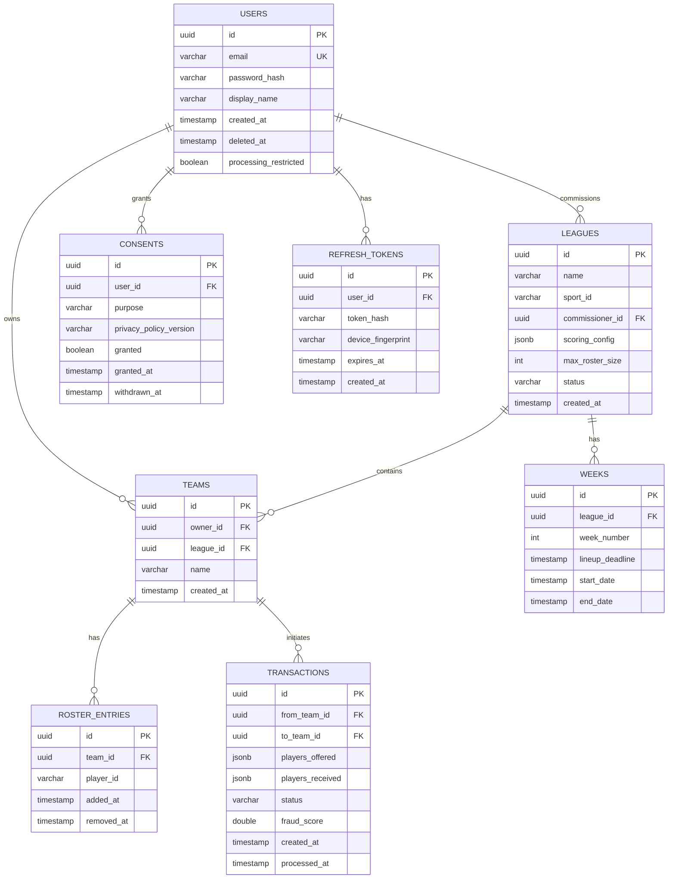

# Database Schema - Fantasy Sports Hub

> **Hybrid Data Architecture**: PostgreSQL (Write Model) + EventStoreDB (Events) + MongoDB (Read Models) + Redis (Cache)

---

## 🗄️ PostgreSQL Schema (Write Model - CRUD)

### Entity Relationship Diagram



---

## 📋 Table Definitions

### users

```sql
CREATE TABLE users (
    id UUID PRIMARY KEY DEFAULT gen_random_uuid(),
    email VARCHAR(255) UNIQUE NOT NULL,
    password_hash VARCHAR(255) NOT NULL,  -- Argon2id
    display_name VARCHAR(100) NOT NULL,
    phone_number VARCHAR(50),  -- Encrypted
    date_of_birth DATE,

    -- Roles (JSONB array)
    roles JSONB NOT NULL DEFAULT '["USER"]',

    -- GDPR/Compliance
    processing_restricted BOOLEAN DEFAULT FALSE,
    restriction_reason VARCHAR(255),
    restricted_at TIMESTAMP,
    deleted_at TIMESTAMP,

    -- Timestamps
    created_at TIMESTAMP NOT NULL DEFAULT NOW(),
    updated_at TIMESTAMP NOT NULL DEFAULT NOW(),

    -- Indexes
    CONSTRAINT users_email_key UNIQUE (email),
    CONSTRAINT users_display_name_length CHECK (char_length(display_name) >= 3)
);

CREATE INDEX idx_users_email ON users(email);
CREATE INDEX idx_users_created_at ON users(created_at);
CREATE INDEX idx_users_deleted_at ON users(deleted_at) WHERE deleted_at IS NOT NULL;
```
---

### leagues

```sql
CREATE TABLE leagues (
    id UUID PRIMARY KEY DEFAULT gen_random_uuid(),
    name VARCHAR(200) NOT NULL,
    sport_id VARCHAR(50) NOT NULL,  -- FUTBOL, BALONCESTO, BASEBALL, etc.
    commissioner_id UUID NOT NULL REFERENCES users(id),

    -- Configuration (JSONB)
    scoring_config JSONB NOT NULL,  -- Sport-specific scoring rules
    draft_config JSONB,  -- Draft settings

    -- Settings
    max_roster_size INT NOT NULL DEFAULT 15,
    max_teams INT NOT NULL DEFAULT 12,
    is_public BOOLEAN DEFAULT FALSE,
    requires_approval BOOLEAN DEFAULT TRUE,

    -- Status
    status VARCHAR(50) NOT NULL DEFAULT 'DRAFT',  -- DRAFT, PRE_SEASON, ACTIVE, PLAYOFFS, FINISHED

    -- Timestamps
    created_at TIMESTAMP NOT NULL DEFAULT NOW(),
    updated_at TIMESTAMP NOT NULL DEFAULT NOW(),
    season_start_date TIMESTAMP,
    season_end_date TIMESTAMP,

    -- Constraints
    CONSTRAINT leagues_max_roster_positive CHECK (max_roster_size > 0),
    CONSTRAINT leagues_max_teams_range CHECK (max_teams BETWEEN 4 AND 20),
    CONSTRAINT leagues_valid_status CHECK (status IN ('DRAFT', 'PRE_SEASON', 'ACTIVE', 'PLAYOFFS', 'FINISHED'))
);

CREATE INDEX idx_leagues_sport ON leagues(sport_id);
CREATE INDEX idx_leagues_commissioner ON leagues(commissioner_id);
CREATE INDEX idx_leagues_status ON leagues(status);
CREATE INDEX idx_leagues_public ON leagues(is_public) WHERE is_public = TRUE;
```

---

### teams

```sql
CREATE TABLE teams (
    id UUID PRIMARY KEY DEFAULT gen_random_uuid(),
    owner_id UUID NOT NULL REFERENCES users(id) ON DELETE CASCADE,
    league_id UUID NOT NULL REFERENCES leagues(id) ON DELETE CASCADE,
    name VARCHAR(100) NOT NULL,

    -- Timestamps
    created_at TIMESTAMP NOT NULL DEFAULT NOW(),
    updated_at TIMESTAMP NOT NULL DEFAULT NOW(),

    -- Constraints
    CONSTRAINT teams_unique_name_per_league UNIQUE (league_id, name),
    CONSTRAINT teams_name_length CHECK (char_length(name) >= 3)
);

CREATE INDEX idx_teams_owner ON teams(owner_id);
CREATE INDEX idx_teams_league ON teams(league_id);
CREATE INDEX idx_teams_league_owner ON teams(league_id, owner_id);
```

---

### weeks

```sql
CREATE TABLE weeks (
    id UUID PRIMARY KEY DEFAULT gen_random_uuid(),
    league_id UUID NOT NULL REFERENCES leagues(id) ON DELETE CASCADE,
    week_number INT NOT NULL,

    -- Dates
    lineup_deadline TIMESTAMP NOT NULL,
    start_date TIMESTAMP NOT NULL,
    end_date TIMESTAMP NOT NULL,

    -- Timestamps
    created_at TIMESTAMP NOT NULL DEFAULT NOW(),

    -- Constraints
    CONSTRAINT weeks_unique_per_league UNIQUE (league_id, week_number),
    CONSTRAINT weeks_valid_dates CHECK (start_date < end_date AND lineup_deadline <= start_date),
    CONSTRAINT weeks_positive_number CHECK (week_number > 0)
);

CREATE INDEX idx_weeks_league ON weeks(league_id);
CREATE INDEX idx_weeks_deadline ON weeks(lineup_deadline);
```

---

### roster_entries

```sql
CREATE TABLE roster_entries (
    id UUID PRIMARY KEY DEFAULT gen_random_uuid(),
    team_id UUID NOT NULL REFERENCES teams(id) ON DELETE CASCADE,
    player_id VARCHAR(100) NOT NULL,  -- External player ID from sports API

    -- Position/Role
    position VARCHAR(50),  -- QB, RB, WR, etc. (sport-specific)

    -- Lifecycle
    added_at TIMESTAMP NOT NULL DEFAULT NOW(),
    removed_at TIMESTAMP,  -- NULL if still active

    -- Constraints
    CONSTRAINT roster_entries_valid_lifecycle CHECK (removed_at IS NULL OR removed_at > added_at)
);

CREATE INDEX idx_roster_team ON roster_entries(team_id);
CREATE INDEX idx_roster_player ON roster_entries(player_id);
CREATE INDEX idx_roster_active ON roster_entries(team_id, player_id) WHERE removed_at IS NULL;

-- Prevent duplicate active players
CREATE UNIQUE INDEX idx_roster_unique_active_player
ON roster_entries(team_id, player_id)
WHERE removed_at IS NULL;
```

---

### transactions

```sql
CREATE TABLE transactions (
    id UUID PRIMARY KEY DEFAULT gen_random_uuid(),
    from_team_id UUID NOT NULL REFERENCES teams(id),
    to_team_id UUID NOT NULL REFERENCES teams(id),

    -- Transaction details
    players_offered JSONB NOT NULL,  -- Array of player IDs
    players_received JSONB NOT NULL,

    -- Status
    status VARCHAR(50) NOT NULL DEFAULT 'PENDING',  -- PENDING, APPROVED, REJECTED, BLOCKED
    fraud_score DOUBLE PRECISION,  -- ML fraud detection score (0.0-1.0)
    fraud_reason TEXT,

    -- Timestamps
    created_at TIMESTAMP NOT NULL DEFAULT NOW(),
    processed_at TIMESTAMP,
    approved_by UUID REFERENCES users(id),

    -- Constraints
    CONSTRAINT transactions_different_teams CHECK (from_team_id != to_team_id),
    CONSTRAINT transactions_valid_status CHECK (status IN ('PENDING', 'APPROVED', 'REJECTED', 'BLOCKED')),
    CONSTRAINT transactions_fraud_score_range CHECK (fraud_score IS NULL OR (fraud_score BETWEEN 0.0 AND 1.0))
);

CREATE INDEX idx_transactions_from_team ON transactions(from_team_id);
CREATE INDEX idx_transactions_to_team ON transactions(to_team_id);
CREATE INDEX idx_transactions_status ON transactions(status);
CREATE INDEX idx_transactions_fraud_high ON transactions(fraud_score) WHERE fraud_score > 0.6;
```

---

### consents (GDPR)

```sql
CREATE TABLE consents (
    id UUID PRIMARY KEY DEFAULT gen_random_uuid(),
    user_id UUID NOT NULL REFERENCES users(id) ON DELETE CASCADE,
    purpose VARCHAR(100) NOT NULL,  -- MARKETING, PERSONALIZATION, ANALYTICS, etc.
    privacy_policy_version VARCHAR(20) NOT NULL,

    -- Consent status
    granted BOOLEAN NOT NULL,
    granted_at TIMESTAMP,
    withdrawn_at TIMESTAMP,

    -- Audit
    ip_address INET,
    user_agent TEXT,

    -- Timestamps
    created_at TIMESTAMP NOT NULL DEFAULT NOW(),

    -- Constraints
    CONSTRAINT consents_valid_lifecycle CHECK (
        (granted = TRUE AND granted_at IS NOT NULL AND withdrawn_at IS NULL)
        OR (granted = FALSE AND withdrawn_at IS NOT NULL)
    )
);

CREATE INDEX idx_consents_user ON consents(user_id);
CREATE INDEX idx_consents_purpose ON consents(user_id, purpose);
CREATE INDEX idx_consents_active ON consents(user_id, purpose)
WHERE granted = TRUE AND withdrawn_at IS NULL;
```

---

### refresh_tokens (JWT)

```sql
CREATE TABLE refresh_tokens (
    id UUID PRIMARY KEY,  -- Token JTI
    user_id UUID NOT NULL REFERENCES users(id) ON DELETE CASCADE,
    token_hash VARCHAR(255) NOT NULL,  -- SHA-256 hash
    device_fingerprint VARCHAR(255),

    -- Expiration
    expires_at TIMESTAMP NOT NULL,

    -- Revocation
    revoked BOOLEAN DEFAULT FALSE,
    revoked_at TIMESTAMP,

    -- Timestamps
    created_at TIMESTAMP NOT NULL DEFAULT NOW(),

    -- Constraints
    CONSTRAINT refresh_tokens_valid_revocation CHECK (
        (revoked = FALSE AND revoked_at IS NULL)
        OR (revoked = TRUE AND revoked_at IS NOT NULL)
    )
);

CREATE INDEX idx_refresh_tokens_user ON refresh_tokens(user_id);
CREATE INDEX idx_refresh_tokens_expires ON refresh_tokens(expires_at);
CREATE INDEX idx_refresh_tokens_active ON refresh_tokens(user_id)
WHERE revoked = FALSE AND expires_at > NOW();

-- Auto-cleanup expired tokens
CREATE INDEX idx_refresh_tokens_cleanup ON refresh_tokens(expires_at)
WHERE expires_at < NOW() OR revoked = TRUE;
```

---

## 🔥 EventStoreDB Streams

### Stream Naming Convention

```
match-{matchId}           # All events for a specific match
player-{playerId}         # All events for a specific player
team-{teamId}             # Team-related events
league-{leagueId}         # League-wide events
security-audit            # Security events
fraud-detection           # Fraud detection events
```

### Event Types

```typescript
// Match Events
PlayerScored {
    eventId: UUID
    matchId: UUID
    playerId: UUID
    sportId: string
    timestamp: Instant
    minute: int
    providerId: string
    metadata: object
    version: long
    recordedAt: Instant
}

PlayerAssisted { ... }
PlayerCarded { ... }
MatchStarted { ... }
MatchEnded { ... }

// Scoring Events
LiveScoreCalculated {
    eventId: UUID
    matchId: UUID
    playerId: UUID
    teamId: UUID
    points: int
    ruleApplied: string
    timestamp: Instant
}

BonusAwarded {
    eventId: UUID
    playerId: UUID
    teamId: UUID
    bonusType: string
    points: int
    description: string
    timestamp: Instant
}

// Security Events
LoginAttempt { ... }
LoginFailed { ... }
LoginSuccessful { ... }
TokenRefreshed { ... }
UnauthorizedAccess { ... }

// Fraud Events
SuspiciousTransactionDetected { ... }
MultiAccountDetected { ... }
CommissionerAbuseDetected { ... }

// GDPR Events
DataExportRequested { ... }
DataDeletionRequested { ... }
ConsentGranted { ... }
ConsentWithdrawn { ... }
```

---

## 📄 MongoDB Collections (Read Models)

### match_projections

```javascript
{
    _id: "match-123",
    matchId: "match-123",
    sportId: "FUTBOL",
    externalMatchId: "api-football-12345",

    status: "IN_PROGRESS",  // SCHEDULED, IN_PROGRESS, FINISHED
    startedAt: ISODate("2025-11-08T15:00:00Z"),
    finishedAt: null,

    // Denormalized match info
    homeTeam: {
        id: "team-456",
        name: "Real Madrid",
        score: 2
    },
    awayTeam: {
        id: "team-789",
        name: "Barcelona",
        score: 1
    },

    // Player events aggregated
    playerEvents: [
        {
            playerId: "player-messi",
            playerName: "Lionel Messi",
            events: [
                { type: "GOL", minute: 23, points: 10 },
                { type: "ASISTENCIA", minute: 67, points: 5 }
            ],
            totalPoints: 15
        }
    ],

    // Metadata
    lastEventVersion: 42,
    lastUpdatedAt: ISODate("2025-11-08T17:30:00Z"),
    providerId: "api-football"
}

// Indexes
db.match_projections.createIndex({ matchId: 1 }, { unique: true })
db.match_projections.createIndex({ sportId: 1, status: 1 })
db.match_projections.createIndex({ startedAt: 1 })
db.match_projections.createIndex({ "playerEvents.playerId": 1 })
```

---

### weekly_team_scores

```javascript
{
    _id: "team-123-week-5",
    teamId: "team-123",
    weekId: "week-5",
    leagueId: "league-456",

    // Denormalized team info
    teamName: "My Fantasy Team",
    ownerName: "John Doe",

    // Scores aggregated
    totalPoints: 145,

    playerScores: {
        "player-messi": {
            playerId: "player-messi",
            playerName: "Lionel Messi",
            position: "DELANTERO",
            totalPoints: 35,
            breakdown: [
                { timestamp: ISODate(...), eventType: "GOL", points: 10, description: "Goal" },
                { timestamp: ISODate(...), eventType: "GOL", points: 10, description: "Goal" },
                { timestamp: ISODate(...), eventType: "GOL", points: 10, description: "Goal" },
                { timestamp: ISODate(...), eventType: "BONUS", points: 5, description: "Hat-trick" }
            ]
        },
        "player-ronaldo": { ... }
    },

    bonuses: [
        {
            playerId: "player-messi",
            bonusType: "HAT_TRICK_PLAYOFF",
            points: 50,
            description: "Hat-trick en playoff ganado",
            awardedAt: ISODate(...)
        }
    ],

    // Metadata
    lastEventVersion: 123,
    lastUpdatedAt: ISODate("2025-11-08T18:00:00Z")
}

// Indexes
db.weekly_team_scores.createIndex({ teamId: 1, weekId: 1 }, { unique: true })
db.weekly_team_scores.createIndex({ leagueId: 1, weekId: 1 })
db.weekly_team_scores.createIndex({ leagueId: 1, "totalPoints": -1 })  // For leaderboards
db.weekly_team_scores.createIndex({ "playerScores.playerId": 1 })
```

---

### player_statistics

```javascript
{
    _id: "player-messi-2025",
    playerId: "player-messi",
    season: "2025",
    sportId: "FUTBOL",

    // Aggregated stats
    gamesPlayed: 38,
    totalPoints: 456,
    averagePointsPerGame: 12.0,

    eventCounts: {
        GOL: 28,
        ASISTENCIA: 15,
        TARJETA_AMARILLA: 3,
        TARJETA_ROJA: 0
    },

    // Trends
    last4WeeksAverage: 14.5,
    trend: "UP",  // UP, DOWN, STABLE

    // Ownership
    ownedByTeamsCount: 45,
    ownershipPercentage: 78.5,

    // Projections (ML-generated)
    projectedPointsNextWeek: 13.2,
    projectionConfidence: 0.85,

    // Metadata
    lastUpdatedAt: ISODate("2025-11-08T20:00:00Z")
}

// Indexes
db.player_statistics.createIndex({ playerId: 1, season: 1 }, { unique: true })
db.player_statistics.createIndex({ sportId: 1, season: 1 })
db.player_statistics.createIndex({ averagePointsPerGame: -1 })
db.player_statistics.createIndex({ ownershipPercentage: -1 })
```

---

## 🔴 Redis Data Structures

### Sessions

```
Key: session:{userId}
Type: Hash
TTL: 30 minutes
Fields: {
    userId: "uuid",
    displayName: "John Doe",
    roles: ["USER", "COMMISSIONER"],
    lastActivity: "timestamp"
}
```

### Live Match State

```
Key: live:match:{matchId}
Type: Hash
TTL: 2 hours
Fields: {
    status: "IN_PROGRESS",
    homeScore: "2",
    awayScore: "1",
    currentMinute: "67",
    lastEvent: "GOL player-messi 67"
}
```

### Leaderboards (Sorted Sets)

```
Key: leaderboard:{leagueId}:{weekId}
Type: Sorted Set
TTL: 10 seconds
Members: teamId → totalPoints (score)

ZADD leaderboard:league-123:week-5 145 team-abc
ZADD leaderboard:league-123:week-5 132 team-def
ZREVRANGE leaderboard:league-123:week-5 0 9  # Top 10
```

### Rate Limiting (Sliding Window)

```
Key: ratelimit:{userId}:{endpoint}
Type: Sorted Set
TTL: 2 minutes
Members: requestId → timestamp

ZADD ratelimit:user-123:/api/teams request-1 1699200000000
ZCARD ratelimit:user-123:/api/teams  # Count requests
ZREMRANGEBYSCORE ratelimit:user-123:/api/teams 0 (now - 60000)  # Cleanup old
```

### Idempotency Keys

```
Key: idempotency:{key}
Type: String
TTL: 24 hours
Value: "1"

SET idempotency:event-abc123 "1" EX 86400 NX
```

---

## 🔧 Database Maintenance

### PostgreSQL

```sql
-- Vacuum and analyze (weekly)
VACUUM ANALYZE;

-- Reindex (monthly)
REINDEX DATABASE fantasy_sports;

-- Archive old data (quarterly)
DELETE FROM refresh_tokens WHERE expires_at < NOW() - INTERVAL '90 days';
DELETE FROM transactions WHERE created_at < NOW() - INTERVAL '2 years' AND status = 'REJECTED';
```

### MongoDB

```javascript
// Compact collections (monthly)
db.runCommand({ compact: "weekly_team_scores" })

// Drop old projections (yearly)
db.weekly_team_scores.deleteMany({
    lastUpdatedAt: { $lt: new Date(Date.now() - 365*24*60*60*1000) }
})
```

### Redis

```bash
# Redis automatically evicts based on TTL
# Manual cleanup if needed:
redis-cli --scan --pattern "session:*" | xargs redis-cli DEL
```

---

## 📊 Capacity Planning

### PostgreSQL

| Table         | Estimated Rows (Year 1) | Growth Rate |
|---------------|-------------------------|-------------|
| users         | 100,000                 | +30K/year   |
| teams         | 500,000                 | +150K/year  |
| leagues       | 50,000                  | +15K/year   |
| roster_entries| 7,500,000               | +2M/year    |
| transactions  | 2,000,000               | +600K/year  |

**Total DB Size (Year 1)**: ~50 GB

### EventStoreDB

| Stream Type   | Events/Day | Retention |
|---------------|------------|-----------|
| Match events  | 500,000    | 5 years   |
| Scoring events| 1,000,000  | 5 years   |
| Audit events  | 100,000    | 2 years   |

**Total Events (Year 1)**: ~500 million
**Storage**: ~500 GB (compressed)

### MongoDB

| Collection        | Documents (Year 1) | Avg Size |
|-------------------|-------------------|----------|
| match_projections | 200,000           | 50 KB    |
| weekly_team_scores| 2,500,000         | 20 KB    |
| player_statistics | 50,000            | 10 KB    |

**Total Size (Year 1)**: ~60 GB

---
