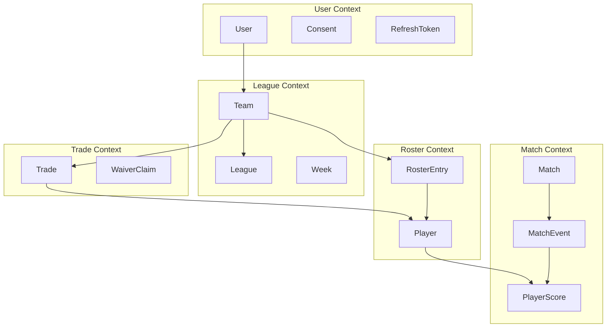

# Data Model

> **Domain-Driven Design**: Aggregates, entities, and value objects with bounded contexts

---

## 🎯 Domain Model Overview



---

## 👤 User Aggregate

### User Entity

```java
/**
 * Aggregate Root: System user.
 */
@Entity
@Table(name = "users")
public class User {

    @Id
    private UUID id;

    @Column(unique = true, nullable = false)
    private String email;

    @Column(nullable = false)
    private String passwordHash;

    @Column(name = "phone_number")
    @Convert(converter = EncryptedStringConverter.class)
    private String phoneNumber;  // Encrypted

    @Enumerated(EnumType.STRING)
    @Column(nullable = false)
    private AccountStatus accountStatus;

    @ElementCollection(fetch = FetchType.EAGER)
    @CollectionTable(name = "user_roles", joinColumns = @JoinColumn(name = "user_id"))
    @Column(name = "role")
    @Enumerated(EnumType.STRING)
    private Set<Role> roles;

    // MFA
    @Column(name = "mfa_secret")
    @Convert(converter = EncryptedStringConverter.class)
    private String mfaSecret;

    @Column(name = "mfa_enabled")
    private boolean mfaEnabled;

    // Audit
    @Column(name = "created_at", nullable = false)
    private Instant createdAt;

    @Column(name = "last_login_at")
    private Instant lastLoginAt;

    // GDPR
    @Column(name = "deletion_date")
    private Instant deletionDate;

    // Value Objects
    @Embedded
    private UserPreferences preferences;

    // Business Logic
    public void enableMFA(String secret) {
        this.mfaSecret = secret;
        this.mfaEnabled = true;
    }

    public void updateLastLogin() {
        this.lastLoginAt = Instant.now();
    }

    public boolean canCreateLeague() {
        return accountStatus == AccountStatus.ACTIVE && !roles.isEmpty();
    }
}

/**
 * Value Object: Preferencias de usuario.
 */
@Embeddable
public class UserPreferences {

    @Column(name = "timezone")
    private String timezone;

    @Column(name = "language")
    private String language;

    @Column(name = "email_notifications")
    private boolean emailNotifications;

    @Column(name = "push_notifications")
    private boolean pushNotifications;
}
```

---

## 🏆 League Aggregate

### League Entity

```java
/**
 * Aggregate Root: Liga fantasy.
 */
@Entity
@Table(name = "leagues")
public class League {

    @Id
    private UUID id;

    @Column(nullable = false)
    private String name;

    @Column(name = "sport_id", nullable = false)
    private String sportId;

    @Column(name = "commissioner_id", nullable = false)
    private UUID commissionerId;

    @Column(name = "max_teams", nullable = false)
    private int maxTeams;

    @Enumerated(EnumType.STRING)
    @Column(nullable = false)
    private LeagueType leagueType;

    @Enumerated(EnumType.STRING)
    @Column(nullable = false)
    private LeagueStatus status;

    @Column(name = "draft_date")
    private Instant draftDate;

    @Column(name = "season_start_date")
    private LocalDate seasonStartDate;

    @Column(name = "season_end_date")
    private LocalDate seasonEndDate;

    @Column(name = "created_at", nullable = false)
    private Instant createdAt;

    // Value Objects
    @Embedded
    private LeagueSettings settings;

    @Embedded
    private ScoringSettings scoringSettings;

    // Business Logic
    public boolean canAddTeam() {
        return getCurrentTeamCount() < maxTeams && status == LeagueStatus.DRAFT;
    }

    public void startSeason() {
        if (status != LeagueStatus.DRAFT) {
            throw new IllegalStateException("Can only start season from DRAFT status");
        }
        if (getCurrentTeamCount() < 2) {
            throw new IllegalStateException("Need at least 2 teams to start");
        }
        this.status = LeagueStatus.ACTIVE;
    }

    private int getCurrentTeamCount() {
        // Query teams count
        return 0;  // Implementation
    }
}

/**
 * Value Object: Configuración de liga.
 */
@Embeddable
public class LeagueSettings {

    @Column(name = "roster_size")
    private int rosterSize;

    @Column(name = "playoff_teams")
    private int playoffTeams;

    @Column(name = "trade_deadline_week")
    private int tradeDeadlineWeek;

    @Column(name = "waiver_period_hours")
    private int waiverPeriodHours;

    @Column(name = "allow_trades")
    private boolean allowTrades;
}

/**
 * Value Object: Configuración de puntuación.
 */
@Embeddable
public class ScoringSettings {

    @Column(name = "scoring_type")
    @Enumerated(EnumType.STRING)
    private ScoringType scoringType;

    @Column(name = "custom_rules", columnDefinition = "JSONB")
    private String customRulesJson;

    public Map<String, Integer> getCustomRules() {
        // Parse JSON
        return Map.of();  // Implementation
    }
}
```

### Team Entity

```java
/**
 * Entity: Equipo fantasy.
 */
@Entity
@Table(name = "teams")
public class Team {

    @Id
    private UUID id;

    @Column(nullable = false)
    private String name;

    @Column(name = "owner_id", nullable = false)
    private UUID ownerId;

    @Column(name = "league_id", nullable = false)
    private UUID leagueId;

    @Column(nullable = false)
    private int wins;

    @Column(nullable = false)
    private int losses;

    @Column(nullable = false)
    private int ties;

    @Column(name = "total_points", nullable = false)
    private BigDecimal totalPoints;

    @Column(name = "draft_position")
    private Integer draftPosition;

    @Column(name = "waiver_priority")
    private Integer waiverPriority;

    @Column(name = "created_at", nullable = false)
    private Instant createdAt;

    // Business Logic
    public void recordWin(BigDecimal points) {
        this.wins++;
        this.totalPoints = this.totalPoints.add(points);
    }

    public void recordLoss(BigDecimal points) {
        this.losses++;
        this.totalPoints = this.totalPoints.add(points);
    }

    public boolean canProposeTrade(Instant now, int tradeDeadlineWeek, int currentWeek) {
        return currentWeek < tradeDeadlineWeek;
    }
}
```

---

## 🎮 Roster Aggregate

### RosterEntry Entity

```java
/**
 * Entity: Entrada en el roster de un equipo.
 */
@Entity
@Table(name = "roster_entries")
public class RosterEntry {

    @Id
    private UUID id;

    @Column(name = "team_id", nullable = false)
    private UUID teamId;

    @Column(name = "week_id", nullable = false)
    private UUID weekId;

    @Column(name = "player_id", nullable = false)
    private UUID playerId;

    @Enumerated(EnumType.STRING)
    @Column(nullable = false)
    private RosterStatus status;  // STARTER, BENCH, IR

    @Column(nullable = false)
    private int position;  // Position in lineup (0-based)

    @Column(name = "points_earned")
    private BigDecimal pointsEarned;

    @Column(name = "acquired_at", nullable = false)
    private Instant acquiredAt;

    // Business Logic
    public void setAsStarter(int position) {
        this.status = RosterStatus.STARTER;
        this.position = position;
    }

    public void setAsBench() {
        this.status = RosterStatus.BENCH;
        this.position = -1;
    }

    public boolean canBeStarted(Week week, Instant now) {
        // Can't change lineup after week starts
        return now.isBefore(week.getStartTime());
    }
}

/**
 * Value Object: Player reference (no full entity, just ID + metadata).
 */
@Embeddable
public class PlayerReference {

    @Column(name = "player_id")
    private UUID playerId;

    @Column(name = "player_name")
    private String playerName;

    @Column(name = "player_position")
    private String position;

    @Column(name = "player_team")
    private String team;
}
```

---

## 🔄 Trade Aggregate

### Trade Entity

```java
/**
 * Aggregate Root: Trade entre equipos.
 */
@Entity
@Table(name = "trades")
public class Trade {

    @Id
    private UUID id;

    @Column(name = "league_id", nullable = false)
    private UUID leagueId;

    @Column(name = "offering_team_id", nullable = false)
    private UUID offeringTeamId;

    @Column(name = "receiving_team_id", nullable = false)
    private UUID receivingTeamId;

    @ElementCollection
    @CollectionTable(name = "trade_offered_players", joinColumns = @JoinColumn(name = "trade_id"))
    @Column(name = "player_id")
    private List<UUID> offeredPlayers;

    @ElementCollection
    @CollectionTable(name = "trade_requested_players", joinColumns = @JoinColumn(name = "trade_id"))
    @Column(name = "player_id")
    private List<UUID> requestedPlayers;

    @Enumerated(EnumType.STRING)
    @Column(nullable = false)
    private TradeStatus status;

    @Column(name = "proposed_at", nullable = false)
    private Instant proposedAt;

    @Column(name = "decided_at")
    private Instant decidedAt;

    @Column(name = "fraud_score")
    private Double fraudScore;

    @Column(name = "requires_commissioner_approval")
    private boolean requiresCommissionerApproval;

    @Column(name = "message", length = 500)
    private String message;

    // Business Logic
    public void accept(UUID decidingUserId) {
        validateCanDecide(decidingUserId);

        this.status = TradeStatus.ACCEPTED;
        this.decidedAt = Instant.now();

        // Domain event
        DomainEvents.raise(new TradeAccepted(this.id, decidingUserId));
    }

    public void reject(UUID decidingUserId, String reason) {
        validateCanDecide(decidingUserId);

        this.status = TradeStatus.REJECTED;
        this.decidedAt = Instant.now();

        DomainEvents.raise(new TradeRejected(this.id, decidingUserId, reason));
    }

    public void flagForReview(double fraudScore) {
        this.fraudScore = fraudScore;
        this.requiresCommissionerApproval = fraudScore > 0.7;
    }

    private void validateCanDecide(UUID userId) {
        if (status != TradeStatus.PENDING) {
            throw new IllegalStateException("Trade already decided");
        }
        // Only receiving team can decide
        // (Commissioner approval is separate flow)
    }
}
```

---

## ⚽ Match Context (Event Sourcing)

### Match Events

```java
/**
 * Event: Base para eventos de partido.
 */
public sealed interface MatchEvent permits
    MatchStarted, MatchEnded, GoalScored, YellowCard, RedCard {

    UUID eventId();
    UUID matchId();
    Instant timestamp();
    String sportId();
    String providerId();
}

/**
 * Event: Gol anotado.
 */
public record GoalScored(
    UUID eventId,
    UUID matchId,
    Instant timestamp,
    String sportId,
    String providerId,
    UUID playerId,
    UUID teamId,
    int minute,
    boolean isPenalty,
    UUID assistPlayerId
) implements MatchEvent {}

/**
 * Event: Partido iniciado.
 */
public record MatchStarted(
    UUID eventId,
    UUID matchId,
    Instant timestamp,
    String sportId,
    String providerId,
    UUID homeTeamId,
    UUID awayTeamId
) implements MatchEvent {}
```

### Match Projection (Read Model)

```java
/**
 * Proyección: Estado actual del partido (MongoDB).
 */
@Document(collection = "match_projections")
public class MatchProjection {

    @Id
    private String id;  // matchId

    private String sportId;
    private MatchStatus status;

    private UUID homeTeamId;
    private UUID awayTeamId;

    private int homeScore;
    private int awayScore;

    private Instant scheduledTime;
    private Instant startTime;
    private Instant endTime;

    private int currentMinute;

    private List<GoalInfo> goals;
    private List<CardInfo> cards;

    private Map<String, PlayerStats> playerStats;

    // Reconstrucción desde eventos
    public void apply(MatchEvent event) {
        switch (event) {
            case MatchStarted started -> {
                this.status = MatchStatus.LIVE;
                this.startTime = started.timestamp();
            }
            case GoalScored goal -> {
                if (goal.teamId().equals(homeTeamId)) {
                    this.homeScore++;
                } else {
                    this.awayScore++;
                }
                this.goals.add(new GoalInfo(goal));
            }
            case MatchEnded ended -> {
                this.status = MatchStatus.FINISHED;
                this.endTime = ended.timestamp();
            }
            default -> {}
        }
    }
}

/**
 * Value Object: Información de gol.
 */
public record GoalInfo(
    UUID playerId,
    UUID teamId,
    int minute,
    boolean isPenalty,
    Instant scoredAt
) {
    public GoalInfo(GoalScored event) {
        this(
            event.playerId(),
            event.teamId(),
            event.minute(),
            event.isPenalty(),
            event.timestamp()
        );
    }
}
```

---

## 📊 Player Scoring (Event Sourcing)

### PlayerScore Projection

```java
/**
 * Proyección: Puntos de jugador por semana (MongoDB).
 */
@Document(collection = "player_weekly_stats")
public class PlayerWeeklyStats {

    @Id
    private String id;  // playerId:weekId

    private UUID playerId;
    private UUID weekId;
    private String leagueId;

    private BigDecimal totalPoints;
    private BigDecimal livePoints;
    private BigDecimal bonusPoints;

    private List<ScoringEvent> events;

    private Map<String, Integer> eventCounts;  // GOL: 3, ASISTENCIA: 2, etc.

    private Instant lastUpdated;

    // Reconstrucción desde eventos
    public void apply(PlayerScoreUpdate update) {
        if (update.isBonus()) {
            this.bonusPoints = this.bonusPoints.add(BigDecimal.valueOf(update.points()));
        } else {
            this.livePoints = this.livePoints.add(BigDecimal.valueOf(update.points()));
        }

        this.totalPoints = this.livePoints.add(this.bonusPoints);
        this.events.add(new ScoringEvent(update));
        this.lastUpdated = Instant.now();

        // Update event counts
        eventCounts.merge(update.eventType(), 1, Integer::sum);
    }
}
```

---

## 🔗 Relationships & Constraints

### Foreign Keys

```sql
ALTER TABLE teams
    ADD CONSTRAINT fk_teams_owner
    FOREIGN KEY (owner_id) REFERENCES users(id) ON DELETE CASCADE;

ALTER TABLE teams
    ADD CONSTRAINT fk_teams_league
    FOREIGN KEY (league_id) REFERENCES leagues(id) ON DELETE CASCADE;

ALTER TABLE roster_entries
    ADD CONSTRAINT fk_roster_team
    FOREIGN KEY (team_id) REFERENCES teams(id) ON DELETE CASCADE;

            ALTER TABLE trades
                ADD CONSTRAINT fk_trades_league
                FOREIGN KEY (league_id) REFERENCES leagues(id);
```

### Unique Constraints

```sql
-- Un usuario solo puede tener un equipo por liga
CREATE UNIQUE INDEX idx_teams_unique_owner_league
    ON teams(owner_id, league_id);

-- Un jugador solo puede estar en un roster activo por semana
CREATE UNIQUE INDEX idx_roster_unique_player_week
    ON roster_entries(player_id, week_id)
    WHERE status != 'DROPPED';

-- Email único
CREATE UNIQUE INDEX idx_users_email
    ON users(email);
```

---
