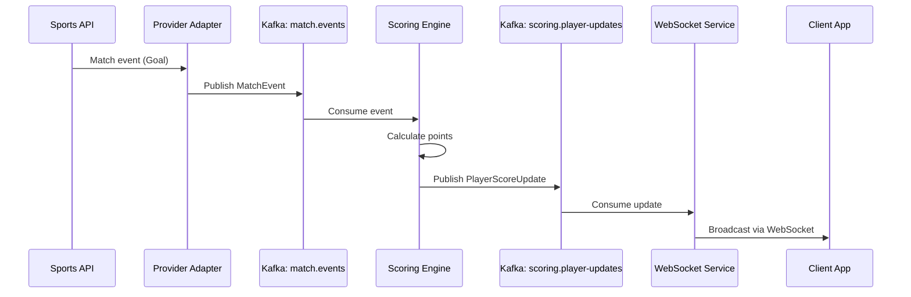
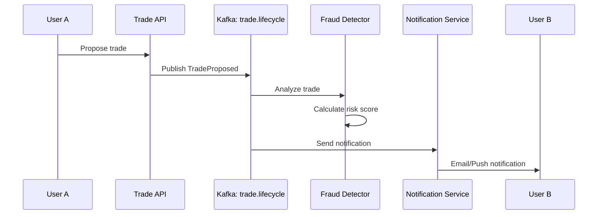

# Kafka Topology

> **Event-Driven Architecture**: Topics, partitions, and consumer groups for distributed processing

---

## 🎯 Kafka Cluster Configuration

### Cluster Spec

```yaml
brokers: 3
replication_factor: 3
min_in_sync_replicas: 2
retention: 7 days (default)
compression: snappy
```

---

## 📋 Topic Catalog

### Topic Naming Convention

```
<domain>.<entity>.<event-type>
```

Examples:
- `match.events.live` - Live match events
- `scoring.updates.calculated` - Score calculations
- `trade.proposals.submitted` - Trade proposals
- `user.actions.performed` - User actions

---

## 🗂️ Core Topics

### match.events

**Purpose**: Real-time match events stream

**Configuration**:
```yaml
partitions: 24
replication_factor: 3
retention_ms: 604800000  # 7 days
compression_type: snappy
min_in_sync_replicas: 2
```

**Partition Key**: `matchId` (ensures all events for same match go to same partition)

**Schema**:
```json
{
  "eventId": "uuid",
  "matchId": "uuid",
  "sportId": "string",
  "providerId": "string",
  "timestamp": "iso8601",
  "eventType": "string",  // GOAL, ASSIST, CARD, etc.
  "playerId": "uuid",
  "teamId": "uuid",
  "minute": "integer",
  "metadata": "object"
}
```

**Producers**:
- Provider adapters (API-Football, API-Sports, etc.)

**Consumers**:
- Live scoring engine
- Match state projection
- Analytics service

---

### scoring.player-updates

**Purpose**: Player score updates

**Configuration**:
```yaml
partitions: 12
replication_factor: 3
retention_ms: 259200000  # 3 days
compression_type: snappy
```

**Partition Key**: `playerId`

**Schema**:
```json
{
  "updateId": "uuid",
  "playerId": "uuid",
  "matchId": "uuid",
  "leagueId": "uuid",
  "weekId": "uuid",
  "pointsAdded": "number",
  "totalPoints": "number",
  "eventType": "string",
  "timestamp": "iso8601",
  "isBonus": "boolean"
}
```

**Producers**:
- Live scoring engine
- Post-match bonus engine

**Consumers**:
- WebSocket broadcast service
- Team score aggregator
- League standings updater

---

### trade.lifecycle

**Purpose**: Eventos del ciclo de vida de trades

**Configuration**:
```yaml
partitions: 6
replication_factor: 3
retention_ms: 2592000000  # 30 days
compression_type: snappy
```

**Partition Key**: `tradeId`

**Schema**:
```json
{
  "eventId": "uuid",
  "tradeId": "uuid",
  "leagueId": "uuid",
  "eventType": "string",  // PROPOSED, ACCEPTED, REJECTED, CANCELLED
  "offeringTeamId": "uuid",
  "receivingTeamId": "uuid",
  "offeredPlayers": ["uuid"],
  "requestedPlayers": ["uuid"],
  "timestamp": "iso8601",
  "metadata": "object"
}
```

**Producers**:
- Trade service

**Consumers**:
- Notification service
- Fraud detection service
- Audit log service

---

### league.updates

**Purpose**: Actualizaciones de configuración de ligas

**Configuration**:
```yaml
partitions: 3
replication_factor: 3
retention_ms: 2592000000  # 30 days
compression_type: snappy
```

**Partition Key**: `leagueId`

**Schema**:
```json
{
  "eventId": "uuid",
  "leagueId": "uuid",
  "eventType": "string",  // CREATED, SETTINGS_CHANGED, TEAM_JOINED, TEAM_LEFT
  "timestamp": "iso8601",
  "changes": "object",
  "initiatedBy": "uuid"
}
```

---

### notifications.outbox

**Purpose**: Outbox pattern para notificaciones

**Configuration**:
```yaml
partitions: 6
replication_factor: 3
retention_ms: 86400000  # 1 day
compression_type: snappy
```

**Partition Key**: `userId`

**Schema**:
```json
{
  "notificationId": "uuid",
  "userId": "uuid",
  "type": "string",  // EMAIL, PUSH, IN_APP
  "channel": "string",
  "subject": "string",
  "body": "string",
  "priority": "string",  // HIGH, NORMAL, LOW
  "timestamp": "iso8601",
  "metadata": "object"
}
```

---

## 🔄 Consumer Groups

### scoring-engine

**Topics**: `match.events`

**Concurrency**: 24 consumers (1 per partition)

**Processing**:
```java
@KafkaListener(
    topics = "match.events",
    groupId = "scoring-engine",
    concurrency = "24"
)
public void consumeMatchEvents(MatchEvent event) {
    scoringEngine.processEvent(event)
        .subscribe();
}
```

**Offset Management**: Auto-commit disabled, manual commit after processing

---

### websocket-broadcaster

**Topics**: `scoring.player-updates`

**Concurrency**: 12 consumers

**Processing**:
```java
@KafkaListener(
    topics = "scoring.player-updates",
    groupId = "websocket-broadcaster",
    concurrency = "12"
)
public void broadcastUpdate(PlayerScoreUpdate update) {
    webSocketService.broadcastToSubscribers(update)
        .subscribe();
}
```

---

### projection-updater

**Topics**: `match.events`, `scoring.player-updates`

**Concurrency**: 6 consumers

**Processing**: Updates read models (MongoDB projections)

---

### fraud-detector

**Topics**: `trade.lifecycle`, `user.actions`

**Concurrency**: 3 consumers

**Processing**: Analyzes trades and user actions for fraud

---

## 📊 Data Flow Diagrams

### Live Scoring Flow



### Trade Flow



---

## 🔧 Producer Configuration

### Java Producer

```java
@Configuration
public class KafkaProducerConfig {

    @Bean
    public ProducerFactory<String, MatchEvent> producerFactory() {
        Map<String, Object> config = new HashMap<>();

        // Connection
        config.put(ProducerConfig.BOOTSTRAP_SERVERS_CONFIG, kafkaBootstrapServers);
        config.put(ProducerConfig.KEY_SERIALIZER_CLASS_CONFIG, StringSerializer.class);
        config.put(ProducerConfig.VALUE_SERIALIZER_CLASS_CONFIG, JsonSerializer.class);

        // Reliability
        config.put(ProducerConfig.ACKS_CONFIG, "all");  // Wait for all replicas
        config.put(ProducerConfig.ENABLE_IDEMPOTENCE_CONFIG, true);  // Exactly-once
        config.put(ProducerConfig.RETRIES_CONFIG, Integer.MAX_VALUE);
        config.put(ProducerConfig.MAX_IN_FLIGHT_REQUESTS_PER_CONNECTION, 5);

        // Performance
        config.put(ProducerConfig.BATCH_SIZE_CONFIG, 32768);  // 32KB batches
        config.put(ProducerConfig.LINGER_MS_CONFIG, 10);  // Wait 10ms for batching
        config.put(ProducerConfig.COMPRESSION_TYPE_CONFIG, "snappy");
        config.put(ProducerConfig.BUFFER_MEMORY_CONFIG, 67108864);  // 64MB buffer

        return new DefaultKafkaProducerFactory<>(config);
    }

    @Bean
    public KafkaTemplate<String, MatchEvent> kafkaTemplate() {
        return new KafkaTemplate<>(producerFactory());
    }
}
```

### Publishing Messages

```java
@Service
public class MatchEventPublisher {

    private final KafkaTemplate<String, MatchEvent> kafkaTemplate;

    /**
     * Publish con callback para confirmar éxito.
     */
    public Mono<SendResult<String, MatchEvent>> publishEvent(MatchEvent event) {
        return Mono.fromFuture(
            kafkaTemplate.send(
                "match.events",
                event.matchId().toString(),  // Partition key
                event
            )
        )
        .doOnSuccess(result ->
            log.info("Event published: partition={}, offset={}",
                result.getRecordMetadata().partition(),
                result.getRecordMetadata().offset()
            )
        )
        .doOnError(error ->
            log.error("Failed to publish event: {}", event, error)
        );
    }

    /**
     * Publish con transacciones para exactamente-una-vez.
     */
    @Transactional
    public Mono<Void> publishEventsTransactional(List<MatchEvent> events) {
        return Flux.fromIterable(events)
            .flatMap(this::publishEvent)
            .then();
    }
}
```

---

## 🔧 Consumer Configuration

### Java Consumer

```java
@Configuration
public class KafkaConsumerConfig {

    @Bean
    public ConsumerFactory<String, MatchEvent> consumerFactory() {
        Map<String, Object> config = new HashMap<>();

        // Connection
        config.put(ConsumerConfig.BOOTSTRAP_SERVERS_CONFIG, kafkaBootstrapServers);
        config.put(ConsumerConfig.KEY_DESERIALIZER_CLASS_CONFIG, StringDeserializer.class);
        config.put(ConsumerConfig.VALUE_DESERIALIZER_CLASS_CONFIG, JsonDeserializer.class);
        config.put(JsonDeserializer.TRUSTED_PACKAGES, "com.fantasy.events");

        // Consumer group
        config.put(ConsumerConfig.GROUP_ID_CONFIG, "scoring-engine");

        // Offset management
        config.put(ConsumerConfig.AUTO_OFFSET_RESET_CONFIG, "earliest");
        config.put(ConsumerConfig.ENABLE_AUTO_COMMIT_CONFIG, false);  // Manual commit

        // Performance
        config.put(ConsumerConfig.FETCH_MIN_BYTES_CONFIG, 1024);  // 1KB minimum
        config.put(ConsumerConfig.FETCH_MAX_WAIT_MS_CONFIG, 500);
        config.put(ConsumerConfig.MAX_POLL_RECORDS_CONFIG, 500);

        // Session management
        config.put(ConsumerConfig.SESSION_TIMEOUT_MS_CONFIG, 30000);
        config.put(ConsumerConfig.HEARTBEAT_INTERVAL_MS_CONFIG, 10000);

        return new DefaultKafkaConsumerFactory<>(config);
    }

    @Bean
    public ConcurrentKafkaListenerContainerFactory<String, MatchEvent> kafkaListenerContainerFactory() {
        var factory = new ConcurrentKafkaListenerContainerFactory<String, MatchEvent>();
        factory.setConsumerFactory(consumerFactory());
        factory.setConcurrency(24);  // 24 consumer threads
        factory.setBatchListener(false);
        factory.getContainerProperties().setAckMode(ContainerProperties.AckMode.MANUAL);
        return factory;
    }
}
```

### Consuming Messages

```java
@Service
public class MatchEventConsumer {

    @KafkaListener(
        topics = "match.events",
        groupId = "scoring-engine",
        concurrency = "24"
    )
    public void consume(
        ConsumerRecord<String, MatchEvent> record,
        Acknowledgment ack
    ) {
        var event = record.value();

        log.debug("Consuming event: partition={}, offset={}",
            record.partition(),
            record.offset()
        );

        try {
            // Process event
            scoringEngine.processEvent(event).block();

            // Manual commit after successful processing
            ack.acknowledge();

        } catch (Exception e) {
            log.error("Error processing event: {}", event, e);
            // Don't acknowledge - will retry
        }
    }

    /**
     * Batch consumption para mejor throughput.
     */
    @KafkaListener(
        topics = "match.events",
        groupId = "projection-updater",
        containerFactory = "batchListenerFactory"
    )
    public void consumeBatch(
        List<ConsumerRecord<String, MatchEvent>> records,
        Acknowledgment ack
    ) {
        var events = records.stream()
            .map(ConsumerRecord::value)
            .collect(Collectors.toList());

        try {
            projectionUpdater.updateBatch(events).block();
            ack.acknowledge();

        } catch (Exception e) {
            log.error("Error processing batch", e);
        }
    }
}
```

---

## 🔍 Monitoring Kafka

### Key Metrics

```yaml
# Consumer lag
kafka_consumer_lag{group="scoring-engine", topic="match.events", partition="0"}

# Messages per second (producer)
rate(kafka_producer_record_send_total[1m])

# Failed messages
kafka_consumer_failed_total

# Broker disk usage
kafka_log_log_size_bytes

# Under-replicated partitions
kafka_server_replicamanager_underreplicatedpartitions
```

### Kafka Manager Commands

```bash
# List topics
kafka-topics --bootstrap-server kafka:9092 --list

# Describe topic
kafka-topics --bootstrap-server kafka:9092 --describe --topic match.events

# Check consumer lag
kafka-consumer-groups --bootstrap-server kafka:9092 --describe --group scoring-engine

# Produce test message
kafka-console-producer --bootstrap-server kafka:9092 --topic match.events

# Consume messages
kafka-console-consumer --bootstrap-server kafka:9092 --topic match.events --from-beginning

# Increase partitions
kafka-topics --bootstrap-server kafka:9092 --alter --topic match.events --partitions 48

# Delete topic (CAUTION!)
kafka-topics --bootstrap-server kafka:9092 --delete --topic old-topic
```

---

## 📈 Capacity Planning

### Throughput Estimates

| Topic                 | Messages/sec | Avg Size | Throughput |
|-----------------------|--------------|----------|------------|
| match.events          | 1000         | 500 bytes | 500 KB/s |
| scoring.player-updates| 5000         | 300 bytes | 1.5 MB/s |
| trade.lifecycle       | 10           | 1 KB      | 10 KB/s    |
| notifications.outbox  | 500          | 400 bytes | 200 KB/s   |

**Total**: ~2.2 MB/s

### Storage Requirements

```
Storage per day = Throughput * 86400 seconds * Replication Factor
                = 2.2 MB/s * 86400 * 3
                = 570 GB/day

7-day retention = 570 GB * 7 = ~4 TB
```

---
