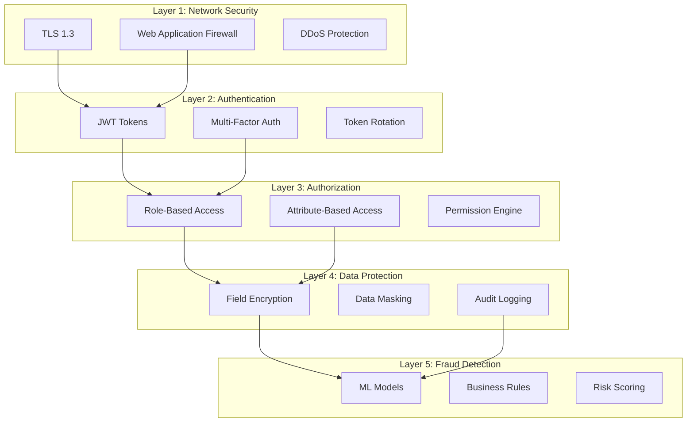

# Security Architecture

> **Defense in Depth**: Multiple security layers with JWT, RBAC/ABAC, encryption, and fraud detection

---

## 🎯 Security Layers



---

## 🔐 Authentication Layer

### JWT Token Structure

```java
/**
 * JWT Claims for authentication.
 */
public record JWTClaims(
    UUID userId,
    String email,
    Set<String> roles,
    Map<String, Object> attributes,
    Instant issuedAt,
    Instant expiresAt,
    String tokenId,           // For revocation
    String deviceFingerprint  // For fraud detection
) {}

/**
 * Token generation service.
 */
@Service
public class JWTService {

    private final JWTConfig config;
    private final Algorithm algorithm;

    public JWTService(JWTConfig config) {
        this.config = config;
        this.algorithm = Algorithm.HMAC512(config.secret());
    }

    /**
     * Generates short-lived access token.
     */
    public String generateAccessToken(User user, String deviceFingerprint) {
        var now = Instant.now();

        return JWT.create()
            .withIssuer(config.issuer())
            .withSubject(user.id().toString())
            .withClaim("email", user.email())
            .withClaim("roles", new ArrayList<>(user.roles()))
            .withClaim("deviceFingerprint", deviceFingerprint)
            .withIssuedAt(now)
            .withExpiresAt(now.plus(config.accessTokenDuration()))
            .withJWTId(UUID.randomUUID().toString())
            .sign(algorithm);
    }

    /**
     * Genera refresh token (larga duración).
     */
    public String generateRefreshToken(User user) {
        var now = Instant.now();

        return JWT.create()
            .withIssuer(config.issuer())
            .withSubject(user.id().toString())
            .withIssuedAt(now)
            .withExpiresAt(now.plus(config.refreshTokenDuration()))
            .withJWTId(UUID.randomUUID().toString())
            .sign(algorithm);
    }

    /**
     * Valida y decodifica token.
     */
    public Mono<JWTClaims> validateToken(String token) {
        return Mono.fromCallable(() -> {
            var verifier = JWT.require(algorithm)
                .withIssuer(config.issuer())
                .build();

            var decodedJWT = verifier.verify(token);

            return new JWTClaims(
                UUID.fromString(decodedJWT.getSubject()),
                decodedJWT.getClaim("email").asString(),
                Set.copyOf(decodedJWT.getClaim("roles").asList(String.class)),
                decodedJWT.getClaims(),
                decodedJWT.getIssuedAtAsInstant(),
                decodedJWT.getExpiresAtAsInstant(),
                decodedJWT.getId(),
                decodedJWT.getClaim("deviceFingerprint").asString()
            );
        })
        .onErrorMap(JWTVerificationException.class, e ->
            new AuthenticationException("Invalid token", e)
        );
    }
}
```

### Token Rotation

```java
/**
 * Rotación automática de tokens para mayor seguridad.
 */
@Service
public class TokenRotationService {

    private final JWTService jwtService;
    private final RefreshTokenRepository refreshTokenRepo;
    private final RedisTemplate<String, String> redisTemplate;

    /**
     * Refresh: genera nuevo access token + opcionalmente rota refresh token.
     */
    public Mono<TokenPair> refreshTokens(String refreshToken) {
        return jwtService.validateToken(refreshToken)
            .flatMap(claims -> {
                // Verificar que refresh token no esté revocado
                return refreshTokenRepo.findByTokenId(claims.tokenId())
                    .switchIfEmpty(Mono.error(
                        new AuthenticationException("Refresh token revoked")
                    ))
                    .flatMap(storedToken -> {
                        if (storedToken.isExpired()) {
                            return Mono.error(
                                new AuthenticationException("Refresh token expired")
                            );
                        }

                        // Generar nuevo access token
                        var user = storedToken.user();
                        var newAccessToken = jwtService.generateAccessToken(
                            user,
                            claims.deviceFingerprint()
                        );

                        // Rotar refresh token si está cerca de expirar
                        if (shouldRotateRefreshToken(storedToken)) {
                            return rotateRefreshToken(storedToken, user)
                                .map(newRefreshToken ->
                                    new TokenPair(newAccessToken, newRefreshToken)
                                );
                        }

                        return Mono.just(new TokenPair(newAccessToken, refreshToken));
                    });
            });
    }

    private boolean shouldRotateRefreshToken(RefreshToken token) {
        var now = Instant.now();
        var expiresAt = token.expiresAt();
        var remainingTime = Duration.between(now, expiresAt);

        // Rotar si quedan menos de 7 días
        return remainingTime.toDays() < 7;
    }

    private Mono<String> rotateRefreshToken(RefreshToken oldToken, User user) {
        var newRefreshToken = jwtService.generateRefreshToken(user);

        return refreshTokenRepo.delete(oldToken)
            .then(refreshTokenRepo.save(
                new RefreshToken(
                    UUID.randomUUID(),
                    user.id(),
                    newRefreshToken,
                    Instant.now().plus(Duration.ofDays(30)),
                    false
                )
            ))
            .thenReturn(newRefreshToken);
    }

    /**
     * Revoca token (logout).
     */
    public Mono<Void> revokeToken(String tokenId) {
        // Agregar a blacklist en Redis (TTL = duración restante del token)
        return Mono.fromRunnable(() ->
            redisTemplate.opsForValue().set(
                "blacklist:" + tokenId,
                "revoked",
                Duration.ofHours(24)
            )
        ).then();
    }
}
```

### Multi-Factor Authentication

```java
/**
 * MFA con TOTP (Time-based One-Time Password).
 */
@Service
public class MFAService {

    private final TOTPGenerator totpGenerator;
    private final UserRepository userRepo;

    /**
     * Genera secret para nuevo usuario MFA.
     */
    public Mono<MFASetup> setupMFA(UUID userId) {
        var secret = totpGenerator.generateSecret();

        return userRepo.findById(userId)
            .flatMap(user -> {
                user.setMfaSecret(secret);
                user.setMfaEnabled(false);  // Requiere verificación

                return userRepo.save(user)
                    .map(savedUser -> new MFASetup(
                        secret,
                        generateQRCode(user.email(), secret)
                    ));
            });
    }

    /**
     * Verifica código TOTP y activa MFA.
     */
    public Mono<Boolean> verifyAndEnableMFA(UUID userId, String code) {
        return userRepo.findById(userId)
            .flatMap(user -> {
                if (user.mfaSecret() == null) {
                    return Mono.error(new IllegalStateException("MFA not setup"));
                }

                var isValid = totpGenerator.verify(code, user.mfaSecret());

                if (isValid) {
                    user.setMfaEnabled(true);
                    return userRepo.save(user).thenReturn(true);
                }

                return Mono.just(false);
            });
    }

    /**
     * Valida código TOTP durante login.
     */
    public Mono<Boolean> validateMFACode(UUID userId, String code) {
        return userRepo.findById(userId)
            .map(user -> {
                if (!user.mfaEnabled()) {
                    return true;  // MFA no habilitado
                }

                return totpGenerator.verify(code, user.mfaSecret());
            });
    }

    private String generateQRCode(String email, String secret) {
        var otpauthURL = String.format(
            "otpauth://totp/FantasySports:%s?secret=%s&issuer=FantasySports",
            email,
            secret
        );

        // Generar QR code image (usando ZXing o similar)
        return otpauthURL;
    }
}
```

---

## 🛡️ Authorization Layer

### RBAC + ABAC Hybrid

```java
/**
 * Roles del sistema.
 */
public enum Role {
    USER,           // Usuario estándar
    COMMISSIONER,   // Comisionado de liga
    ADMIN,          // Administrador del sistema
    MODERATOR       // Moderador
}

/**
 * Permisos granulares.
 */
public enum Permission {
    // League management
    CREATE_LEAGUE,
    DELETE_LEAGUE,
    UPDATE_LEAGUE_SETTINGS,
    INVITE_USERS,

    // Team management
    MANAGE_ROSTER,
    PROPOSE_TRADE,
    SUBMIT_WAIVER_CLAIM,

    // Commissioner powers
    RESOLVE_DISPUTE,
    OVERRIDE_TRANSACTION,
    MODIFY_SCORES,

    // Admin powers
    MANAGE_USERS,
    MANAGE_SYSTEM_CONFIG,
    VIEW_ALL_DATA
}

/**
 * Policy-based authorization engine.
 */
@Service
public class AuthorizationService {

    private final Map<Role, Set<Permission>> rolePermissions;

    public AuthorizationService() {
        this.rolePermissions = Map.of(
            Role.USER, Set.of(
                Permission.CREATE_LEAGUE,
                Permission.MANAGE_ROSTER,
                Permission.PROPOSE_TRADE,
                Permission.SUBMIT_WAIVER_CLAIM
            ),
            Role.COMMISSIONER, Set.of(
                Permission.UPDATE_LEAGUE_SETTINGS,
                Permission.INVITE_USERS,
                Permission.RESOLVE_DISPUTE,
                Permission.OVERRIDE_TRANSACTION
            ),
            Role.ADMIN, Set.of(
                Permission.MANAGE_USERS,
                Permission.MANAGE_SYSTEM_CONFIG,
                Permission.VIEW_ALL_DATA,
                Permission.MODIFY_SCORES
            )
        );
    }

    /**
     * Verifica si usuario tiene permiso.
     * Combina RBAC (role-based) + ABAC (attribute-based).
     */
    public Mono<Boolean> hasPermission(
        User user,
        Permission permission,
        Resource resource
    ) {
        // RBAC: Check role-based permissions
        var hasRolePermission = user.roles().stream()
            .flatMap(role -> rolePermissions.getOrDefault(role, Set.of()).stream())
            .anyMatch(p -> p == permission);

        if (!hasRolePermission) {
            return Mono.just(false);
        }

        // ABAC: Check attribute-based rules
        return evaluateAttributePolicy(user, permission, resource);
    }

    /**
     * ABAC: Políticas basadas en atributos.
     */
    private Mono<Boolean> evaluateAttributePolicy(
        User user,
        Permission permission,
        Resource resource
    ) {
        return Mono.fromCallable(() -> {
            // Ejemplo: MANAGE_ROSTER solo si el usuario es dueño del equipo
            if (permission == Permission.MANAGE_ROSTER && resource instanceof Team team) {
                return team.ownerId().equals(user.id());
            }

            // Ejemplo: UPDATE_LEAGUE_SETTINGS solo si es comisionado de ESA liga
            if (permission == Permission.UPDATE_LEAGUE_SETTINGS && resource instanceof League league) {
                return league.commissionerId().equals(user.id());
            }

            // Default: permitir si tiene el permiso via roles
            return true;
        });
    }
}
```

### Security Annotations

```java
/**
 * Anotaciones para control de acceso declarativo.
 */
@Target(ElementType.METHOD)
@Retention(RetentionPolicy.RUNTIME)
public @interface RequiresPermission {
    Permission value();
}

@Target(ElementType.METHOD)
@Retention(RetentionPolicy.RUNTIME)
public @interface RequiresRole {
    Role[] value();
}

/**
 * Aspect para interceptar y verificar permisos.
 */
@Aspect
@Component
public class SecurityAspect {

    private final AuthorizationService authzService;

    @Around("@annotation(requiresPermission)")
    public Object checkPermission(
        ProceedingJoinPoint joinPoint,
        RequiresPermission requiresPermission
    ) throws Throwable {
        var user = SecurityContextHolder.getCurrentUser();
        var resource = extractResource(joinPoint);

        var hasPermission = authzService.hasPermission(
            user,
            requiresPermission.value(),
            resource
        ).block();

        if (Boolean.TRUE.equals(hasPermission)) {
            return joinPoint.proceed();
        }

        throw new AccessDeniedException(
            "User lacks permission: " + requiresPermission.value()
        );
    }
}
```

---

## 🔒 Data Encryption

### Field-Level Encryption

```java
/**
 * Encriptación a nivel de campo para datos sensibles.
 */
@Service
public class EncryptionService {

    private final SecretKey secretKey;
    private final Cipher cipher;

    public EncryptionService(EncryptionConfig config) throws Exception {
        this.secretKey = new SecretKeySpec(
            config.encryptionKey().getBytes(),
            "AES"
        );
        this.cipher = Cipher.getInstance("AES/GCM/NoPadding");
    }

    /**
     * Encripta valor.
     */
    public String encrypt(String plaintext) {
        try {
            var iv = generateIV();
            var gcmSpec = new GCMParameterSpec(128, iv);

            cipher.init(Cipher.ENCRYPT_MODE, secretKey, gcmSpec);
            var encrypted = cipher.doFinal(plaintext.getBytes(StandardCharsets.UTF_8));

            // Combinar IV + ciphertext
            var combined = new byte[iv.length + encrypted.length];
            System.arraycopy(iv, 0, combined, 0, iv.length);
            System.arraycopy(encrypted, 0, combined, iv.length, encrypted.length);

            return Base64.getEncoder().encodeToString(combined);
        } catch (Exception e) {
            throw new EncryptionException("Encryption failed", e);
        }
    }

    /**
     * Desencripta valor.
     */
    public String decrypt(String ciphertext) {
        try {
            var combined = Base64.getDecoder().decode(ciphertext);

            // Separar IV + ciphertext
            var iv = Arrays.copyOfRange(combined, 0, 12);
            var encrypted = Arrays.copyOfRange(combined, 12, combined.length);

            var gcmSpec = new GCMParameterSpec(128, iv);
            cipher.init(Cipher.DECRYPT_MODE, secretKey, gcmSpec);

            var decrypted = cipher.doFinal(encrypted);
            return new String(decrypted, StandardCharsets.UTF_8);
        } catch (Exception e) {
            throw new EncryptionException("Decryption failed", e);
        }
    }

    private byte[] generateIV() {
        var iv = new byte[12];
        new SecureRandom().nextBytes(iv);
        return iv;
    }
}

/**
 * JPA Converter para auto-encriptar campos.
 */
@Converter
public class EncryptedStringConverter implements AttributeConverter<String, String> {

    @Autowired
    private EncryptionService encryptionService;

    @Override
    public String convertToDatabaseColumn(String attribute) {
        return attribute == null ? null : encryptionService.encrypt(attribute);
    }

    @Override
    public String convertToEntityAttribute(String dbData) {
        return dbData == null ? null : encryptionService.decrypt(dbData);
    }
}

/**
 * Entidad con campo encriptado.
 */
@Entity
@Table(name = "users")
public class User {

    @Id
    private UUID id;

    private String email;

    @Convert(converter = EncryptedStringConverter.class)
    private String phoneNumber;  // Encriptado en DB

    @Convert(converter = EncryptedStringConverter.class)
    private String mfaSecret;    // Encriptado en DB
}
```

### Data Masking

```java
/**
 * Enmascaramiento de datos sensibles en logs/responses.
 */
@Component
public class DataMaskingService {

    /**
     * Enmascara email: user@example.com → u***@e***.com
     */
    public String maskEmail(String email) {
        if (email == null || !email.contains("@")) {
            return email;
        }

        var parts = email.split("@");
        var username = parts[0];
        var domain = parts[1];

        var maskedUsername = username.charAt(0) + "***";
        var maskedDomain = domain.charAt(0) + "***" + domain.substring(domain.lastIndexOf('.'));

        return maskedUsername + "@" + maskedDomain;
    }

    /**
     * Enmascara número de teléfono: +1234567890 → +123***7890
     */
    public String maskPhone(String phone) {
        if (phone == null || phone.length() < 8) {
            return phone;
        }

        return phone.substring(0, 4) + "***" + phone.substring(phone.length() - 4);
    }

    /**
     * Enmascara JWT token: eyJhbG... → eyJ***
     */
    public String maskToken(String token) {
        if (token == null || token.length() < 10) {
            return token;
        }

        return token.substring(0, 8) + "***";
    }
}
```

---

## 📊 Audit Logging

### Security Audit Trail

```java
/**
 * Eventos de auditoría de seguridad.
 */
public sealed interface SecurityAuditEvent permits
    LoginAttempt, TokenRefreshed, PermissionDenied, DataAccessed, MFASetup {

    UUID eventId();
    UUID userId();
    Instant timestamp();
    String ipAddress();
    String userAgent();
    Map<String, Object> metadata();
}

/**
 * Servicio de auditoría.
 */
@Service
public class SecurityAuditService {

    private final KafkaTemplate<String, SecurityAuditEvent> kafkaTemplate;
    private final AuditLogRepository auditRepo;

    /**
     * Registra evento de auditoría.
     */
    public Mono<Void> logEvent(SecurityAuditEvent event) {
        return Mono.fromRunnable(() -> {
            // 1. Enviar a Kafka para procesamiento async
            kafkaTemplate.send("security-audit", event.userId().toString(), event);

            // 2. Guardar en PostgreSQL para compliance
            auditRepo.save(new AuditLog(
                event.eventId(),
                event.userId(),
                event.getClass().getSimpleName(),
                event.timestamp(),
                event.ipAddress(),
                event.userAgent(),
                event.metadata()
            ));
        }).then();
    }

    /**
     * Registra login exitoso.
     */
    public Mono<Void> logSuccessfulLogin(User user, String ipAddress, String userAgent) {
        var event = new LoginAttempt(
            UUID.randomUUID(),
            user.id(),
            Instant.now(),
            ipAddress,
            userAgent,
            Map.of("success", true, "email", user.email())
        );

        return logEvent(event);
    }

    /**
     * Registra login fallido.
     */
    public Mono<Void> logFailedLogin(String email, String ipAddress, String userAgent, String reason) {
        var event = new LoginAttempt(
            UUID.randomUUID(),
            null,
            Instant.now(),
            ipAddress,
            userAgent,
            Map.of("success", false, "email", email, "reason", reason)
        );

        return logEvent(event);
    }

    /**
     * Registra acceso denegado.
     */
    public Mono<Void> logAccessDenied(
        User user,
        Permission permission,
        Resource resource,
        String ipAddress
    ) {
        var event = new PermissionDenied(
            UUID.randomUUID(),
            user.id(),
            Instant.now(),
            ipAddress,
            null,
            Map.of(
                "permission", permission.name(),
                "resourceType", resource.getClass().getSimpleName(),
                "resourceId", resource.id().toString()
            )
        );

        return logEvent(event);
    }
}
```

---
