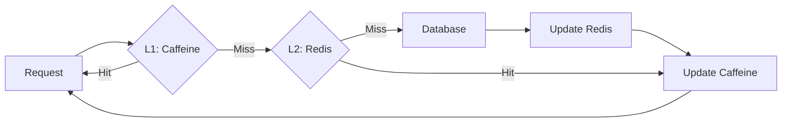

# Performance Tuning

> **Reactive + Caching + Partitioning**: Optimizations for 100K+ concurrent users

---

## 🎯 Performance Goals

| Metric                    | Target | Critical Threshold|
|---------------------------|--------|-------------------|
| API Response Time (p95)   | < 200ms| < 500ms |
| API Response Time (p99)   | < 500ms| < 1000ms |
| Live Score Update Latency | < 1s   | < 3s |
| Database Query Time (p95) | < 50ms | < 200ms |
| Kafka Message Processing  | < 100ms| < 500ms |
| WebSocket Message Delivery| < 100ms| < 300ms |
| Concurrent Users          | 100K   | 150K |
| Throughput (requests/sec) | 10K    | 5K |

---

## ⚡ Reactive Programming Optimization

### Backpressure Management

```java
/**
 * Backpressure management in reactive streams.
 */
@Service
public class OptimizedMatchEventProcessor {

    /**
     * Processes events with backpressure strategy.
     */
    public Flux<PlayerScoreUpdate> processEvents(String matchId) {
        return matchEventStream(matchId)
            // Buffer with overflow strategy
            .onBackpressureBuffer(
                1000,  // Buffer size
                BufferOverflowStrategy.DROP_OLDEST
            )
            // Parallel processing
            .parallel(4)
            .runOn(Schedulers.parallel())
            .flatMap(this::applyRules)
            .sequential()
            // Rate limiting
            .limitRate(100);  // Request 100 at a time
    }

    /**
     * Batching to reduce I/O operations.
     */
    public Flux<List<PlayerScoreUpdate>> processBatched(String matchId) {
        return matchEventStream(matchId)
            .window(Duration.ofMillis(500))  // 500ms window
            .flatMap(window ->
                window
                    .flatMap(this::applyRules)
                    .collectList()
                    .filter(list -> !list.isEmpty())
            )
            .doOnNext(batch -> log.debug("Processing batch of {} updates", batch.size()));
    }
}
```

### Connection Pooling

```java
/**
 * Optimized connection pool configuration.
 */
@Configuration
public class ConnectionPoolConfiguration {

    /**
     * PostgreSQL R2DBC connection pool.
     */
    @Bean
    public ConnectionFactory connectionFactory() {
        return ConnectionFactories.get(
            ConnectionFactoryOptions.builder()
                .option(DRIVER, "postgresql")
                .option(HOST, postgresConfig.host())
                .option(PORT, postgresConfig.port())
                .option(USER, postgresConfig.user())
                .option(PASSWORD, postgresConfig.password())
                .option(DATABASE, postgresConfig.database())
                // Pool configuration
                .option(Option.valueOf("initialSize"), 10)
                .option(Option.valueOf("maxSize"), 50)
                .option(Option.valueOf("maxIdleTime"), Duration.ofMinutes(30))
                .option(Option.valueOf("maxAcquireTime"), Duration.ofSeconds(3))
                .option(Option.valueOf("maxCreateConnectionTime"), Duration.ofSeconds(5))
                // Performance options
                .option(Option.valueOf("statementCacheSize"), 100)
                .option(Option.valueOf("preparedStatementCacheSize"), 256)
                .build()
        );
    }

    /**
     * MongoDB Reactive connection pool.
     */
    @Bean
    public MongoClient mongoClient() {
        var settings = MongoClientSettings.builder()
            .applyConnectionString(new ConnectionString(mongoConfig.uri()))
            .applyToConnectionPoolSettings(builder ->
                builder
                    .minSize(5)
                    .maxSize(100)
                    .maxWaitTime(3, TimeUnit.SECONDS)
                    .maxConnectionIdleTime(30, TimeUnit.MINUTES)
                    .maxConnectionLifeTime(60, TimeUnit.MINUTES)
            )
            .applyToSocketSettings(builder ->
                builder
                    .connectTimeout(5, TimeUnit.SECONDS)
                    .readTimeout(10, TimeUnit.SECONDS)
            )
            .build();

        return MongoClients.create(settings);
    }
}
```

---

## 🗄️ Database Optimization

### Query Optimization

```sql
-- Índices compuestos para queries frecuentes
CREATE INDEX idx_roster_user_week ON roster_entries(user_id, week_id, status);
CREATE INDEX idx_matches_sport_date ON matches(sport_id, scheduled_time) WHERE status = 'LIVE';
CREATE INDEX idx_trades_league_status ON trades(league_id, status, proposed_at DESC);

-- Índices parciales para casos específicos
CREATE INDEX idx_active_users ON users(id) WHERE account_status = 'ACTIVE';
CREATE INDEX idx_live_matches ON matches(id, sport_id) WHERE status = 'LIVE';

-- Índices de cobertura (include columns)
CREATE INDEX idx_user_teams_covering ON teams(owner_id) INCLUDE (name, league_id);
```

### Query Patterns

```java
/**
 * Queries optimizadas con proyecciones.
 */
@Repository
public interface OptimizedTeamRepository extends R2dbcRepository<Team, UUID> {

    /**
     * Proyección: solo campos necesarios (evita SELECT *).
     */
    @Query("""
        SELECT t.id, t.name, t.owner_id, t.league_id
        FROM teams t
        WHERE t.league_id = :leagueId
        AND t.status = 'ACTIVE'
        """)
    Flux<TeamProjection> findActiveTeamsByLeague(UUID leagueId);

    /**
     * Paginación con cursor (mejor que OFFSET para grandes datasets).
     */
    @Query("""
        SELECT * FROM teams
        WHERE league_id = :leagueId
        AND id > :lastId
        ORDER BY id
        LIMIT :limit
        """)
    Flux<Team> findNextPage(UUID leagueId, UUID lastId, int limit);

    /**
     * Batch insert para múltiples registros.
     */
    @Modifying
    @Query("""
        INSERT INTO teams (id, name, owner_id, league_id)
        VALUES (:id, :name, :ownerId, :leagueId)
        ON CONFLICT (id) DO NOTHING
        """)
    Mono<Integer> batchInsert(List<Team> teams);
}
```

### MongoDB Optimization

```java
/**
 * Configuración de índices en MongoDB.
 */
@Configuration
public class MongoIndexConfiguration {

    @Bean
    public MongoTemplate mongoTemplate(MongoClient mongoClient) {
        var template = new MongoTemplate(mongoClient, "fantasy-sports");

        // Crear índices
        createIndexes(template);

        return template;
    }

    private void createIndexes(MongoTemplate template) {
        // Match projections: compound index
        template.indexOps("match_projections")
            .ensureIndex(new Index()
                .on("sportId", Sort.Direction.ASC)
                .on("status", Sort.Direction.ASC)
                .on("scheduledTime", Sort.Direction.DESC)
            );

        // Player stats: compound index con partial filter
        template.indexOps("player_weekly_stats")
            .ensureIndex(new Index()
                .on("leagueId", Sort.Direction.ASC)
                .on("weekNumber", Sort.Direction.ASC)
                .on("totalPoints", Sort.Direction.DESC)
                .partial(PartialIndexFilter.of(
                    Criteria.where("totalPoints").gt(0)
                ))
            );

        // TTL index para datos temporales
        template.indexOps("live_match_state")
            .ensureIndex(new Index()
                .on("expiresAt", Sort.Direction.ASC)
                .expire(Duration.ofHours(24))
            );
    }
}
```

---

## 💾 Caching Strategy

### Multi-Level Cache



### Caffeine (L1 Cache)

```java
/**
 * Cache local en memoria (L1).
 */
@Configuration
public class CaffeineConfiguration {

    @Bean
    public CacheManager cacheManager() {
        var caffeineCacheManager = new CaffeineCacheManager();

        // Cache de usuarios (pequeño, alta frecuencia)
        caffeineCacheManager.registerCustomCache("users",
            Caffeine.newBuilder()
                .maximumSize(10_000)
                .expireAfterWrite(Duration.ofMinutes(15))
                .recordStats()
                .build()
        );

        // Cache de reglas de scoring (estático)
        caffeineCacheManager.registerCustomCache("scoring-rules",
            Caffeine.newBuilder()
                .maximumSize(100)
                .expireAfterWrite(Duration.ofHours(1))
                .build()
        );

        // Cache de match state (alta frecuencia)
        caffeineCacheManager.registerCustomCache("match-state",
            Caffeine.newBuilder()
                .maximumSize(1_000)
                .expireAfterWrite(Duration.ofMinutes(5))
                .recordStats()
                .build()
        );

        return caffeineCacheManager;
    }
}
```

### Redis (L2 Cache)

```java
/**
 * Cache distribuido (L2).
 */
@Service
public class RedisCacheService {

    private final ReactiveRedisTemplate<String, Object> redisTemplate;

    /**
     * Get con cache-aside pattern.
     */
    public <T> Mono<T> getOrLoad(
        String key,
        Supplier<Mono<T>> loader,
        Duration ttl
    ) {
        return redisTemplate.opsForValue()
            .get(key)
            .cast(Object.class)
            .map(cached -> (T) cached)
            .switchIfEmpty(
                loader.get()
                    .flatMap(value ->
                        redisTemplate.opsForValue()
                            .set(key, value, ttl)
                            .thenReturn(value)
                    )
            );
    }

    /**
     * Write-through: actualiza cache + DB.
     */
    public <T> Mono<T> writeThrough(
        String key,
        T value,
        Supplier<Mono<T>> dbWriter,
        Duration ttl
    ) {
        return dbWriter.get()
            .flatMap(saved ->
                redisTemplate.opsForValue()
                    .set(key, saved, ttl)
                    .thenReturn(saved)
            );
    }

    /**
     * Cache invalidation.
     */
    public Mono<Void> invalidate(String pattern) {
        return redisTemplate.keys(pattern)
            .flatMap(redisTemplate::delete)
            .then();
    }
}
```

### Cache Warming

```java
/**
 * Pre-carga de datos críticos al inicio.
 */
@Component
public class CacheWarmer {

    @EventListener(ApplicationReadyEvent.class)
    public void warmUpCache() {
        log.info("Starting cache warm-up...");

        // Pre-cargar reglas de scoring
        Flux.fromIterable(sportRegistry.getAllSports())
            .flatMap(sportId ->
                sportRegistry.getPluginOrThrow(sportId)
                    .liveRules()
            )
            .doOnNext(rule -> cacheManager.getCache("scoring-rules").put(rule.ruleId(), rule))
            .subscribe();

        // Pre-cargar ligas activas
        leagueRepo.findByStatus(LeagueStatus.ACTIVE)
            .take(1000)
            .doOnNext(league -> cacheManager.getCache("leagues").put(league.id(), league))
            .subscribe();

        log.info("Cache warm-up completed");
    }
}
```

---

## 🔀 Kafka Optimization

### Partitioning Strategy

```java
/**
 * Partitioning para paralelismo.
 */
@Configuration
public class KafkaProducerConfiguration {

    @Bean
    public KafkaTemplate<String, MatchEvent> kafkaTemplate() {
        var configProps = new HashMap<String, Object>();

        // Producer optimization
        configProps.put(ProducerConfig.BOOTSTRAP_SERVERS_CONFIG, kafkaBootstrap);
        configProps.put(ProducerConfig.KEY_SERIALIZER_CLASS_CONFIG, StringSerializer.class);
        configProps.put(ProducerConfig.VALUE_SERIALIZER_CLASS_CONFIG, JsonSerializer.class);

        // Performance tuning
        configProps.put(ProducerConfig.BATCH_SIZE_CONFIG, 32768);  // 32KB batches
        configProps.put(ProducerConfig.LINGER_MS_CONFIG, 10);      // Wait 10ms for batching
        configProps.put(ProducerConfig.COMPRESSION_TYPE_CONFIG, "snappy");
        configProps.put(ProducerConfig.ACKS_CONFIG, "1");          // Leader ack only
        configProps.put(ProducerConfig.BUFFER_MEMORY_CONFIG, 67108864);  // 64MB buffer

        return new KafkaTemplate<>(new DefaultKafkaProducerFactory<>(configProps));
    }

    /**
     * Partitioner personalizado: por match_id.
     */
    public class MatchIdPartitioner implements Partitioner {
        @Override
        public int partition(
            String topic,
            Object key,
            byte[] keyBytes,
            Object value,
            byte[] valueBytes,
            Cluster cluster
        ) {
            var matchEvent = (MatchEvent) value;
            var matchId = matchEvent.matchId().toString();

            // Hash consistente por match_id → mismo match siempre a misma partición
            return Math.abs(matchId.hashCode()) % cluster.partitionCountForTopic(topic);
        }
    }
}
```

### Consumer Optimization

```java
/**
 * Consumer con parallel processing.
 */
@Service
public class OptimizedEventConsumer {

    @KafkaListener(
        topics = "match-events",
        concurrency = "10",  // 10 consumer threads
        groupId = "scoring-engine"
    )
    public void consumeEvents(List<MatchEvent> events) {
        Flux.fromIterable(events)
            .parallel(4)
            .runOn(Schedulers.parallel())
            .flatMap(this::processEvent)
            .sequential()
            .subscribe();
    }

    /**
     * Batch processing para mejor throughput.
     */
    @KafkaListener(
        topics = "match-events",
        containerFactory = "batchConsumerFactory"
    )
    public void consumeBatch(List<MatchEvent> batch) {
        processBatch(batch).subscribe();
    }

    private Mono<Void> processBatch(List<MatchEvent> events) {
        return Flux.fromIterable(events)
            .flatMap(this::processEvent)
            .collectList()
            .flatMap(scoreRepo::saveAll)
            .then();
    }
}
```

---

## 🚀 JVM Tuning

### Garbage Collection

```bash
# G1GC (recomendado para throughput + baja latencia)
JAVA_OPTS="
  -Xms4g
  -Xmx4g
  -XX:+UseG1GC
  -XX:MaxGCPauseMillis=200
  -XX:G1HeapRegionSize=16m
  -XX:InitiatingHeapOccupancyPercent=45
  -XX:+ParallelRefProcEnabled
  -XX:+UseStringDeduplication
"

# ZGC (latencia ultra-baja < 10ms)
JAVA_OPTS="
  -Xms8g
  -Xmx8g
  -XX:+UseZGC
  -XX:ZCollectionInterval=120
  -XX:ZAllocationSpikeTolerance=2
"
```

### Memory Settings

```bash
# Heap memory
-Xms4g                          # Initial heap
-Xmx4g                          # Max heap (same as initial to avoid resizing)

# Metaspace
-XX:MetaspaceSize=256m
-XX:MaxMetaspaceSize=512m

# Direct memory (for Netty buffers)
-XX:MaxDirectMemorySize=1g

# Code cache
-XX:ReservedCodeCacheSize=512m
```

### Thread Tuning

```java
/**
 * Configuración optimizada de thread pools.
 */
@Configuration
public class ExecutorConfiguration {

    /**
     * Thread pool para operaciones I/O.
     */
    @Bean("ioExecutor")
    public Executor ioExecutor() {
        return new ThreadPoolTaskExecutor() {{
            setCorePoolSize(50);
            setMaxPoolSize(200);
            setQueueCapacity(1000);
            setThreadNamePrefix("io-");
            setRejectedExecutionHandler(new ThreadPoolExecutor.CallerRunsPolicy());
            initialize();
        }};
    }

    /**
     * Thread pool para operaciones CPU-bound.
     */
    @Bean("cpuExecutor")
    public Executor cpuExecutor() {
        var cpuCount = Runtime.getRuntime().availableProcessors();

        return new ThreadPoolTaskExecutor() {{
            setCorePoolSize(cpuCount);
            setMaxPoolSize(cpuCount * 2);
            setQueueCapacity(100);
            setThreadNamePrefix("cpu-");
            initialize();
        }};
    }
}
```

---

## 📊 Performance Monitoring

### Metrics Collection

```java
/**
 * Métricas de performance.
 */
@Component
public class PerformanceMetrics {

    private final MeterRegistry registry;

    public PerformanceMetrics(MeterRegistry registry) {
        this.registry = registry;

        // JVM metrics
        new JvmGcMetrics().bindTo(registry);
        new JvmMemoryMetrics().bindTo(registry);
        new JvmThreadMetrics().bindTo(registry);
        new ProcessorMetrics().bindTo(registry);

        // Hikari pool metrics (if using)
        new HikariDataSourcePoolMetrics(dataSource, "hikari", List.of()).bindTo(registry);
    }

    /**
     * Métrica custom: query latency.
     */
    public Timer queryTimer(String queryName) {
        return Timer.builder("db.query.duration")
            .tag("query", queryName)
            .publishPercentiles(0.5, 0.95, 0.99)
            .register(registry);
    }

    /**
     * Métrica custom: cache hit rate.
     */
    public void recordCacheAccess(String cacheName, boolean hit) {
        Counter.builder("cache.access")
            .tag("cache", cacheName)
            .tag("result", hit ? "hit" : "miss")
            .register(registry)
            .increment();
    }
}
```

---
