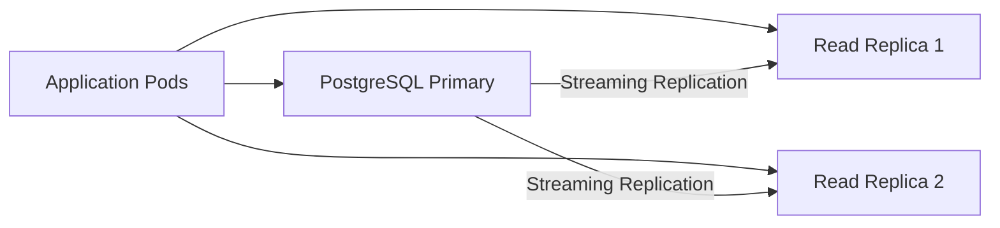
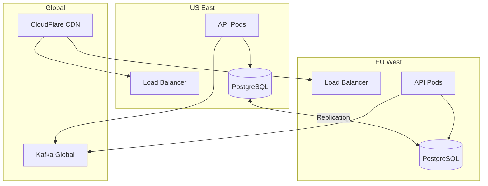
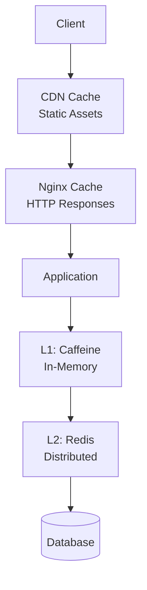

# Scaling Strategy

> **Horizontal Scaling + Auto-Scaling**: From 100 to 100K+ concurrent users

---

## 🎯 Scaling Targets

### Growth Phases

| Phase         | Users | Concurrent | RPS | Infrastructure |
|---------------|-------|------------|-----|----------------|
| **MVP**       | 100   | 10         | 50  | Single node    |
| **Early**     | 1K    | 100        | 500 | 3 nodes, manual scaling |
| **Growth**    | 10K   | 1K         | 5K  | Auto-scaling (5-20 pods) |
| **Scale**     | 100K  | 10K        | 50K | Auto-scaling (20-100 pods) |
| **Enterprise**| 1M+   | 100K+      | 500K+ | Multi-region, edge caching |

---

## 📊 Current Capacity

### Single Pod Capacity

**Measured Performance** (1 pod with 2GB RAM, 1 CPU):
- **Throughput**: ~200 RPS
- **Concurrent Users**: ~500
- **P95 Latency**: 150ms
- **Memory Usage**: ~1.2GB steady state

**Bottlenecks**:
- Database connections (pool limit)
- Kafka consumer throughput
- JVM GC pauses

---

## 🔄 Horizontal Pod Autoscaling (HPA)

### HPA Configuration

```yaml
# api-hpa.yaml
apiVersion: autoscaling/v2
kind: HorizontalPodAutoscaler
metadata:
  name: fantasy-api-hpa
  namespace: fantasy-sports
spec:
  scaleTargetRef:
    apiVersion: apps/v1
    kind: Deployment
    name: fantasy-api

  minReplicas: 10
  maxReplicas: 100

  metrics:
  # CPU-based scaling
  - type: Resource
    resource:
      name: cpu
      target:
        type: Utilization
        averageUtilization: 70

  # Memory-based scaling
  - type: Resource
    resource:
      name: memory
      target:
        type: Utilization
        averageUtilization: 80

  # Custom metric: Request rate
  - type: Pods
    pods:
      metric:
        name: http_requests_per_second
      target:
        type: AverageValue
        averageValue: "150"  # Scale when avg > 150 RPS per pod

  # Custom metric: Response time
  - type: Pods
    pods:
      metric:
        name: http_request_duration_p95
      target:
        type: AverageValue
        averageValue: "300"  # Scale when P95 > 300ms

  behavior:
    scaleUp:
      stabilizationWindowSeconds: 60
      policies:
      # Aggressive scale-up during traffic spikes
      - type: Percent
        value: 100  # Double pods
        periodSeconds: 60
      - type: Pods
        value: 10  # Or add 10 pods
        periodSeconds: 60
      selectPolicy: Max  # Use most aggressive

    scaleDown:
      stabilizationWindowSeconds: 300  # Wait 5min before scaling down
      policies:
      # Conservative scale-down to avoid thrashing
      - type: Percent
        value: 10  # Remove 10% of pods
        periodSeconds: 60
      - type: Pods
        value: 2  # Or remove 2 pods
        periodSeconds: 60
      selectPolicy: Min  # Use most conservative
```

### Custom Metrics Adapter

```yaml
# custom-metrics-config.yaml
apiVersion: v1
kind: ConfigMap
metadata:
  name: adapter-config
  namespace: monitoring
data:
  config.yaml: |
    rules:
    # HTTP requests per second (per pod)
    - seriesQuery: 'http_requests_total{namespace="fantasy-sports"}'
      resources:
        overrides:
          namespace: {resource: "namespace"}
          pod: {resource: "pod"}
      name:
        matches: "^http_requests_total"
        as: "http_requests_per_second"
      metricsQuery: 'sum(rate(http_requests_total{<<.LabelMatchers>>}[1m])) by (<<.GroupBy>>)'

    # P95 response time (per pod)
    - seriesQuery: 'http_request_duration_seconds_bucket{namespace="fantasy-sports"}'
      resources:
        overrides:
          namespace: {resource: "namespace"}
          pod: {resource: "pod"}
      name:
        matches: "^http_request_duration_seconds_bucket"
        as: "http_request_duration_p95"
      metricsQuery: 'histogram_quantile(0.95, sum(rate(http_request_duration_seconds_bucket{<<.LabelMatchers>>}[2m])) by (le, <<.GroupBy>>))'
```

---

## 📈 Vertical Pod Autoscaling (VPA)

### VPA for Databases

```yaml
# postgres-vpa.yaml
apiVersion: autoscaling.k8s.io/v1
kind: VerticalPodAutoscaler
metadata:
  name: postgres-vpa
  namespace: fantasy-sports
spec:
  targetRef:
    apiVersion: apps/v1
    kind: StatefulSet
    name: postgres

  updatePolicy:
    updateMode: "Auto"  # Auto-update pods with new limits

  resourcePolicy:
    containerPolicies:
    - containerName: postgres
      minAllowed:
        cpu: 2000m
        memory: 4Gi
      maxAllowed:
        cpu: 8000m
        memory: 16Gi
      controlledResources: ["cpu", "memory"]
```

---

## 🗄️ Database Scaling

### PostgreSQL Scaling

**Vertical Scaling** (Current):
```yaml
resources:
  requests:
    cpu: 4000m
    memory: 8Gi
  limits:
    cpu: 8000m
    memory: 16Gi

storage: 1Ti  # SSD
```

**Read Replicas** (Future):


**Implementation**:
```java
@Configuration
public class DataSourceConfig {

    @Bean
    @Primary
    public DataSource primaryDataSource() {
        // Write operations
        return buildDataSource(primaryUrl);
    }

    @Bean
    public DataSource replicaDataSource() {
        // Read operations
        return buildDataSource(replicaUrl);
    }

    @Bean
    public DataSource routingDataSource(
        @Qualifier("primaryDataSource") DataSource primary,
        @Qualifier("replicaDataSource") DataSource replica
    ) {
        var routing = new RoutingDataSource();
        routing.setDefaultTargetDataSource(primary);
        routing.setTargetDataSources(Map.of(
            "PRIMARY", primary,
            "REPLICA", replica
        ));
        return routing;
    }
}

/**
 * Routing logic: writes to primary, reads to replica.
 */
public class RoutingDataSource extends AbstractRoutingDataSource {

    @Override
    protected Object determineCurrentLookupKey() {
        return TransactionSynchronizationManager.isCurrentTransactionReadOnly()
            ? "REPLICA"
            : "PRIMARY";
    }
}
```

### MongoDB Scaling

**Sharding Strategy**:
```javascript
// Shard by leagueId for match projections
sh.shardCollection("fantasy_sports.match_projections", { leagueId: 1 })

// Shard by userId for player stats
sh.shardCollection("fantasy_sports.player_weekly_stats", { userId: 1, weekId: 1 })
```

**Shard Configuration**:
```yaml
# 3 shards, 3 replicas each = 9 total nodes
shards: 3
replicas_per_shard: 3
config_servers: 3
mongos_routers: 3
```

### Redis Scaling

**Redis Cluster**:
```yaml
# 6 nodes: 3 primary + 3 replicas
nodes: 6
cluster_enabled: true
cluster_replicas: 1

# Partitioning: hash slots 0-16383
hash_slots: 16384
```

**Connection Pooling**:

```java
@Bean
public LettuceConnectionFactory redisConnectionFactory() {
    var clusterConfig = new RedisClusterConfiguration()
        .clusterNode("redis-0", 6379)
        .clusterNode("redis-1", 6379)
        .clusterNode("redis-2", 6379);

    var poolConfig = new GenericObjectPoolConfig();
    poolConfig.setMaxTotal(100);  // Max connections
    poolConfig.setMaxIdle(50);
    poolConfig.setMinIdle(10);

    var clientConfig = LettucePoolingClientConfiguration.builder()
        .poolConfig(poolConfig)
        .build();

    return new LettuceConnectionFactory(clusterConfig, clientConfig);
}
```

---

## 📡 Kafka Scaling

### Partition Scaling

**Current**:

```yaml
match.events:
  partitions: 24
  replication: 3

scoring.player-updates:
  partitions: 12
  replication: 3
```

**Scale to 100K users**:

```yaml
match.events:
  partitions: 48  # Doubled
  replication: 3

scoring.player-updates:
  partitions: 24  # Doubled
  replication: 3
```

**Repartitioning Strategy**:

```bash
# Add partitions (can't decrease)
kafka-topics --bootstrap-server kafka:9092 \
  --alter --topic match.events \
  --partitions 48

# Verify
kafka-topics --bootstrap-server kafka:9092 \
  --describe --topic match.events
```

### Consumer Scaling

**Automatic Consumer Scaling**:

```java
@Configuration
public class KafkaConsumerScaling {

    /**
     * Scale consumers to match partitions.
     * If 48 partitions → 48 consumer threads.
     */
    @Bean
    public ConcurrentKafkaListenerContainerFactory<String, MatchEvent>
        kafkaListenerContainerFactory() {

        var factory = new ConcurrentKafkaListenerContainerFactory<String, MatchEvent>();
        factory.setConsumerFactory(consumerFactory());

        // Concurrency = number of partitions
        var partitions = getPartitionCount("match.events");
        factory.setConcurrency(partitions);

        return factory;
    }

    private int getPartitionCount(String topic) {
        // Query Kafka for partition count
        return 48;  // Implementation
    }
}
```

---

## 🌍 Geographic Distribution

### Multi-Region Architecture



### GeoDNS Routing

```yaml
# Route 53 geolocation routing
- record: api.fantasy-sports.com
  type: A
  geolocation:
    - continent: NA
      value: us-east-lb.example.com
    - continent: EU
      value: eu-west-lb.example.com
    - default: us-east-lb.example.com
```

---

## 💾 Caching Layers

### Multi-Level Cache Hierarchy



### Cache Hit Ratios

**Target Metrics**:
```
CDN Hit Rate: >95%
Nginx Hit Rate: >80%
L1 (Caffeine) Hit Rate: >90%
L2 (Redis) Hit Rate: >85%
Overall Cache Hit Rate: >98%
```

### Cache Warming Strategy

```java
@Component
public class CacheWarmer {

    @Scheduled(cron = "0 0 * * * *")  // Every hour
    public void warmCriticalData() {
        // Pre-load active leagues
        leagueRepo.findByStatus(LeagueStatus.ACTIVE)
            .take(1000)
            .doOnNext(league ->
                cacheManager.getCache("leagues").put(league.id(), league)
            )
            .subscribe();

        // Pre-load live matches
        matchRepo.findByStatus(MatchStatus.LIVE)
            .doOnNext(match ->
                cacheManager.getCache("matches").put(match.id(), match)
            )
            .subscribe();

        // Pre-load scoring rules
        sportRegistry.getAllSports()
            .forEach(sportId -> {
                var rules = sportRegistry.getPluginOrThrow(sportId).liveRules();
                cacheManager.getCache("scoring-rules").put(sportId, rules);
            });
    }
}
```

---

## 🔧 Connection Pooling

### Optimal Pool Sizes

**Formula**: `connections = ((core_count * 2) + effective_spindle_count)`

**PostgreSQL**:
```yaml
# With 4 CPU cores, 1 SSD
pool_size: 10  # (4 * 2) + 1 = 9, round to 10
max_lifetime: 30min
idle_timeout: 10min
```

**MongoDB**:
```yaml
pool_size: 100  # Higher for read-heavy workload
max_wait_time: 3s
max_connection_idle_time: 30min
```

**Redis**:
```yaml
max_total: 100
max_idle: 50
min_idle: 10
```

---

## 📊 Load Testing

### Gatling Load Test

```scala
class ScaleTest extends Simulation {

  val httpProtocol = http
    .baseUrl("https://api.fantasy-sports.com")
    .acceptHeader("application/json")

  // Scenario: Normal traffic
  val normalTraffic = scenario("Normal Traffic")
    .exec(
      http("Get Standings")
        .get("/api/v1/leagues/${leagueId}/standings")
        .check(status.is(200))
    )

  // Scenario: Live match spike
  val liveMatchSpike = scenario("Live Match Spike")
    .exec(
      http("Get Live Scores")
        .get("/api/v1/matches/${matchId}/live-scores")
        .check(status.is(200))
    )

  setUp(
    // Ramp to 10K concurrent users over 5 minutes
    normalTraffic.inject(
      rampUsersPerSec(100) to 2000 during (5.minutes),
      constantUsersPerSec(2000) during (10.minutes)
    ),

    // Simulate match start spike (additional 8K users)
    liveMatchSpike.inject(
      nothingFor(2.minutes),
      rampUsersPerSec(0) to 8000 during (1.minute),
      constantUsersPerSec(8000) during (5.minutes)
    )
  ).protocols(httpProtocol)
   .assertions(
     global.responseTime.max.lt(2000),
     global.successfulRequests.percent.gt(99.5)
   )
}
```

### Performance Benchmarks

**Target Performance** (100K concurrent users):

```yaml
# Application Layer
api_pods: 50
api_cpu_per_pod: 2000m
api_memory_per_pod: 3Gi
total_api_capacity: ~10K RPS

# Database Layer
postgres_cpu: 16000m
postgres_memory: 32Gi
postgres_connections: 500
read_replicas: 3

# Cache Layer
redis_nodes: 6
redis_memory_per_node: 16Gi
total_cache_capacity: 96Gi

# Message Layer
kafka_brokers: 3
kafka_partitions_total: 120
consumer_threads_total: 120
```

---

## 🚀 Scaling Checklist

### Pre-Scale Preparation

- [ ] Run load tests to identify bottlenecks
- [ ] Review metrics and identify resource constraints
- [ ] Plan database scaling strategy (vertical vs horizontal)
- [ ] Update HPA configurations
- [ ] Increase rate limits for external APIs
- [ ] Warm up caches before traffic spike
- [ ] Alert on-call team

### During Scale Event

- [ ] Monitor HPA scaling behavior
- [ ] Watch database connection pools
- [ ] Track Kafka consumer lag
- [ ] Monitor cache hit rates
- [ ] Check error rates and latency
- [ ] Verify all pods are healthy

### Post-Scale Review

- [ ] Analyze actual vs expected performance
- [ ] Review cost implications
- [ ] Document lessons learned
- [ ] Update capacity planning models
- [ ] Adjust HPA thresholds if needed

---
