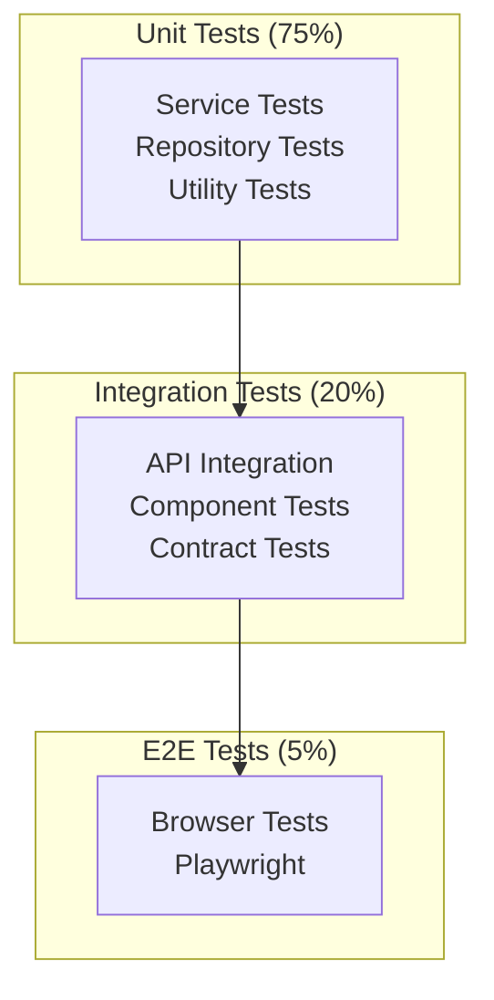

# Testing Strategy

> **Test Pyramid + Reactive Testing**: Complete coverage with TDD and reactive testing

---

## 🎯 Test Pyramid



**Distribution**:
- **Unit Tests**: 75% - Fast, isolated, no dependencies
- **Integration Tests**: 20% - Medium speed, real databases (testcontainers)
- **E2E Tests**: 5% - Slow, full system, critical user journeys

---

## 🧪 Unit Testing

### Service Layer Tests

```java
/**
 * Unit tests for LiveScoringEngine.
 */
@ExtendWith(MockitoExtension.class)
class LiveScoringEngineTest {

    @Mock
    private SportRegistry sportRegistry;

    @Mock
    private PlayerScoreRepository scoreRepo;

    @InjectMocks
    private LiveScoringEngine liveScoringEngine;

    private SportScoringConfig futbolConfig;

    @BeforeEach
    void setUp() {
        futbolConfig = new FutbolScoringConfig();
        when(sportRegistry.getPluginOrThrow("FUTBOL")).thenReturn(futbolConfig);
    }

    @Test
    @DisplayName("Should award 10 points for goal")
    void shouldAward10PointsForGoal() {
        // Given
        var event = MatchEvent.builder()
            .sportId("FUTBOL")
            .type(EventType.GOAL)
            .playerId(UUID.randomUUID())
            .matchId(UUID.randomUUID())
            .build();

        when(scoreRepo.save(any())).thenReturn(Mono.empty());

        // When
        var result = liveScoringEngine.applyLiveRules(event).block();

        // Then
        assertThat(result.points()).isEqualTo(10);
        assertThat(result.isBonus()).isFalse();
        verify(scoreRepo).save(argThat(update ->
            update.points() == 10 && update.playerId().equals(event.playerId())
        ));
    }

    @Test
    @DisplayName("Should handle multiple applicable rules")
    void shouldHandleMultipleApplicableRules() {
        // Given: Penalty goal (2 applicable rules)
        var event = MatchEvent.builder()
            .sportId("FUTBOL")
            .type(EventType.GOAL)
            .playerId(UUID.randomUUID())
            .isPenalty(true)
            .build();

        when(scoreRepo.save(any())).thenReturn(Mono.empty());

        // When
        var result = liveScoringEngine.applyLiveRules(event).block();

        // Then: gol (10) + penalty (5) = 15
        assertThat(result.points()).isEqualTo(15);
    }

    @Test
    @DisplayName("Should return 0 points when no rules apply")
    void shouldReturn0PointsWhenNoRulesApply() {
        // Given: Evento sin reglas configuradas
        var event = MatchEvent.builder()
            .sportId("FUTBOL")
            .type(EventType.UNKNOWN)
            .playerId(UUID.randomUUID())
            .build();

        when(scoreRepo.save(any())).thenReturn(Mono.empty());

        // When
        var result = liveScoringEngine.applyLiveRules(event).block();

        // Then
        assertThat(result.points()).isEqualTo(0);
    }
}
```

### Reactive Testing with StepVerifier

```java
/**
 * Testing reactive streams con StepVerifier.
 */
@SpringBootTest
class MatchEventStreamTest {

    @Autowired
    private MatchEventService matchEventService;

    @Test
    @DisplayName("Should emit events in order")
    void shouldEmitEventsInOrder() {
        var matchId = UUID.randomUUID().toString();

        StepVerifier.create(
            matchEventService.streamMatchEvents(matchId)
                .take(3)
        )
        .expectNextMatches(event -> event.type() == EventType.MATCH_STARTED)
        .expectNextMatches(event -> event.type() == EventType.GOL)
        .expectNextMatches(event -> event.type() == EventType.MATCH_ENDED)
        .verifyComplete();
    }

    @Test
    @DisplayName("Should handle backpressure correctly")
    void shouldHandleBackpressure() {
        var matchId = UUID.randomUUID().toString();

        StepVerifier.create(
            matchEventService.streamMatchEvents(matchId)
                .limitRate(10),  // Request 10 at a time
            10  // Initial request
        )
        .expectNextCount(10)
        .thenRequest(10)
        .expectNextCount(10)
        .thenCancel()
        .verify();
    }

    @Test
    @DisplayName("Should timeout if no events emitted")
    void shouldTimeoutIfNoEvents() {
        var matchId = "non-existent-match";

        StepVerifier.create(
            matchEventService.streamMatchEvents(matchId)
                .timeout(Duration.ofSeconds(5))
        )
        .expectError(TimeoutException.class)
        .verify();
    }
}
```

### Repository Tests

```java
/**
 * Repository tests con @DataR2dbcTest.
 */
@DataR2dbcTest
@Import(TestDatabaseConfiguration.class)
class UserRepositoryTest {

    @Autowired
    private UserRepository userRepo;

    @Test
    @DisplayName("Should save and find user by ID")
    void shouldSaveAndFindById() {
        // Given
        var user = User.builder()
            .id(UUID.randomUUID())
            .email("test@example.com")
            .passwordHash("hashed")
            .createdAt(Instant.now())
            .build();

        // When
        var saved = userRepo.save(user).block();
        var found = userRepo.findById(saved.id()).block();

        // Then
        assertThat(found).isNotNull();
        assertThat(found.email()).isEqualTo("test@example.com");
    }

    @Test
    @DisplayName("Should find user by email")
    void shouldFindByEmail() {
        // Given
        var user = createAndSaveUser("unique@example.com");

        // When
        var found = userRepo.findByEmail("unique@example.com").block();

        // Then
        assertThat(found).isNotNull();
        assertThat(found.id()).isEqualTo(user.id());
    }

    @Test
    @DisplayName("Should enforce unique email constraint")
    void shouldEnforceUniqueEmailConstraint() {
        // Given
        createAndSaveUser("duplicate@example.com");

        // When/Then
        var duplicate = User.builder()
            .id(UUID.randomUUID())
            .email("duplicate@example.com")
            .passwordHash("hashed")
            .build();

        StepVerifier.create(userRepo.save(duplicate))
            .expectError(DataIntegrityViolationException.class)
            .verify();
    }
}
```

---

## 🔗 Integration Testing

### Testcontainers Setup

```java
/**
 * Base class para integration tests con testcontainers.
 */
@SpringBootTest(webEnvironment = SpringBootTest.WebEnvironment.RANDOM_PORT)
@Testcontainers
public abstract class IntegrationTestBase {

    @Container
    static PostgreSQLContainer<?> postgres = new PostgreSQLContainer<>("postgres:16-alpine")
        .withDatabaseName("test_db")
        .withUsername("test")
        .withPassword("test");

    @Container
    static MongoDBContainer mongodb = new MongoDBContainer("mongo:7")
        .withExposedPorts(27017);

    @Container
    static GenericContainer<?> redis = new GenericContainer<>("redis:7-alpine")
        .withExposedPorts(6379);

    @Container
    static KafkaContainer kafka = new KafkaContainer(
        DockerImageName.parse("confluentinc/cp-kafka:7.5.0")
    );

    @DynamicPropertySource
    static void registerProperties(DynamicPropertyRegistry registry) {
        // PostgreSQL
        registry.add("spring.r2dbc.url", () ->
            "r2dbc:postgresql://" + postgres.getHost() + ":" + postgres.getFirstMappedPort() + "/test_db"
        );
        registry.add("spring.r2dbc.username", postgres::getUsername);
        registry.add("spring.r2dbc.password", postgres::getPassword);

        // MongoDB
        registry.add("spring.data.mongodb.uri", mongodb::getReplicaSetUrl);

        // Redis
        registry.add("spring.redis.host", redis::getHost);
        registry.add("spring.redis.port", () -> redis.getFirstMappedPort().toString());

        // Kafka
        registry.add("spring.kafka.bootstrap-servers", kafka::getBootstrapServers);
    }
}
```

### API Integration Tests

```java
/**
 * API integration tests con WebTestClient.
 */
@SpringBootTest(webEnvironment = SpringBootTest.WebEnvironment.RANDOM_PORT)
class LeagueAPIIntegrationTest extends IntegrationTestBase {

    @Autowired
    private WebTestClient webClient;

    @Autowired
    private UserRepository userRepo;

    @Autowired
    private LeagueRepository leagueRepo;

    private String authToken;

    @BeforeEach
    void setUp() {
        // Crear usuario y obtener token
        var user = createTestUser();
        authToken = obtainAuthToken(user);
    }

    @Test
    @DisplayName("POST /api/leagues - Should create league successfully")
    void shouldCreateLeague() {
        // Given
        var request = new CreateLeagueRequest(
            "Test League",
            "FUTBOL",
            10,
            LeagueType.HEAD_TO_HEAD
        );

        // When/Then
        webClient.post()
            .uri("/api/leagues")
            .header("Authorization", "Bearer " + authToken)
            .contentType(MediaType.APPLICATION_JSON)
            .bodyValue(request)
            .exchange()
            .expectStatus().isCreated()
            .expectBody(LeagueResponse.class)
            .value(response -> {
                assertThat(response.name()).isEqualTo("Test League");
                assertThat(response.sportId()).isEqualTo("FUTBOL");
                assertThat(response.maxTeams()).isEqualTo(10);
            });
    }

    @Test
    @DisplayName("GET /api/leagues/{id} - Should return league details")
    void shouldReturnLeagueDetails() {
        // Given
        var league = createTestLeague();

        // When/Then
        webClient.get()
            .uri("/api/leagues/{id}", league.id())
            .header("Authorization", "Bearer " + authToken)
            .exchange()
            .expectStatus().isOk()
            .expectBody(LeagueResponse.class)
            .value(response -> {
                assertThat(response.id()).isEqualTo(league.id());
                assertThat(response.name()).isEqualTo(league.name());
            });
    }

    @Test
    @DisplayName("POST /api/leagues - Should validate max teams")
    void shouldValidateMaxTeams() {
        // Given
        var request = new CreateLeagueRequest(
            "Invalid League",
            "FUTBOL",
            101,  // > 100 (max allowed)
            LeagueType.HEAD_TO_HEAD
        );

        // When/Then
        webClient.post()
            .uri("/api/leagues")
            .header("Authorization", "Bearer " + authToken)
            .bodyValue(request)
            .exchange()
            .expectStatus().isBadRequest()
            .expectBody()
            .jsonPath("$.error").isEqualTo("Validation failed")
            .jsonPath("$.details[0].field").isEqualTo("maxTeams");
    }

    @Test
    @DisplayName("DELETE /api/leagues/{id} - Should require commissioner role")
    void shouldRequireCommissionerRole() {
        // Given
        var league = createTestLeague();
        var otherUserToken = obtainAuthToken(createTestUser());

        // When/Then: Usuario no comisionado no puede eliminar
        webClient.delete()
            .uri("/api/leagues/{id}", league.id())
            .header("Authorization", "Bearer " + otherUserToken)
            .exchange()
            .expectStatus().isForbidden();

        // When/Then: Comisionado SÍ puede eliminar
        webClient.delete()
            .uri("/api/leagues/{id}", league.id())
            .header("Authorization", "Bearer " + authToken)
            .exchange()
            .expectStatus().isNoContent();
    }
}
```

### Event Sourcing Integration Tests

```java
/**
 * Integration tests para Event Sourcing.
 */
@SpringBootTest
class EventSourcingIntegrationTest extends IntegrationTestBase {

    @Autowired
    private MatchEventStore eventStore;

    @Autowired
    private MatchStateProjection projection;

    @Test
    @DisplayName("Should rebuild projection from event stream")
    void shouldRebuildProjectionFromEvents() {
        var matchId = UUID.randomUUID().toString();

        // Given: Stream de eventos
        var events = List.of(
            new MatchStarted(UUID.randomUUID(), UUID.fromString(matchId), Instant.now(), "FUTBOL", "provider-1", UUID.randomUUID(), UUID.randomUUID()),
            new GoalScored(UUID.randomUUID(), UUID.fromString(matchId), Instant.now(), "FUTBOL", "provider-1", UUID.randomUUID(), UUID.randomUUID(), 15, false, null),
            new GoalScored(UUID.randomUUID(), UUID.fromString(matchId), Instant.now(), "FUTBOL", "provider-1", UUID.randomUUID(), UUID.randomUUID(), 30, false, null),
            new MatchEnded(UUID.randomUUID(), UUID.fromString(matchId), Instant.now(), "FUTBOL", "provider-1")
        );

        // When: Guardar eventos
        eventStore.appendEvents(matchId, events).block();

        // When: Reconstruir proyección
        var state = projectionRunner.rebuildProjection(projection, matchId).block();

        // Then
        assertThat(state.getMatchId()).isEqualTo(UUID.fromString(matchId));
        assertThat(state.getStatus()).isEqualTo(MatchStatus.FINISHED);
        assertThat(state.getTotalGoals()).isEqualTo(2);
    }
}
```

---

## 🌐 E2E Testing (Playwright)

### Browser Test Setup

```java
/**
 * E2E tests con Playwright.
 */
@SpringBootTest(webEnvironment = SpringBootTest.WebEnvironment.DEFINED_PORT)
class LeagueE2ETest {

    private Playwright playwright;
    private Browser browser;
    private BrowserContext context;
    private Page page;

    @BeforeEach
    void setUp() {
        playwright = Playwright.create();
        browser = playwright.chromium().launch(new BrowserType.LaunchOptions().setHeadless(true));
        context = browser.newContext();
        page = context.newPage();
    }

    @AfterEach
    void tearDown() {
        page.close();
        context.close();
        browser.close();
        playwright.close();
    }

    @Test
    @DisplayName("User can create and join a league")
    void userCanCreateAndJoinLeague() {
        // Navigate to homepage
        page.navigate("http://localhost:8080");

        // Login
        page.click("#login-button");
        page.fill("#email", "test@example.com");
        page.fill("#password", "password123");
        page.click("#submit-login");

        // Wait for redirect to dashboard
        page.waitForURL("**/dashboard");

        // Create league
        page.click("#create-league-button");
        page.fill("#league-name", "My Test League");
        page.selectOption("#sport-select", "FUTBOL");
        page.fill("#max-teams", "10");
        page.click("#submit-league");

        // Verify league created
        assertThat(page.locator(".league-card")).containsText("My Test League");

        // Invite user
        page.click(".league-card:has-text('My Test League')");
        page.click("#invite-button");
        page.fill("#email-input", "friend@example.com");
        page.click("#send-invite");

        // Verify invitation sent
        assertThat(page.locator(".notification")).containsText("Invitation sent");
    }

    @Test
    @DisplayName("User can manage roster and make trades")
    void userCanManageRosterAndTrade() {
        // Setup: crear liga y equipo
        setupLeagueAndTeam();

        // Navigate to roster
        page.navigate("http://localhost:8080/team/my-team");

        // Add player from waiver wire
        page.click("#waiver-wire-tab");
        page.fill("#search-player", "Messi");
        page.click(".player-card:has-text('Lionel Messi')");
        page.click("#claim-player");

        // Verify player added
        page.click("#my-roster-tab");
        assertThat(page.locator(".roster-player")).containsText("Lionel Messi");

        // Propose trade
        page.click("#trades-tab");
        page.click("#propose-trade-button");
        page.selectOption("#trade-partner", "Team 2");
        page.click(".my-player:has-text('Messi')");
        page.click(".their-player:has-text('Ronaldo')");
        page.click("#submit-trade");

        // Verify trade proposed
        assertThat(page.locator(".trade-status")).containsText("Pending");
    }
}
```

---

## 📊 Contract Testing (Pact)

### Provider Contract Tests

```java
/**
 * Contract tests para API provider.
 */
@Provider("fantasy-api")
@PactFolder("pacts")
@SpringBootTest(webEnvironment = SpringBootTest.WebEnvironment.RANDOM_PORT)
class ProviderContractTest {

    @LocalServerPort
    private int port;

    @TestTemplate
    @ExtendWith(PactVerificationInvocationContextProvider.class)
    void verifyPact(PactVerificationContext context) {
        context.verifyInteraction();
    }

    @BeforeEach
    void setUp(PactVerificationContext context) {
        context.setTarget(new HttpTestTarget("localhost", port));
    }

    @State("user exists")
    void userExists() {
        // Setup: crear usuario de prueba
        var user = User.builder()
            .id(UUID.fromString("123e4567-e89b-12d3-a456-426614174000"))
            .email("test@example.com")
            .build();

        userRepo.save(user).block();
    }

    @State("league exists")
    void leagueExists() {
        // Setup: crear liga de prueba
        var league = League.builder()
            .id(UUID.fromString("123e4567-e89b-12d3-a456-426614174001"))
            .name("Test League")
            .build();

        leagueRepo.save(league).block();
    }
}
```

---

## 🔧 Performance Testing

### Load Testing (Gatling)

```scala
/**
 * Load test scenario con Gatling.
 */
class LeagueLoadTest extends Simulation {

  val httpProtocol = http
    .baseUrl("http://localhost:8080")
    .acceptHeader("application/json")
    .authorizationHeader("Bearer ${authToken}")

  val createLeague = scenario("Create League")
    .exec(
      http("Create League")
        .post("/api/leagues")
        .body(StringBody("""{
          "name": "Load Test League",
          "sportId": "FUTBOL",
          "maxTeams": 10
        }"""))
        .check(status.is(201))
    )

  val viewLeagues = scenario("View Leagues")
    .exec(
      http("Get Leagues")
        .get("/api/leagues")
        .check(status.is(200))
    )

  setUp(
    createLeague.inject(
      rampUsersPerSec(1) to 100 during (60.seconds),
      constantUsersPerSec(100) during (300.seconds)
    ),
    viewLeagues.inject(
      rampUsersPerSec(10) to 1000 during (60.seconds),
      constantUsersPerSec(1000) during (300.seconds)
    )
  ).protocols(httpProtocol)
   .assertions(
     global.responseTime.max.lt(1000),
     global.successfulRequests.percent.gt(99)
   )
}
```

---

## 📈 Test Coverage Goals

| Layer           | Coverage Target | Critical Threshold |
|-----------------|-----------------|-------------------|
| Service Layer   | >90%            | >80%              |
| Repository Layer| >85%            | >75%              |
| Controller Layer| >80%            | >70%              |
| Overall         | >85%            | >75%              |

---
