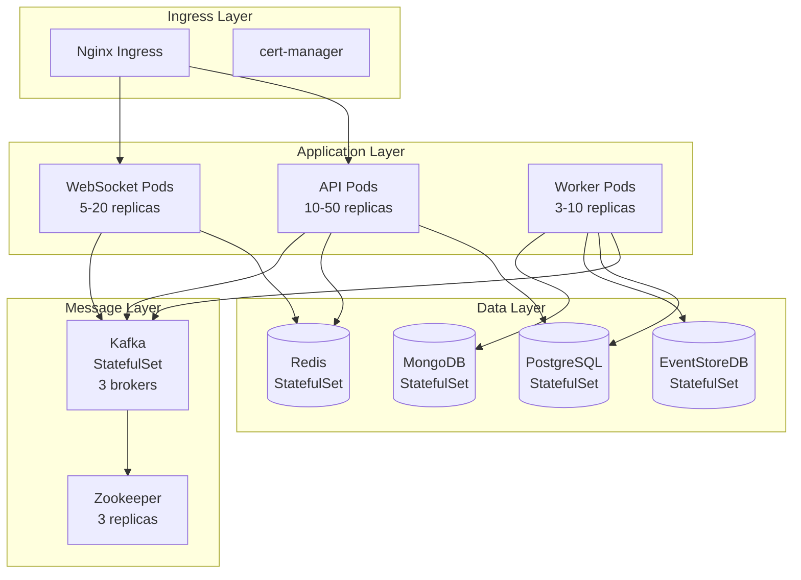

# Kubernetes Deployment

> **Auto-Scaling + High Availability**: Production-ready deployment with Kubernetes

---

## 🎯 Cluster Architecture



---

## 📦 Deployment Manifests

### Namespace

```yaml
# namespace.yaml
apiVersion: v1
kind: Namespace
metadata:
  name: fantasy-sports
  labels:
    name: fantasy-sports
    environment: production
```

### API Deployment

```yaml
# api-deployment.yaml
apiVersion: apps/v1
kind: Deployment
metadata:
  name: fantasy-api
  namespace: fantasy-sports
  labels:
    app: fantasy-api
    version: v1
spec:
  replicas: 10
  revisionHistoryLimit: 3
  strategy:
    type: RollingUpdate
    rollingUpdate:
      maxSurge: 3
      maxUnavailable: 1
  selector:
    matchLabels:
      app: fantasy-api
  template:
    metadata:
      labels:
        app: fantasy-api
        version: v1
      annotations:
        prometheus.io/scrape: "true"
        prometheus.io/port: "8080"
        prometheus.io/path: "/actuator/prometheus"
    spec:
      affinity:
        # Anti-affinity: do not place pods on the same node
        podAntiAffinity:
          preferredDuringSchedulingIgnoredDuringExecution:
          - weight: 100
            podAffinityTerm:
              labelSelector:
                matchExpressions:
                - key: app
                  operator: In
                  values:
                  - fantasy-api
              topologyKey: kubernetes.io/hostname

      containers:
      - name: fantasy-api
        image: ghcr.io/fantasy-sports/api:1.0.0
        imagePullPolicy: IfNotPresent

        ports:
        - name: http
          containerPort: 8080
          protocol: TCP
        - name: actuator
          containerPort: 8081
          protocol: TCP

        env:
        - name: SPRING_PROFILES_ACTIVE
          value: "production"
        - name: JAVA_OPTS
          value: >-
            -Xms2g -Xmx2g
            -XX:+UseG1GC
            -XX:MaxGCPauseMillis=200
            -XX:+ParallelRefProcEnabled

        # ConfigMap references
        envFrom:
        - configMapRef:
            name: fantasy-config
        - secretRef:
            name: fantasy-secrets

        resources:
          requests:
            memory: "2Gi"
            cpu: "1000m"
          limits:
            memory: "3Gi"
            cpu: "2000m"

        # Readiness probe
        readinessProbe:
          httpGet:
            path: /actuator/health/readiness
            port: 8081
          initialDelaySeconds: 30
          periodSeconds: 10
          timeoutSeconds: 5
          failureThreshold: 3

        # Liveness probe
        livenessProbe:
          httpGet:
            path: /actuator/health/liveness
            port: 8081
          initialDelaySeconds: 60
          periodSeconds: 20
          timeoutSeconds: 5
          failureThreshold: 3

        # Startup probe (para arranques lentos)
        startupProbe:
          httpGet:
            path: /actuator/health/liveness
            port: 8081
          initialDelaySeconds: 0
          periodSeconds: 10
          timeoutSeconds: 5
          failureThreshold: 30  # 5 minutos max startup

        volumeMounts:
        - name: config-volume
          mountPath: /config
          readOnly: true
        - name: tmp
          mountPath: /tmp

      volumes:
      - name: config-volume
        configMap:
          name: fantasy-config
      - name: tmp
        emptyDir: {}

      # Security context
      securityContext:
        runAsNonRoot: true
        runAsUser: 1000
        fsGroup: 1000

      # Termination grace period
      terminationGracePeriodSeconds: 30
```

### HorizontalPodAutoscaler

```yaml
# api-hpa.yaml
apiVersion: autoscaling/v2
kind: HorizontalPodAutoscaler
metadata:
  name: fantasy-api-hpa
  namespace: fantasy-sports
spec:
  scaleTargetRef:
    apiVersion: apps/v1
    kind: Deployment
    name: fantasy-api

  minReplicas: 10
  maxReplicas: 50

  metrics:
  # CPU utilization
  - type: Resource
    resource:
      name: cpu
      target:
        type: Utilization
        averageUtilization: 70

  # Memory utilization
  - type: Resource
    resource:
      name: memory
      target:
        type: Utilization
        averageUtilization: 80

  # Custom metric: request rate
  - type: Pods
    pods:
      metric:
        name: http_requests_per_second
      target:
        type: AverageValue
        averageValue: "1000"

  # Behavior configuration
  behavior:
    scaleUp:
      stabilizationWindowSeconds: 60
      policies:
      - type: Percent
        value: 50
        periodSeconds: 60
      - type: Pods
        value: 5
        periodSeconds: 60
      selectPolicy: Max

    scaleDown:
      stabilizationWindowSeconds: 300
      policies:
      - type: Percent
        value: 10
        periodSeconds: 60
      - type: Pods
        value: 2
        periodSeconds: 60
      selectPolicy: Min
```

### Service

```yaml
# api-service.yaml
apiVersion: v1
kind: Service
metadata:
  name: fantasy-api
  namespace: fantasy-sports
  labels:
    app: fantasy-api
spec:
  type: ClusterIP
  sessionAffinity: None
  selector:
    app: fantasy-api
  ports:
  - name: http
    port: 80
    targetPort: 8080
    protocol: TCP
```

### Ingress

```yaml
# ingress.yaml
apiVersion: networking.k8s.io/v1
kind: Ingress
metadata:
  name: fantasy-ingress
  namespace: fantasy-sports
  annotations:
    kubernetes.io/ingress.class: "nginx"
    cert-manager.io/cluster-issuer: "letsencrypt-prod"
    nginx.ingress.kubernetes.io/ssl-redirect: "true"
    nginx.ingress.kubernetes.io/rate-limit: "100"
    nginx.ingress.kubernetes.io/proxy-body-size: "10m"
    nginx.ingress.kubernetes.io/proxy-connect-timeout: "30"
    nginx.ingress.kubernetes.io/proxy-send-timeout: "30"
    nginx.ingress.kubernetes.io/proxy-read-timeout: "30"
spec:
  tls:
  - hosts:
    - api.fantasy-sports.com
    - ws.fantasy-sports.com
    secretName: fantasy-tls

  rules:
  - host: api.fantasy-sports.com
    http:
      paths:
      - path: /
        pathType: Prefix
        backend:
          service:
            name: fantasy-api
            port:
              number: 80

  - host: ws.fantasy-sports.com
    http:
      paths:
      - path: /
        pathType: Prefix
        backend:
          service:
            name: fantasy-websocket
            port:
              number: 80
```

---

## 💾 StatefulSets (Databases)

### PostgreSQL StatefulSet

```yaml
# postgres-statefulset.yaml
apiVersion: apps/v1
kind: StatefulSet
metadata:
  name: postgres
  namespace: fantasy-sports
spec:
  serviceName: postgres
  replicas: 3
  selector:
    matchLabels:
      app: postgres

  template:
    metadata:
      labels:
        app: postgres
    spec:
      containers:
      - name: postgres
        image: postgres:16-alpine
        ports:
        - containerPort: 5432
          name: postgres

        env:
        - name: POSTGRES_DB
          value: fantasy_sports
        - name: POSTGRES_USER
          valueFrom:
            secretKeyRef:
              name: postgres-secret
              key: username
        - name: POSTGRES_PASSWORD
          valueFrom:
            secretKeyRef:
              name: postgres-secret
              key: password
        - name: PGDATA
          value: /var/lib/postgresql/data/pgdata

        volumeMounts:
        - name: postgres-storage
          mountPath: /var/lib/postgresql/data

        resources:
          requests:
            memory: "4Gi"
            cpu: "2000m"
          limits:
            memory: "8Gi"
            cpu: "4000m"

        livenessProbe:
          exec:
            command:
            - pg_isready
            - -U
            - postgres
          initialDelaySeconds: 30
          periodSeconds: 10

  volumeClaimTemplates:
  - metadata:
      name: postgres-storage
    spec:
      accessModes: ["ReadWriteOnce"]
      storageClassName: "fast-ssd"
      resources:
        requests:
          storage: 500Gi
```

### EventStoreDB StatefulSet

```yaml
# eventstore-statefulset.yaml
apiVersion: apps/v1
kind: StatefulSet
metadata:
  name: eventstore
  namespace: fantasy-sports
spec:
  serviceName: eventstore
  replicas: 3
  selector:
    matchLabels:
      app: eventstore

  template:
    metadata:
      labels:
        app: eventstore
    spec:
      containers:
      - name: eventstore
        image: eventstore/eventstore:23.10.0-bookworm-slim
        ports:
        - containerPort: 2113
          name: http
        - containerPort: 1113
          name: tcp

        env:
        - name: EVENTSTORE_CLUSTER_SIZE
          value: "3"
        - name: EVENTSTORE_INT_IP
          valueFrom:
            fieldRef:
              fieldPath: status.podIP
        - name: EVENTSTORE_EXT_IP
          valueFrom:
            fieldRef:
              fieldPath: status.podIP
        - name: EVENTSTORE_INSECURE
          value: "false"
        - name: EVENTSTORE_ENABLE_ATOM_PUB_OVER_HTTP
          value: "true"

        volumeMounts:
        - name: eventstore-data
          mountPath: /var/lib/eventstore
        - name: eventstore-logs
          mountPath: /var/log/eventstore

        resources:
          requests:
            memory: "2Gi"
            cpu: "1000m"
          limits:
            memory: "4Gi"
            cpu: "2000m"

  volumeClaimTemplates:
  - metadata:
      name: eventstore-data
    spec:
      accessModes: ["ReadWriteOnce"]
      storageClassName: "fast-ssd"
      resources:
        requests:
          storage: 200Gi
  - metadata:
      name: eventstore-logs
    spec:
      accessModes: ["ReadWriteOnce"]
      resources:
        requests:
          storage: 10Gi
```

### Kafka StatefulSet

```yaml
# kafka-statefulset.yaml
apiVersion: apps/v1
kind: StatefulSet
metadata:
  name: kafka
  namespace: fantasy-sports
spec:
  serviceName: kafka
  replicas: 3
  selector:
    matchLabels:
      app: kafka

  template:
    metadata:
      labels:
        app: kafka
    spec:
      containers:
      - name: kafka
        image: confluentinc/cp-kafka:7.5.0
        ports:
        - containerPort: 9092
          name: kafka
        - containerPort: 9093
          name: kafka-internal

        env:
        - name: KAFKA_BROKER_ID
          valueFrom:
            fieldRef:
              fieldPath: metadata.name
        - name: KAFKA_ZOOKEEPER_CONNECT
          value: "zookeeper:2181"
        - name: KAFKA_ADVERTISED_LISTENERS
          value: "PLAINTEXT://$(POD_NAME).kafka:9092"
        - name: KAFKA_LISTENERS
          value: "PLAINTEXT://0.0.0.0:9092"
        - name: KAFKA_OFFSETS_TOPIC_REPLICATION_FACTOR
          value: "3"
        - name: KAFKA_TRANSACTION_STATE_LOG_REPLICATION_FACTOR
          value: "3"
        - name: KAFKA_TRANSACTION_STATE_LOG_MIN_ISR
          value: "2"
        - name: KAFKA_NUM_PARTITIONS
          value: "12"
        - name: KAFKA_DEFAULT_REPLICATION_FACTOR
          value: "3"

        volumeMounts:
        - name: kafka-data
          mountPath: /var/lib/kafka/data

        resources:
          requests:
            memory: "4Gi"
            cpu: "2000m"
          limits:
            memory: "8Gi"
            cpu: "4000m"

  volumeClaimTemplates:
  - metadata:
      name: kafka-data
    spec:
      accessModes: ["ReadWriteOnce"]
      storageClassName: "fast-ssd"
      resources:
        requests:
          storage: 500Gi
```

---

## 🔧 ConfigMaps & Secrets

### ConfigMap

```yaml
# configmap.yaml
apiVersion: v1
kind: ConfigMap
metadata:
  name: fantasy-config
  namespace: fantasy-sports
data:
  # Database URLs
  POSTGRES_URL: "r2dbc:postgresql://postgres:5432/fantasy_sports"
  MONGODB_URL: "mongodb://mongodb:27017/fantasy_sports"
  REDIS_URL: "redis://redis:6379"
  EVENTSTORE_URL: "esdb://eventstore:2113"

  # Kafka
  KAFKA_BOOTSTRAP_SERVERS: "kafka-0.kafka:9092,kafka-1.kafka:9092,kafka-2.kafka:9092"

  # Application settings
  SPRING_PROFILES_ACTIVE: "production"
  SERVER_PORT: "8080"
  MANAGEMENT_PORT: "8081"

  # Logging
  LOGGING_LEVEL_ROOT: "INFO"
  LOGGING_LEVEL_COM_FANTASY: "DEBUG"
```

### Secrets

```yaml
# secrets.yaml
apiVersion: v1
kind: Secret
metadata:
  name: fantasy-secrets
  namespace: fantasy-sports
type: Opaque
stringData:
  # Database credentials
  POSTGRES_USER: "fantasy_user"
  POSTGRES_PASSWORD: "changeme"

  # JWT secret
  JWT_SECRET: "super-secret-key-change-in-production"

  # API keys
  API_FOOTBALL_KEY: "your-api-key"
  API_SPORTS_KEY: "your-api-key"

  # Encryption key
  ENCRYPTION_KEY: "encryption-key-32-chars-long"
```

---

## 📊 Monitoring & Observability

### ServiceMonitor (Prometheus)

```yaml
# servicemonitor.yaml
apiVersion: monitoring.coreos.com/v1
kind: ServiceMonitor
metadata:
  name: fantasy-api
  namespace: fantasy-sports
  labels:
    app: fantasy-api
spec:
  selector:
    matchLabels:
      app: fantasy-api
  endpoints:
  - port: actuator
    path: /actuator/prometheus
    interval: 30s
    scrapeTimeout: 10s
```

### PodMonitor

```yaml
# podmonitor.yaml
apiVersion: monitoring.coreos.com/v1
kind: PodMonitor
metadata:
  name: fantasy-pods
  namespace: fantasy-sports
spec:
  selector:
    matchLabels:
      environment: production
  podMetricsEndpoints:
  - port: actuator
    path: /actuator/prometheus
    interval: 30s
```

---

## 🚀 Deployment Strategies

### Blue-Green Deployment

```yaml
# blue-green-deployment.sh
#!/bin/bash

# Deploy green version
kubectl apply -f api-deployment-green.yaml

# Wait for green to be ready
kubectl wait --for=condition=available --timeout=300s deployment/fantasy-api-green

# Switch traffic to green
kubectl patch service fantasy-api -p '{"spec":{"selector":{"version":"green"}}}'

# Monitor for 10 minutes
sleep 600

# If successful, delete blue
kubectl delete deployment fantasy-api-blue
```

### Canary Deployment

```yaml
# canary-deployment.yaml
apiVersion: flagger.app/v1beta1
kind: Canary
metadata:
  name: fantasy-api
  namespace: fantasy-sports
spec:
  targetRef:
    apiVersion: apps/v1
    kind: Deployment
    name: fantasy-api

  service:
    port: 80

  analysis:
    interval: 1m
    threshold: 5
    maxWeight: 50
    stepWeight: 10

    metrics:
    - name: request-success-rate
      thresholdRange:
        min: 99
      interval: 1m

    - name: request-duration
      thresholdRange:
        max: 500
      interval: 1m

  webhooks:
  - name: load-test
    url: http://flagger-loadtester/
    timeout: 5s
    metadata:
      cmd: "hey -z 1m -q 10 -c 2 http://fantasy-api-canary/"
```

---
