# CI/CD Pipeline

> **GitHub Actions + GitOps**: Complete pipeline from commit to production

---

## 🎯 Pipeline Overview

```mermaid
graph LR
    COMMIT[Git Push] --> BUILD[Build & Test]
    BUILD --> SECURITY[Security Scan]
    SECURITY --> IMAGE[Docker Build]
    IMAGE --> PUSH[Push to Registry]
    PUSH --> DEPLOY_DEV[Deploy Dev]
    DEPLOY_DEV --> E2E[E2E Tests]
    E2E --> DEPLOY_STAGING[Deploy Staging]
    DEPLOY_STAGING --> SMOKE[Smoke Tests]
    SMOKE --> APPROVAL[Manual Approval]
    APPROVAL --> DEPLOY_PROD[Deploy Production]
    DEPLOY_PROD --> MONITOR[Monitor]
```



---

## 🔧 GitHub Actions Workflows

### Main CI/CD Workflow

```yaml
# .github/workflows/ci-cd.yml
name: CI/CD Pipeline

on:
  push:
    branches: [main, develop]
  pull_request:
    branches: [main]

env:
  REGISTRY: ghcr.io
  IMAGE_NAME: ${{ github.repository }}
  JAVA_VERSION: '21'

jobs:
  # ============================================
  # Stage 1: Build & Unit Tests
  # ============================================
  build:
    name: Build and Unit Tests
    runs-on: ubuntu-latest
    steps:
      - name: Checkout code
        uses: actions/checkout@v4

      - name: Set up JDK 21
        uses: actions/setup-java@v4
        with:
          java-version: ${{ env.JAVA_VERSION }}
          distribution: 'temurin'
          cache: 'gradle'

      - name: Grant execute permission for gradlew
        run: chmod +x gradlew

      - name: Build with Gradle
        run: ./gradlew build -x test

      - name: Run unit tests
        run: ./gradlew test

      - name: Generate test report
        if: always()
        uses: dorny/test-reporter@v1
        with:
          name: JUnit Test Results
          path: build/test-results/test/*.xml
          reporter: java-junit

      - name: Upload coverage to Codecov
        uses: codecov/codecov-action@v4
        with:
          files: build/reports/jacoco/test/jacocoTestReport.xml
          fail_ci_if_error: true

  # ============================================
  # Stage 2: Code Quality & Security
  # ============================================
  code-quality:
    name: Code Quality Analysis
    runs-on: ubuntu-latest
    needs: build
    steps:
      - name: Checkout code
        uses: actions/checkout@v4
        with:
          fetch-depth: 0  # Full history for SonarQube

      - name: Set up JDK 21
        uses: actions/setup-java@v4
        with:
          java-version: ${{ env.JAVA_VERSION }}
          distribution: 'temurin'
          cache: 'gradle'

      - name: SonarQube Scan
        env:
          SONAR_TOKEN: ${{ secrets.SONAR_TOKEN }}
        run: |
          ./gradlew sonarqube \
            -Dsonar.projectKey=fantasy-sports-hub \
            -Dsonar.host.url=${{ secrets.SONAR_HOST_URL }}

      - name: Quality Gate Check
        uses: sonarsource/sonarqube-quality-gate-action@master
        timeout-minutes: 5
        env:
          SONAR_TOKEN: ${{ secrets.SONAR_TOKEN }}

  security-scan:
    name: Security Scanning
    runs-on: ubuntu-latest
    needs: build
    steps:
      - name: Checkout code
        uses: actions/checkout@v4

      - name: Run Trivy vulnerability scanner
        uses: aquasecurity/trivy-action@master
        with:
          scan-type: 'fs'
          scan-ref: '.'
          format: 'sarif'
          output: 'trivy-results.sarif'
          severity: 'CRITICAL,HIGH'

      - name: Upload Trivy results to GitHub Security
        uses: github/codeql-action/upload-sarif@v3
        with:
          sarif_file: 'trivy-results.sarif'

      - name: OWASP Dependency Check
        run: ./gradlew dependencyCheckAnalyze

      - name: Upload OWASP report
        if: always()
        uses: actions/upload-artifact@v4
        with:
          name: owasp-dependency-check-report
          path: build/reports/dependency-check-report.html

  # ============================================
  # Stage 3: Docker Build & Push
  # ============================================
  docker:
    name: Build and Push Docker Image
    runs-on: ubuntu-latest
    needs: [build, code-quality, security-scan]
    if: github.event_name == 'push'
    permissions:
      contents: read
      packages: write
    steps:
      - name: Checkout code
        uses: actions/checkout@v4

      - name: Set up JDK 21
        uses: actions/setup-java@v4
        with:
          java-version: ${{ env.JAVA_VERSION }}
          distribution: 'temurin'
          cache: 'gradle'

      - name: Build application
        run: ./gradlew bootJar

      - name: Log in to GitHub Container Registry
        uses: docker/login-action@v3
        with:
          registry: ${{ env.REGISTRY }}
          username: ${{ github.actor }}
          password: ${{ secrets.GITHUB_TOKEN }}

      - name: Extract metadata
        id: meta
        uses: docker/metadata-action@v5
        with:
          images: ${{ env.REGISTRY }}/${{ env.IMAGE_NAME }}
          tags: |
            type=ref,event=branch
            type=ref,event=pr
            type=semver,pattern={{version}}
            type=semver,pattern={{major}}.{{minor}}
            type=sha,prefix={{branch}}-

      - name: Build and push Docker image
        uses: docker/build-push-action@v5
        with:
          context: .
          push: true
          tags: ${{ steps.meta.outputs.tags }}
          labels: ${{ steps.meta.outputs.labels }}
          cache-from: type=gha
          cache-to: type=gha,mode=max

      - name: Scan Docker image with Trivy
        uses: aquasecurity/trivy-action@master
        with:
          image-ref: ${{ env.REGISTRY }}/${{ env.IMAGE_NAME }}:${{ github.sha }}
          format: 'sarif'
          output: 'trivy-image-results.sarif'

  # ============================================
  # Stage 4: Deploy to Development
  # ============================================
  deploy-dev:
    name: Deploy to Development
    runs-on: ubuntu-latest
    needs: docker
    if: github.ref == 'refs/heads/develop'
    environment:
      name: development
      url: https://dev.fantasy-sports.com
    steps:
      - name: Checkout GitOps repo
        uses: actions/checkout@v4
        with:
          repository: fantasy-sports/gitops-config
          token: ${{ secrets.GITOPS_TOKEN }}

      - name: Update image tag
        run: |
          cd environments/dev
          kustomize edit set image \
            ghcr.io/fantasy-sports/api:${{ github.sha }}

      - name: Commit and push
        run: |
          git config user.name "GitHub Actions"
          git config user.email "actions@github.com"
          git add .
          git commit -m "Deploy ${{ github.sha }} to dev"
          git push

      - name: Wait for deployment
        run: |
          kubectl wait --for=condition=available --timeout=300s \
            deployment/fantasy-api -n fantasy-sports-dev

  # ============================================
  # Stage 5: E2E Tests
  # ============================================
  e2e-tests:
    name: E2E Tests
    runs-on: ubuntu-latest
    needs: deploy-dev
    steps:
      - name: Checkout code
        uses: actions/checkout@v4

      - name: Set up Node.js
        uses: actions/setup-node@v4
        with:
          node-version: '20'

      - name: Install Playwright
        run: |
          npm ci
          npx playwright install --with-deps

      - name: Run E2E tests
        env:
          BASE_URL: https://dev.fantasy-sports.com
        run: npx playwright test

      - name: Upload test results
        if: always()
        uses: actions/upload-artifact@v4
        with:
          name: playwright-report
          path: playwright-report/

  # ============================================
  # Stage 6: Deploy to Staging
  # ============================================
  deploy-staging:
    name: Deploy to Staging
    runs-on: ubuntu-latest
    needs: [deploy-dev, e2e-tests]
    if: github.ref == 'refs/heads/main'
    environment:
      name: staging
      url: https://staging.fantasy-sports.com
    steps:
      - name: Checkout GitOps repo
        uses: actions/checkout@v4
        with:
          repository: fantasy-sports/gitops-config
          token: ${{ secrets.GITOPS_TOKEN }}

      - name: Update image tag
        run: |
          cd environments/staging
          kustomize edit set image \
            ghcr.io/fantasy-sports/api:${{ github.sha }}

      - name: Commit and push
        run: |
          git config user.name "GitHub Actions"
          git config user.email "actions@github.com"
          git add .
          git commit -m "Deploy ${{ github.sha }} to staging"
          git push

  # ============================================
  # Stage 7: Smoke Tests
  # ============================================
  smoke-tests:
    name: Smoke Tests (Staging)
    runs-on: ubuntu-latest
    needs: deploy-staging
    steps:
      - name: Health check
        run: |
          curl -f https://staging.fantasy-sports.com/actuator/health || exit 1

      - name: API smoke test
        run: |
          response=$(curl -s https://staging.fantasy-sports.com/api/v1/health)
          echo $response | jq -e '.status == "UP"' || exit 1

  # ============================================
  # Stage 8: Deploy to Production
  # ============================================
  deploy-production:
    name: Deploy to Production
    runs-on: ubuntu-latest
    needs: smoke-tests
    if: github.ref == 'refs/heads/main'
    environment:
      name: production
      url: https://fantasy-sports.com
    steps:
      - name: Checkout GitOps repo
        uses: actions/checkout@v4
        with:
          repository: fantasy-sports/gitops-config
          token: ${{ secrets.GITOPS_TOKEN }}

      - name: Update image tag
        run: |
          cd environments/production
          kustomize edit set image \
            ghcr.io/fantasy-sports/api:${{ github.sha }}

      - name: Commit and push
        run: |
          git config user.name "GitHub Actions"
          git config user.email "actions@github.com"
          git add .
          git commit -m "Deploy ${{ github.sha }} to production"
          git push

      - name: Create GitHub Release
        uses: actions/create-release@v1
        env:
          GITHUB_TOKEN: ${{ secrets.GITHUB_TOKEN }}
        with:
          tag_name: v${{ github.run_number }}
          release_name: Release v${{ github.run_number }}
          body: |
            Deployed to production
            Commit: ${{ github.sha }}

      - name: Notify Slack
        uses: slackapi/slack-github-action@v1
        with:
          payload: |
            {
              "text": "🚀 Deployed to production: v${{ github.run_number }}",
              "blocks": [
                {
                  "type": "section",
                  "text": {
                    "type": "mrkdwn",
                    "text": "*Deployment successful*\nVersion: v${{ github.run_number }}\nCommit: ${{ github.sha }}"
                  }
                }
              ]
            }
        env:
          SLACK_WEBHOOK_URL: ${{ secrets.SLACK_WEBHOOK_URL }}
```

---

## 🐳 Dockerfile

```dockerfile
# Multi-stage build for optimized image size

# Stage 1: Build
FROM eclipse-temurin:21-jdk-jammy AS builder

WORKDIR /app

# Copy Gradle wrapper and build files
COPY gradlew .
COPY gradle gradle
COPY build.gradle.kts .
COPY settings.gradle.kts .

# Download dependencies (cached layer)
RUN ./gradlew dependencies --no-daemon

# Copy source code
COPY src src

# Build application
RUN ./gradlew bootJar --no-daemon

# Stage 2: Runtime
FROM eclipse-temurin:21-jre-jammy

# Create non-root user
RUN useradd -r -u 1000 -g root fantasy

# Set working directory
WORKDIR /app

# Copy JAR from builder
COPY --from=builder /app/build/libs/*.jar app.jar

# Change ownership
RUN chown -R fantasy:root /app

# Switch to non-root user
USER fantasy

# Expose ports
EXPOSE 8080 8081

# Health check
HEALTHCHECK --interval=30s --timeout=3s --start-period=60s --retries=3 \
  CMD curl -f http://localhost:8081/actuator/health || exit 1

# JVM options
ENV JAVA_OPTS="-Xms2g -Xmx2g -XX:+UseG1GC -XX:MaxGCPauseMillis=200"

# Run application
ENTRYPOINT ["sh", "-c", "java $JAVA_OPTS -jar app.jar"]
```

---

## 🔄 GitOps with ArgoCD

### ArgoCD Application

```yaml
# argocd/application.yaml
apiVersion: argoproj.io/v1alpha1
kind: Application
metadata:
  name: fantasy-api-production
  namespace: argocd
spec:
  project: fantasy-sports

  source:
    repoURL: https://github.com/fantasy-sports/gitops-config
    targetRevision: main
    path: environments/production

  destination:
    server: https://kubernetes.default.svc
    namespace: fantasy-sports

  syncPolicy:
    automated:
      prune: true
      selfHeal: true
      allowEmpty: false
    syncOptions:
    - CreateNamespace=true
    retry:
      limit: 5
      backoff:
        duration: 5s
        factor: 2
        maxDuration: 3m
```

### Kustomize Overlay (Production)

```yaml
# environments/production/kustomization.yaml
apiVersion: kustomize.config.k8s.io/v1beta1
kind: Kustomization

namespace: fantasy-sports

bases:
  - ../../base

images:
  - name: ghcr.io/fantasy-sports/api
    newTag: main-abc123def  # Updated by CI/CD

replicas:
  - name: fantasy-api
    count: 10

resources:
  - ingress.yaml
  - hpa.yaml

configMapGenerator:
  - name: fantasy-config
    literals:
      - SPRING_PROFILES_ACTIVE=production
      - LOG_LEVEL=INFO

secretGenerator:
  - name: fantasy-secrets
    envs:
      - secrets.env
```

---

## 📊 Pipeline Metrics

### Key Metrics to Track

```yaml
# Prometheus metrics for CI/CD
ci_pipeline_duration_seconds
ci_pipeline_success_total
ci_pipeline_failure_total
deployment_frequency
lead_time_for_changes
time_to_restore_service
change_failure_rate
```

### Grafana Dashboard

```json
{
  "dashboard": {
    "title": "CI/CD Pipeline Metrics",
    "panels": [
      {
        "title": "Deployment Frequency",
        "targets": [
          {
            "expr": "rate(deployment_success_total[7d])"
          }
        ]
      },
      {
        "title": "Pipeline Success Rate",
        "targets": [
          {
            "expr": "sum(ci_pipeline_success_total) / (sum(ci_pipeline_success_total) + sum(ci_pipeline_failure_total)) * 100"
          }
        ]
      },
      {
        "title": "Lead Time",
        "targets": [
          {
            "expr": "histogram_quantile(0.95, rate(lead_time_for_changes_bucket[7d]))"
          }
        ]
      }
    ]
  }
}
```

---

## 🚨 Rollback Procedures

### Automatic Rollback

```yaml
# .github/workflows/rollback.yml
name: Rollback Deployment

on:
  workflow_dispatch:
    inputs:
      environment:
        description: 'Environment to rollback'
        required: true
        type: choice
        options:
          - production
          - staging
      version:
        description: 'Version to rollback to'
        required: true

jobs:
  rollback:
    runs-on: ubuntu-latest
    environment: ${{ inputs.environment }}
    steps:
      - name: Checkout GitOps repo
        uses: actions/checkout@v4
        with:
          repository: fantasy-sports/gitops-config
          token: ${{ secrets.GITOPS_TOKEN }}

      - name: Rollback to version
        run: |
          cd environments/${{ inputs.environment }}
          kustomize edit set image \
            ghcr.io/fantasy-sports/api:${{ inputs.version }}

      - name: Commit and push
        run: |
          git add .
          git commit -m "Rollback ${{ inputs.environment }} to ${{ inputs.version }}"
          git push

      - name: Notify Slack
        uses: slackapi/slack-github-action@v1
        with:
          payload: |
            {
              "text": "⏪ Rollback initiated for ${{ inputs.environment }} to ${{ inputs.version }}"
            }
        env:
          SLACK_WEBHOOK_URL: ${{ secrets.SLACK_WEBHOOK_URL }}
```

---
