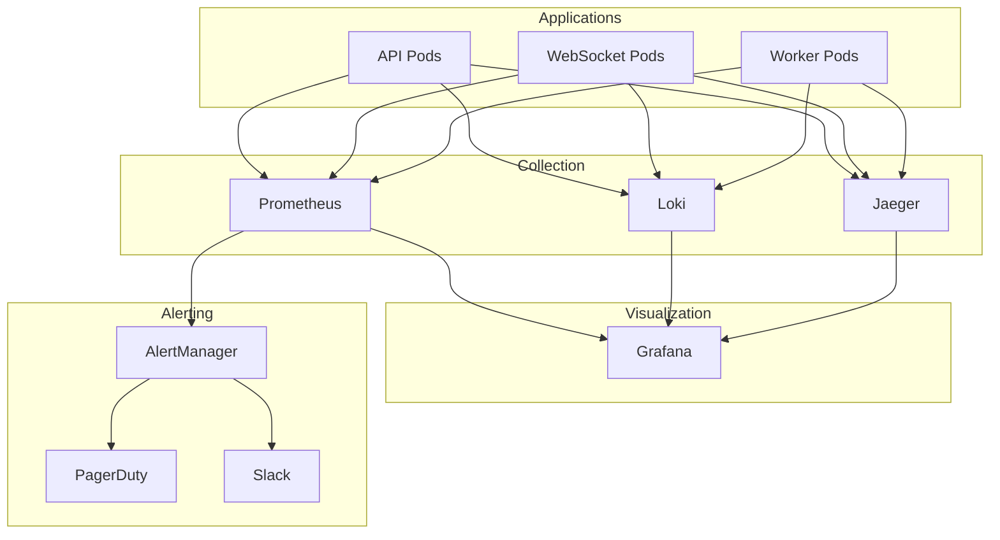

# Observability - Monitoring and Observability

> **Three Pillars**: Metrics (Prometheus), Logs (Loki), Traces (Jaeger)

---

## 🎯 Observability Stack



---

## 📊 Metrics (Prometheus + Grafana)

### Application Metrics

```java
/**
 * Custom metrics with Micrometer.
 */
@Component
public class ApplicationMetrics {

    private final MeterRegistry registry;
    private final Counter requestCounter;
    private final Timer requestTimer;
    private final Gauge activeUsers;

    public ApplicationMetrics(MeterRegistry registry) {
        this.registry = registry;

        // Counter: Total requests
        this.requestCounter = Counter.builder("http.requests.total")
            .description("Total HTTP requests")
            .tag("application", "fantasy-api")
            .register(registry);

        // Timer: Request latency
        this.requestTimer = Timer.builder("http.requests.duration")
            .description("HTTP request duration")
            .publishPercentiles(0.5, 0.95, 0.99)
            .tag("application", "fantasy-api")
            .register(registry);

        // Gauge: Active users
        this.activeUsers = Gauge.builder("users.active", this::getActiveUserCount)
            .description("Active users count")
            .register(registry);
    }

    /**
     * Business metric: Trades per hour.
     */
    public void recordTrade(Trade trade) {
        Counter.builder("trades.total")
            .tag("status", trade.status().name())
            .tag("league", trade.leagueId().toString())
            .register(registry)
            .increment();
    }

    /**
     * Business metric: Live matches.
     */
    public void recordLiveMatch(String sportId) {
        Gauge.builder("matches.live", () -> getLiveMatchCount(sportId))
            .tag("sport", sportId)
            .register(registry);
    }

    /**
     * Performance metric: Cache hit rate.
     */
    public void recordCacheAccess(String cacheName, boolean hit) {
        Counter.builder("cache.requests")
            .tag("cache", cacheName)
            .tag("result", hit ? "hit" : "miss")
            .register(registry)
            .increment();
    }
}
```

### Key Metrics to Monitor

**Application Metrics**:
```promql
# Request rate (QPS)
rate(http_requests_total[5m])

# Request latency P95
histogram_quantile(0.95, rate(http_requests_duration_bucket[5m]))

# Error rate
rate(http_requests_total{status=~"5.."}[5m]) / rate(http_requests_total[5m])

# Active users
users_active

# Trade volume
rate(trades_total[1h])
```

**JVM Metrics**:
```promql
# Heap memory usage
jvm_memory_used_bytes{area="heap"} / jvm_memory_max_bytes{area="heap"}

# GC pause time
rate(jvm_gc_pause_seconds_sum[5m])

# Thread count
jvm_threads_live

# CPU usage
process_cpu_usage
```

**Database Metrics**:
```promql
# Connection pool usage
hikari_connections_active / hikari_connections_max

# Query duration
rate(db_query_duration_seconds_sum[5m])

# Connection errors
rate(hikari_connections_timeout_total[5m])
```

**Kafka Metrics**:
```promql
# Consumer lag
kafka_consumer_lag{group="scoring-engine"}

# Message rate
rate(kafka_producer_record_send_total[5m])

# Failed messages
rate(kafka_consumer_failed_total[5m])
```

### Prometheus Configuration

```yaml
# prometheus.yml
global:
  scrape_interval: 15s
  evaluation_interval: 15s
  external_labels:
    cluster: 'production'
    environment: 'prod'

scrape_configs:
  # API pods
  - job_name: 'fantasy-api'
    kubernetes_sd_configs:
      - role: pod
        namespaces:
          names:
            - fantasy-sports
    relabel_configs:
      - source_labels: [__meta_kubernetes_pod_label_app]
        action: keep
        regex: fantasy-api
      - source_labels: [__meta_kubernetes_pod_annotation_prometheus_io_scrape]
        action: keep
        regex: true
      - source_labels: [__meta_kubernetes_pod_annotation_prometheus_io_path]
        action: replace
        target_label: __metrics_path__
        regex: (.+)
      - source_labels: [__address__, __meta_kubernetes_pod_annotation_prometheus_io_port]
        action: replace
        regex: ([^:]+)(?::\d+)?;(\d+)
        replacement: $1:$2
        target_label: __address__

  # PostgreSQL exporter
  - job_name: 'postgres'
    static_configs:
      - targets: ['postgres-exporter:9187']

  # Kafka exporter
  - job_name: 'kafka'
    static_configs:
      - targets: ['kafka-exporter:9308']

  # Redis exporter
  - job_name: 'redis'
    static_configs:
      - targets: ['redis-exporter:9121']
```

### Grafana Dashboards

**Application Overview Dashboard**:
```json
{
  "dashboard": {
    "title": "Fantasy Sports - Application Overview",
    "panels": [
      {
        "title": "Request Rate",
        "targets": [
          {
            "expr": "sum(rate(http_requests_total[5m])) by (method, status)"
          }
        ],
        "type": "graph"
      },
      {
        "title": "P95 Latency",
        "targets": [
          {
            "expr": "histogram_quantile(0.95, sum(rate(http_requests_duration_bucket[5m])) by (le))"
          }
        ],
        "type": "graph"
      },
      {
        "title": "Error Rate %",
        "targets": [
          {
            "expr": "sum(rate(http_requests_total{status=~\"5..\"}[5m])) / sum(rate(http_requests_total[5m])) * 100"
          }
        ],
        "type": "stat",
        "thresholds": [
          {"value": 0, "color": "green"},
          {"value": 1, "color": "yellow"},
          {"value": 5, "color": "red"}
        ]
      },
      {
        "title": "Active Users",
        "targets": [
          {
            "expr": "users_active"
          }
        ],
        "type": "stat"
      }
    ]
  }
}
```

---

## 📝 Logs (Loki)

### Structured Logging

```java
/**
 * Structured logging with Logback + Loki.
 */
@Service
public class LeagueService {

    private static final Logger log = LoggerFactory.getLogger(LeagueService.class);

    public Mono<League> createLeague(CreateLeagueRequest request) {
        var leagueId = UUID.randomUUID();

        // Structured logging
        log.info("Creating league",
            kv("leagueId", leagueId),
            kv("name", request.name()),
            kv("sportId", request.sportId()),
            kv("userId", getCurrentUserId()),
            kv("action", "league.create")
        );

        return leagueRepo.save(league)
            .doOnSuccess(saved ->
                log.info("League created successfully",
                    kv("leagueId", saved.id()),
                    kv("duration", Duration.between(start, Instant.now()).toMillis())
                )
            )
            .doOnError(error ->
                log.error("Failed to create league",
                    kv("leagueId", leagueId),
                    kv("error", error.getMessage()),
                    error
                )
            );
    }
}
```

### Logback Configuration

```xml
<!-- logback-spring.xml -->
<configuration>
    <appender name="LOKI" class="com.github.loki4j.logback.Loki4jAppender">
        <http>
            <url>http://loki:3100/loki/api/v1/push</url>
        </http>
        <format>
            <label>
                <pattern>application=fantasy-api,host=${HOSTNAME},level=%level</pattern>
            </label>
            <message>
                <pattern>
                {
                    "timestamp": "%date{ISO8601}",
                    "level": "%level",
                    "thread": "%thread",
                    "logger": "%logger{36}",
                    "message": "%message",
                    "mdc": {
                        "traceId": "%X{traceId}",
                        "spanId": "%X{spanId}",
                        "userId": "%X{userId}",
                        "leagueId": "%X{leagueId}"
                    }
                }
                </pattern>
            </message>
        </format>
    </appender>

    <appender name="CONSOLE" class="ch.qos.logback.core.ConsoleAppender">
        <encoder>
            <pattern>%d{HH:mm:ss.SSS} [%thread] %-5level %logger{36} - %msg%n</pattern>
        </encoder>
    </appender>

    <root level="INFO">
        <appender-ref ref="LOKI"/>
        <appender-ref ref="CONSOLE"/>
    </root>
</configuration>
```

### LogQL Queries

```logql
# Error logs in the last hour
{application="fantasy-api", level="ERROR"} |= "" | json

# Specific user logs
{application="fantasy-api"} | json | userId="123e4567-e89b-12d3-a456-426614174000"

# Request latency > 1s
{application="fantasy-api"} | json | duration > 1000 | line_format "{{.message}} - {{.duration}}ms"

# Error rate per minute
sum(rate({application="fantasy-api", level="ERROR"}[1m]))

# Top 10 most frequent errors
topk(10, sum by (error) (count_over_time({application="fantasy-api", level="ERROR"}[1h])))
```

---

## 🔍 Distributed Tracing (Jaeger)

### OpenTelemetry Configuration

```java
/**
 * Configuración de OpenTelemetry para tracing distribuido.
 */
@Configuration
public class TracingConfiguration {

    @Bean
    public OpenTelemetry openTelemetry() {
        var resource = Resource.getDefault()
            .merge(Resource.create(Attributes.of(
                ResourceAttributes.SERVICE_NAME, "fantasy-api",
                ResourceAttributes.SERVICE_VERSION, "1.0.0",
                ResourceAttributes.DEPLOYMENT_ENVIRONMENT, "production"
            )));

        var jaegerExporter = JaegerGrpcSpanExporter.builder()
            .setEndpoint("http://jaeger-collector:14250")
            .build();

        var tracerProvider = SdkTracerProvider.builder()
            .addSpanProcessor(BatchSpanProcessor.builder(jaegerExporter).build())
            .setResource(resource)
            .build();

        return OpenTelemetrySdk.builder()
            .setTracerProvider(tracerProvider)
            .setPropagators(ContextPropagators.create(W3CTraceContextPropagator.getInstance()))
            .buildAndRegisterGlobal();
    }
}
```

### Manual Instrumentation

```java
/**
 * Tracing manual para operaciones complejas.
 */
@Service
public class ScoringService {

    private final Tracer tracer;

    public ScoringService(OpenTelemetry openTelemetry) {
        this.tracer = openTelemetry.getTracer("fantasy-scoring");
    }

    public Mono<PlayerScoreUpdate> calculateScore(MatchEvent event) {
        var span = tracer.spanBuilder("calculate-score")
            .setAttribute("event.type", event.type().name())
            .setAttribute("player.id", event.playerId().toString())
            .setAttribute("match.id", event.matchId().toString())
            .startSpan();

        try (var scope = span.makeCurrent()) {
            return fetchScoringRules(event.sportId())
                .flatMap(rules -> applyRules(event, rules))
                .doOnSuccess(score -> {
                    span.setAttribute("score.points", score.points());
                    span.setStatus(StatusCode.OK);
                })
                .doOnError(error -> {
                    span.recordException(error);
                    span.setStatus(StatusCode.ERROR, error.getMessage());
                })
                .doFinally(signal -> span.end());
        }
    }

    private Mono<List<ScoringRule>> fetchScoringRules(String sportId) {
        var span = tracer.spanBuilder("fetch-scoring-rules")
            .setAttribute("sport.id", sportId)
            .startSpan();

        try (var scope = span.makeCurrent()) {
            return ruleRepo.findBySportId(sportId)
                .doFinally(signal -> span.end());
        }
    }
}
```

### Trace Analysis Queries

```
# Find slow requests (> 1s)
duration > 1s

# Find errors
error=true

# Specific service traces
service=fantasy-api

# Cross-service traces
service=fantasy-api OR service=fantasy-scoring

# Database query traces
operation=SELECT AND service=postgres
```

---

## 🚨 Alerting (AlertManager)

### Alert Rules

```yaml
# prometheus-alerts.yml
groups:
  - name: application_alerts
    interval: 30s
    rules:
      # High error rate
      - alert: HighErrorRate
        expr: |
          sum(rate(http_requests_total{status=~"5.."}[5m]))
          /
          sum(rate(http_requests_total[5m]))
          > 0.05
        for: 5m
        labels:
          severity: critical
        annotations:
          summary: "High error rate detected"
          description: "Error rate is {{ $value | humanizePercentage }}"

      # High latency
      - alert: HighLatency
        expr: |
          histogram_quantile(0.95,
            rate(http_requests_duration_bucket[5m])
          ) > 1.0
        for: 5m
        labels:
          severity: warning
        annotations:
          summary: "High latency detected"
          description: "P95 latency is {{ $value }}s"

      # Low availability
      - alert: ServiceDown
        expr: up{job="fantasy-api"} == 0
        for: 1m
        labels:
          severity: critical
        annotations:
          summary: "Service is down"
          description: "{{ $labels.instance }} is not responding"

  - name: database_alerts
    interval: 30s
    rules:
      # Database connection pool exhausted
      - alert: DatabasePoolExhausted
        expr: |
          hikari_connections_active / hikari_connections_max > 0.9
        for: 5m
        labels:
          severity: warning
        annotations:
          summary: "Database connection pool near exhaustion"
          description: "Connection pool usage is {{ $value | humanizePercentage }}"

      # Slow queries
      - alert: SlowDatabaseQueries
        expr: |
          rate(db_query_duration_seconds_sum[5m])
          /
          rate(db_query_duration_seconds_count[5m])
          > 0.5
        for: 5m
        labels:
          severity: warning
        annotations:
          summary: "Database queries are slow"
          description: "Average query time is {{ $value }}s"

  - name: kafka_alerts
    interval: 30s
    rules:
      # High consumer lag
      - alert: HighConsumerLag
        expr: kafka_consumer_lag{group="scoring-engine"} > 10000
        for: 10m
        labels:
          severity: warning
        annotations:
          summary: "High Kafka consumer lag"
          description: "Consumer lag is {{ $value }} messages"

  - name: business_alerts
    interval: 1m
    rules:
      # No live matches (during expected hours)
        - alert: NoLiveMatches
        expr: |
          matches_live == 0
          AND
          hour() >= 18 AND hour() <= 23
        for: 30m
        labels:
          severity: warning
        annotations:
          summary: "No live matches detected"
          description: "Expected live matches but found none"
```

### AlertManager Configuration

```yaml
# alertmanager.yml
global:
  resolve_timeout: 5m
  slack_api_url: 'https://hooks.slack.com/services/XXX/YYY/ZZZ'

route:
  group_by: ['alertname', 'cluster', 'service']
  group_wait: 10s
  group_interval: 10s
  repeat_interval: 12h
  receiver: 'default'
  routes:
    - match:
        severity: critical
      receiver: 'pagerduty'
      continue: true

    - match:
        severity: critical
      receiver: 'slack-critical'

    - match:
        severity: warning
      receiver: 'slack-warnings'

receivers:
  - name: 'default'
    webhook_configs:
      - url: 'http://webhook-logger:8080/alerts'

  - name: 'pagerduty'
    pagerduty_configs:
      - service_key: 'YOUR_PAGERDUTY_KEY'
        description: '{{ .GroupLabels.alertname }}'

  - name: 'slack-critical'
    slack_configs:
      - channel: '#alerts-critical'
        title: ':fire: Critical Alert'
        text: '{{ range .Alerts }}{{ .Annotations.summary }}\n{{ .Annotations.description }}\n{{ end }}'

  - name: 'slack-warnings'
    slack_configs:
      - channel: '#alerts-warnings'
        title: ':warning: Warning Alert'
        text: '{{ range .Alerts }}{{ .Annotations.summary }}\n{{ end }}'
```

---

## 📈 SLIs & SLOs

### Service Level Indicators (SLIs)

```yaml
slis:
  availability:
    description: "Percentage of successful requests"
    query: |
      sum(rate(http_requests_total{status!~"5.."}[30d]))
      /
      sum(rate(http_requests_total[30d]))

  latency:
    description: "Percentage of requests < 500ms"
    query: |
      sum(rate(http_requests_duration_bucket{le="0.5"}[30d]))
      /
      sum(rate(http_requests_duration_count[30d]))

  error_rate:
    description: "Percentage of requests without errors"
    query: |
      1 - (
        sum(rate(http_requests_total{status=~"5.."}[30d]))
        /
        sum(rate(http_requests_total[30d]))
      )
```

### Service Level Objectives (SLOs)

| Metric       | SLO    | SLA   |
|--------------|--------|-------|
| Availability | 99.9%  | 99.5% |
| Latency (P95)| < 500ms| < 1000ms |
| Error Rate   | < 0.1% | < 1% |

---
