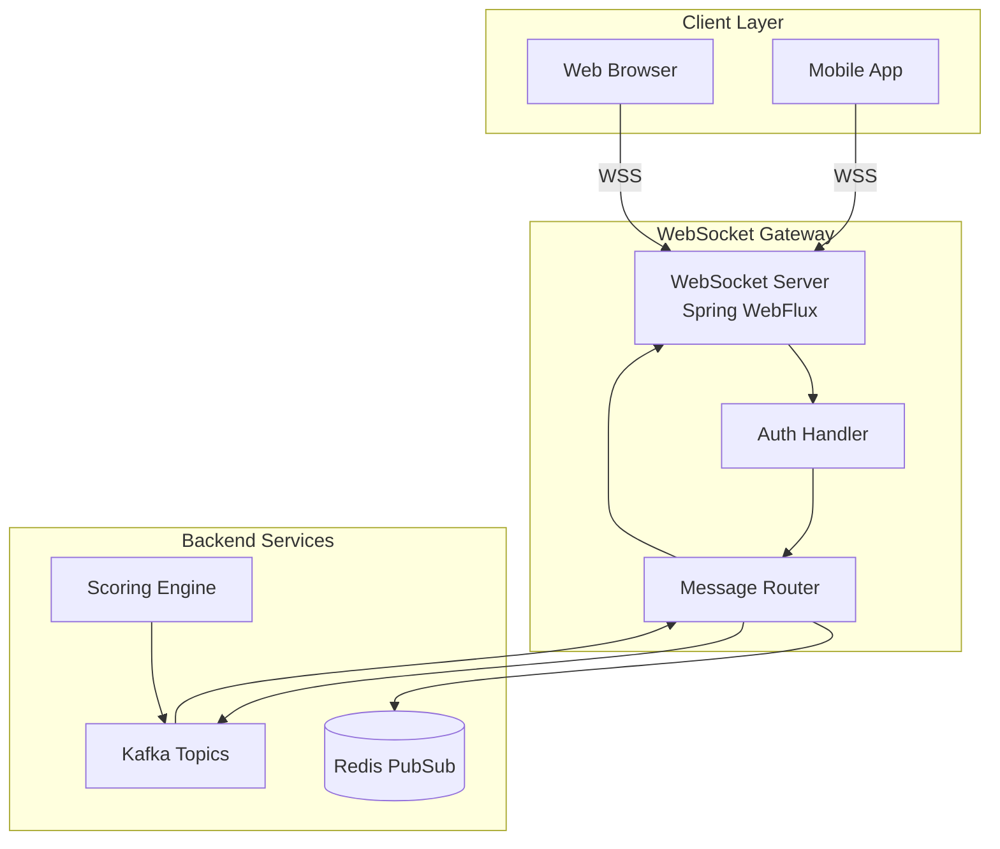

# WebSocket Protocol - WebSocket Protocol

> **Real-Time Bidirectional Communication**: Live scores, notifications, and updates

---

## 🎯 WebSocket Architecture



---

## 🔌 Connection Establishment

### Connection URL

```
wss://ws.fantasy-sports.com/v1/ws
```

### Authentication

**Method 1: Query Parameter (Simple)**
```
wss://ws.fantasy-sports.com/v1/ws?token=eyJhbGciOiJIUzUxMiJ9...
```

**Method 2: Initial Message (Recommended)**
```javascript
// 1. Connect without auth
const ws = new WebSocket('wss://ws.fantasy-sports.com/v1/ws');

// 2. Send auth message immediately
ws.onopen = () => {
  ws.send(JSON.stringify({
    type: 'AUTH',
    payload: {
      token: 'eyJhbGciOiJIUzUxMiJ9...'
    }
  }));
};
```

### Connection Lifecycle

```javascript
const ws = new WebSocket('wss://ws.fantasy-sports.com/v1/ws');

ws.onopen = (event) => {
  console.log('Connected to WebSocket');

  // Authenticate
  ws.send(JSON.stringify({
    type: 'AUTH',
    payload: { token: accessToken }
  }));
};

ws.onmessage = (event) => {
  const message = JSON.parse(event.data);
  handleMessage(message);
};

ws.onerror = (error) => {
  console.error('WebSocket error:', error);
};

ws.onclose = (event) => {
  console.log('Disconnected:', event.code, event.reason);

  // Reconnect logic
  if (!event.wasClean) {
    setTimeout(reconnect, 5000);
  }
};
```

---

## 📨 Message Format

### Base Message Structure

```typescript
interface WebSocketMessage {
  type: string;           // Message type
  payload: any;           // Message payload
  timestamp?: string;     // ISO 8601 timestamp
  messageId?: string;     // Unique message ID (for acks)
  correlationId?: string; // For request/response pairing
}
```

### Message Types

#### Client → Server

| Type         | Description            | Requires Auth |
|--------------|------------------------|---------------|
| `AUTH`       | Authenticate connection| No            |
| `SUBSCRIBE`  | Subscribe to topic     | Yes           |
| `UNSUBSCRIBE`| Unsubscribe from topic | Yes           |
| `PING`       | Heartbeat              | Yes           |
| `ACK`        | Acknowledge message    | Yes           |

#### Server → Client

| Type                | Description               |
|---------------------|---------------------------|
| `AUTH_SUCCESS`      | Authentication successful |
| `AUTH_FAILED`       | Authentication failed     |
| `SUBSCRIBED`        | Subscription confirmed    |
| `UNSUBSCRIBED`      | Unsubscription confirmed  |
| `LIVE_SCORE_UPDATE` | Live score update         |
| `TRADE_NOTIFICATION`| Trade status change       |
| `MATCH_EVENT`       | Match event occurred      |
| `PONG`              | Heartbeat response        |
| `ERROR`             | Error message             |

---

## 🔔 Subscription Model

### Subscribe to Topics

```javascript
// Subscribe to match live scores
ws.send(JSON.stringify({
  type: 'SUBSCRIBE',
  payload: {
    topic: 'match.live',
    matchId: '123e4567-e89b-12d3-a456-426614174000'
  }
}));

// Subscribe to league updates
ws.send(JSON.stringify({
  type: 'SUBSCRIBE',
  payload: {
    topic: 'league.updates',
    leagueId: '123e4567-e89b-12d3-a456-426614174001'
  }
}));

// Subscribe to personal notifications
ws.send(JSON.stringify({
  type: 'SUBSCRIBE',
  payload: {
    topic: 'user.notifications'
  }
}));
```

### Available Topics

| Topic               | Description                  | Parameters  |
|---------------------|------------------------------|-------------|
| `match.live`        | Live match events and scores | `matchId`   |
| `league.standings`  | League standings updates     | `leagueId`  |
| `league.updates`    | League configuration changes | `leagueId`  |
| `team.roster`       | Team roster changes          | `teamId`    |
| `user.notifications`| Personal notifications       | -           |
| `trade.updates`     | Trade proposals and responses| `teamId`    |

---

## ⚡ Real-Time Updates

### Live Score Update

```json
{
  "type": "LIVE_SCORE_UPDATE",
  "timestamp": "2025-11-08T20:15:30Z",
  "payload": {
    "matchId": "123e4567-e89b-12d3-a456-426614174000",
    "event": {
      "type": "GOL",
      "playerId": "player-123",
      "playerName": "Lionel Messi",
      "teamId": "team-456",
      "minute": 23,
      "isPenalty": false
    },
    "playerUpdate": {
      "playerId": "player-123",
      "pointsAdded": 10,
      "totalPoints": 25,
      "description": "Gol (10 pts)"
    },
    "matchState": {
      "homeScore": 1,
      "awayScore": 0,
      "minute": 23,
      "status": "LIVE"
    }
  }
}
```

### Match Event Stream

```json
{
  "type": "MATCH_EVENT",
  "timestamp": "2025-11-08T20:15:30Z",
  "payload": {
    "matchId": "123e4567-e89b-12d3-a456-426614174000",
    "eventType": "YELLOW_CARD",
    "playerId": "player-789",
    "playerName": "Sergio Ramos",
    "minute": 45,
    "pointsImpact": -2,
    "description": "Tarjeta amarilla (-2 pts)"
  }
}
```

### Trade Notification

```json
{
  "type": "TRADE_NOTIFICATION",
  "timestamp": "2025-11-08T20:30:00Z",
  "payload": {
    "tradeId": "trade-123",
    "status": "PROPOSED",
    "fromTeam": {
      "id": "team-111",
      "name": "FC Dream Team"
    },
    "toTeam": {
      "id": "team-222",
      "name": "Warriors FC"
    },
    "offeredPlayers": [
      {
        "id": "player-001",
        "name": "Cristiano Ronaldo",
        "position": "FWD"
      }
    ],
    "requestedPlayers": [
      {
        "id": "player-002",
        "name": "Kylian Mbappé",
        "position": "FWD"
      }
    ],
    "message": "Interested in trading for Mbappé",
    "expiresAt": "2025-11-10T20:30:00Z"
  }
}
```

### Standings Update

```json
{
  "type": "LEAGUE_STANDINGS_UPDATE",
  "timestamp": "2025-11-08T21:00:00Z",
  "payload": {
    "leagueId": "league-123",
    "weekId": "week-5",
    "standings": [
      {
        "rank": 1,
        "teamId": "team-111",
        "teamName": "FC Dream Team",
        "wins": 4,
        "losses": 1,
        "totalPoints": 520.5,
        "weekPoints": 105.2
      },
      {
        "rank": 2,
        "teamId": "team-222",
        "teamName": "Warriors FC",
        "wins": 3,
        "losses": 2,
        "totalPoints": 485.3,
        "weekPoints": 98.7
      }
    ]
  }
}
```

---

## 💓 Heartbeat & Keep-Alive

### Client → Server PING

```json
{
  "type": "PING",
  "timestamp": "2025-11-08T20:00:00Z"
}
```

### Server → Client PONG

```json
{
  "type": "PONG",
  "timestamp": "2025-11-08T20:00:00Z",
  "serverTime": "2025-11-08T20:00:00.123Z"
}
```

**Recommendation**: Client should send PING every 30 seconds to keep connection alive.

---

## 🔄 Reliable Delivery

### Message Acknowledgment

```javascript
// Server sends message with messageId
{
  "type": "LIVE_SCORE_UPDATE",
  "messageId": "msg-12345",
  "payload": { ... }
}

// Client acknowledges receipt
ws.send(JSON.stringify({
  "type": "ACK",
  "payload": {
    "messageId": "msg-12345"
  }
}));
```

### Retry Logic (Server-Side)

- Server tracks unacknowledged messages
- Retries up to 3 times with exponential backoff
- After 3 failures, marks message as undeliverable
- Client can request missed messages on reconnect

---

## 🚨 Error Handling

### Error Message Format

```json
{
  "type": "ERROR",
  "timestamp": "2025-11-08T20:00:00Z",
  "payload": {
    "code": "SUBSCRIPTION_FAILED",
    "message": "Unable to subscribe to topic 'match.live'",
    "details": {
      "reason": "Match not found",
      "matchId": "invalid-match-id"
    }
  }
}
```

### Error Codes

| Code                 | Description           | Recovery          |
|----------------------|-----------------------|-------------------|
| `AUTH_FAILED`        | Authentication failed | Re-authenticate   |
| `TOKEN_EXPIRED`      | JWT token expired     | Refresh token     |
| `SUBSCRIPTION_FAILED`| Subscription failed   | Check parameters  |
| `INVALID_MESSAGE`    | Malformed message     | Fix message format|
| `RATE_LIMIT_EXCEEDED`| Too many messages     | Slow down         |
| `INTERNAL_ERROR`     | Server error          | Retry later       |

---

## 🔧 Server Implementation

### WebSocket Handler

```java
/**
 * WebSocket handler para comunicación real-time.
 */
@Component
public class FantasyWebSocketHandler implements WebSocketHandler {

    private final Map<String, WebSocketSession> sessions = new ConcurrentHashMap<>();
    private final Map<String, Set<String>> subscriptions = new ConcurrentHashMap<>();
    private final JWTService jwtService;
    private final RedisPubSubService pubSubService;

    @Override
    public Mono<Void> handle(WebSocketSession session) {
        return session.receive()
            .flatMap(message -> handleMessage(session, message))
            .then(Mono.defer(() -> cleanupSession(session)));
    }

    private Mono<Void> handleMessage(WebSocketSession session, WebSocketMessage message) {
        return Mono.fromCallable(() -> {
            var msg = parseMessage(message.getPayloadAsText());

            return switch (msg.type()) {
                case "AUTH" -> handleAuth(session, msg);
                case "SUBSCRIBE" -> handleSubscribe(session, msg);
                case "UNSUBSCRIBE" -> handleUnsubscribe(session, msg);
                case "PING" -> handlePing(session, msg);
                case "ACK" -> handleAck(session, msg);
                default -> handleError(session, "INVALID_MESSAGE", "Unknown message type");
            };
        }).then();
    }

    /**
     * Autenticación con JWT.
     */
    private Mono<Void> handleAuth(WebSocketSession session, WSMessage msg) {
        var token = msg.payload().get("token").toString();

        return jwtService.validateToken(token)
            .flatMap(claims -> {
                // Asociar sesión con usuario
                sessions.put(session.getId(), session);
                session.getAttributes().put("userId", claims.userId());

                // Responder con éxito
                return sendMessage(session, new WSMessage(
                    "AUTH_SUCCESS",
                    Map.of("userId", claims.userId())
                ));
            })
            .onErrorResume(error ->
                sendMessage(session, new WSMessage(
                    "AUTH_FAILED",
                    Map.of("reason", error.getMessage())
                ))
            );
    }

    /**
     * Suscripción a tópico.
     */
    private Mono<Void> handleSubscribe(WebSocketSession session, WSMessage msg) {
        var userId = (UUID) session.getAttributes().get("userId");
        if (userId == null) {
            return sendMessage(session, new WSMessage(
                "ERROR",
                Map.of("code", "AUTH_REQUIRED")
            ));
        }

        var topic = msg.payload().get("topic").toString();
        var topicKey = buildTopicKey(topic, msg.payload());

        // Validar permisos
        return validateSubscription(userId, topic, msg.payload())
            .flatMap(hasPermission -> {
                if (!hasPermission) {
                    return sendMessage(session, new WSMessage(
                        "ERROR",
                        Map.of("code", "SUBSCRIPTION_FORBIDDEN")
                    ));
                }

                // Agregar suscripción
                subscriptions.computeIfAbsent(session.getId(), k -> new HashSet<>())
                    .add(topicKey);

                // Suscribirse a Redis PubSub
                pubSubService.subscribe(topicKey, message ->
                    sendMessage(session, message)
                );

                // Confirmar suscripción
                return sendMessage(session, new WSMessage(
                    "SUBSCRIBED",
                    Map.of("topic", topic)
                ));
            });
    }

    /**
     * Envía mensaje a cliente.
     */
    private Mono<Void> sendMessage(WebSocketSession session, WSMessage message) {
        var json = objectMapper.writeValueAsString(message);
        return session.send(Mono.just(session.textMessage(json)));
    }

    /**
     * Cleanup al desconectar.
     */
    private Mono<Void> cleanupSession(WebSocketSession session) {
        return Mono.fromRunnable(() -> {
            sessions.remove(session.getId());

            // Unsuscribirse de todos los tópicos
            var topics = subscriptions.remove(session.getId());
            if (topics != null) {
                topics.forEach(pubSubService::unsubscribe);
            }
        });
    }
}
```

### Broadcasting Updates

```java
/**
 * Servicio para broadcast de actualizaciones.
 */
@Service
public class WebSocketBroadcastService {

    private final RedisPubSubService pubSubService;

    /**
     * Broadcast live score update a suscriptores del match.
     */
    public Mono<Void> broadcastLiveScore(UUID matchId, PlayerScoreUpdate update) {
        var topic = "match.live:" + matchId;

        var message = new WSMessage(
            "LIVE_SCORE_UPDATE",
            Map.of(
                "matchId", matchId,
                "playerUpdate", update
            )
        );

        return pubSubService.publish(topic, message);
    }

    /**
     * Broadcast trade notification.
     */
    public Mono<Void> broadcastTradeNotification(Trade trade) {
        var topics = List.of(
            "team.trades:" + trade.offeringTeamId(),
            "team.trades:" + trade.receivingTeamId()
        );

        var message = new WSMessage(
            "TRADE_NOTIFICATION",
            Map.of(
                "tradeId", trade.id(),
                "status", trade.status(),
                "trade", trade
            )
        );

        return Flux.fromIterable(topics)
            .flatMap(topic -> pubSubService.publish(topic, message))
            .then();
    }
}
```

---

## 📱 Client SDK Examples

### JavaScript/TypeScript

```typescript
class FantasyWebSocketClient {
  private ws: WebSocket | null = null;
  private reconnectAttempts = 0;
  private maxReconnectAttempts = 5;
  private subscriptions = new Set<string>();

  constructor(private token: string) {}

  connect(): Promise<void> {
    return new Promise((resolve, reject) => {
      this.ws = new WebSocket('wss://ws.fantasy-sports.com/v1/ws');

      this.ws.onopen = () => {
        console.log('WebSocket connected');
        this.authenticate().then(resolve).catch(reject);
        this.startHeartbeat();
      };

      this.ws.onmessage = (event) => {
        const message = JSON.parse(event.data);
        this.handleMessage(message);
      };

      this.ws.onerror = (error) => {
        console.error('WebSocket error:', error);
        reject(error);
      };

      this.ws.onclose = (event) => {
        console.log('WebSocket closed:', event.code);
        this.stopHeartbeat();
        this.attemptReconnect();
      };
    });
  }

  private authenticate(): Promise<void> {
    return this.send({
      type: 'AUTH',
      payload: { token: this.token }
    });
  }

  subscribe(topic: string, params?: any): Promise<void> {
    const key = JSON.stringify({ topic, ...params });
    this.subscriptions.add(key);

    return this.send({
      type: 'SUBSCRIBE',
      payload: { topic, ...params }
    });
  }

  private send(message: any): Promise<void> {
    return new Promise((resolve, reject) => {
      if (!this.ws || this.ws.readyState !== WebSocket.OPEN) {
        reject(new Error('WebSocket not connected'));
        return;
      }

      this.ws.send(JSON.stringify(message));
      resolve();
    });
  }

  private handleMessage(message: any): void {
    switch (message.type) {
      case 'LIVE_SCORE_UPDATE':
        this.emit('liveScore', message.payload);
        break;
      case 'TRADE_NOTIFICATION':
        this.emit('trade', message.payload);
        break;
      // ... other message types
    }
  }

  private startHeartbeat(): void {
    this.heartbeatInterval = setInterval(() => {
      this.send({ type: 'PING' });
    }, 30000);
  }

  private attemptReconnect(): void {
    if (this.reconnectAttempts >= this.maxReconnectAttempts) {
      console.error('Max reconnect attempts reached');
      return;
    }

    this.reconnectAttempts++;
    const delay = Math.min(1000 * Math.pow(2, this.reconnectAttempts), 30000);

    setTimeout(() => {
      console.log(`Reconnecting... (attempt ${this.reconnectAttempts})`);
      this.connect();
    }, delay);
  }
}

// Usage
const client = new FantasyWebSocketClient(accessToken);
await client.connect();

client.on('liveScore', (update) => {
  console.log('Live score update:', update);
  updateUI(update);
});

await client.subscribe('match.live', { matchId: '123...' });
```

---