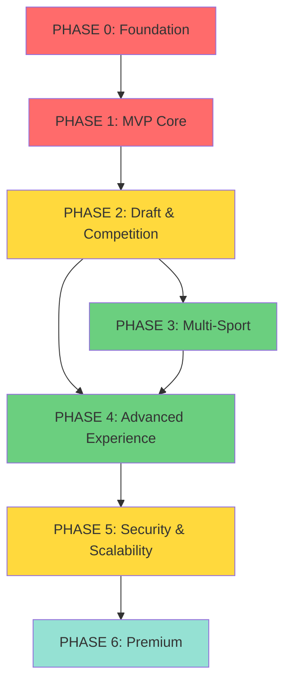

# Development Roadmap - Fantasy Sports Hub

> Complete development roadmap with prioritization, dependencies, and estimated timeline

**Status**: ✅ Active
**Version**: 1.0.0
**Last Updated**: 2025-11-09

---

## 📊 Executive Summary

**Total Duration**: ~31-40 weeks (7-9 months)
**Team Recommended**:
- 2-3 Backend Engineers (Java/Spring)
- 2 Frontend Engineers (React/Next.js)
- 1 DevOps Engineer
- 1 QA Engineer

**Critical Path**: Phase 0 → Phase 1 → Phase 2 → Phase 5 (production)

---

## 🎯 Global Priorities

| Priority | Description                         | Criteria |
|-----------|-------------------------------------|----------|
| **P0**    | Blocking - Nothing works without this | Essential MVP |
| **P1**    | Critical - Required for production | Complete experience |
| **P2**    | Important - Key differentiator    | Engagement and retention |
| **P3**    | Nice to have - Monetization         | Revenue streams |

---

## 🚀 Phase-based Roadmap

### PHASE 0: FOUNDATION (3-4 weeks) - P0

**Objective**: Functional base infrastructure for development

**Backend Tasks:**

| Task                                  | Módulo       | Duración | Dependencias | Prioridad |
|---------------------------------------|--------------|----------|--------------|-----------|
| Setup Kubernetes cluster (dev/staging)| Infrastructure | 3 días | Ninguna | P0 |
| CI/CD pipeline (GitHub Actions)       | Infrastructure | 3 días | K8s cluster | P0 |
| Observability stack (Prometheus + Grafana) | Infrastructure | 2 días | K8s cluster | P0 |
| PostgreSQL setup + migrations         | Database | 2 días | K8s cluster | P0 |
| EventStoreDB setup                    | Database | 2 días | K8s cluster | P0 |
| MongoDB setup                         | Database | 1 día | K8s cluster | P0 |
| Redis setup                           | Database | 1 día | K8s cluster | P0 |
| Kafka setup (Strimzi operator)        | Messaging | 3 días | K8s cluster | P0 |
| Spring WebFlux project skeleton       | Core Backend | 2 días | Ninguna | P0 |
| Event Sourcing base (EventStore client) | Core Backend | 3 días | EventStoreDB, Spring skeleton | P0 |
| CQRS pattern implementation           | Core Backend | 3 días | Event Sourcing base | P0 |
| API Gateway (Spring Cloud Gateway)    | Core Backend | 2 días | Spring skeleton | P0 |
| Security config (JWT base)            | Authentication | 3 días | Spring skeleton | P0 |

**Frontend Tasks:**

| Task                           | Módulo       | Duración | Dependencias | Prioridad |
|--------------------------------|--------------|----------|--------------|-----------|
| Next.js 14 project setup       | Core Frontend | 1 día | Ninguna | P0 |
| Tailwind + Shadcn/ui setup     | Core Frontend | 1 día | Next.js setup | P0 |
| TanStack Query + Zustand setup | State Management | 1 día | Next.js setup | P0 |
| Axios client + interceptors    | API Client | 2 días | Next.js setup | P0 |
| ESLint + Prettier config       | DevTools | 1 día | Next.js setup | P0 |
| Vitest + Testing Library setup | Testing | 2 días | Next.js setup | P0 |

**Deliverables**:
- ✅ Infraestructura completa desplegada
- ✅ Backend skeleton con Event Sourcing funcional
- ✅ Frontend skeleton con state management
- ✅ CI/CD pipeline ejecutando builds y tests
- ✅ Observability dashboard operacional

---

### FASE 1: MVP CORE (6-8 semanas) - P0

**Objetivo**: Funcionalidad mínima viable para una liga de fantasía

**Backend Tasks:**

#### **Authentication & User Management**

| Task                          | Módulo       | Duración | Dependencias | Prioridad |
|-------------------------------|--------------|----------|--------------|-----------|
| User registration/login (JWT) | Auth Service | 3 días | Security config (Fase 0) | P0 |
| Token refresh rotation        | Auth Service | 2 días | User registration | P0 |
| Password reset flow           | Auth Service | 2 días | User registration | P0 |
| User profile CRUD             | User Service | 2 días | Auth Service | P0 |
| User preferences              | User Service | 1 día | User profile | P0 |

#### **Plugin Architecture**

| Task                            | Módulo       | Duración | Dependencias | Prioridad |
|---------------------------------|--------------|----------|--------------|-----------|
| Sport Plugin Registry interface | Plugin Core  | 3 días   | CQRS (Fase 0) | P0 |
| Fútbol Plugin implementation    | Sport Plugins| 4 días   | Plugin Registry | P0 |
| Position validation engine      | Plugin Core  | 3 días   | Plugin Registry | P0 |

#### **Multi-Provider Integration**

| Task                                  | Módulo       | Duración | Dependencias | Prioridad |
|---------------------------------------|--------------|----------|--------------|-----------|
| API-Football client                   | Provider Integration | 4 días | Plugin Registry | P0 |
| Data normalization service            | Provider Integration | 3 días | API-Football client | P0 |
| Circuit breaker + retry (Resilience4j)| Provider Integration | 2 días | API-Football client | P0 |

#### **Player Catalog**

| Task                                     | Módulo       | Duración | Dependencias | Prioridad |
|------------------------------------------|--------------|----------|--------------|-----------|
| Player entity + repository               | Player Catalog | 2 días | Plugin Registry | P0 |
| Player CRUD endpoints                    | Player Catalog | 3 días | Player entity | P0 |
| Player search/filter (MongoDB projection)| Player Catalog | 4 días | Player CRUD, Multi-Provider | P0 |
| Player stats aggregation                 | Player Catalog | 3 días | Multi-Provider | P0 |

#### **League Management**

| Task                             | Módulo       | Duración | Dependencias | Prioridad |
|----------------------------------|--------------|----------|--------------|-----------|
| League aggregate (Event Sourcing)| League Service | 4 días | CQRS | P0 |
| League CRUD commands             | League Service | 3 días | League aggregate | P0 |
| League projection (MongoDB)      | League Service | 3 días | League aggregate | P0 |
| League settings configuration    | League Service | 3 días | League CRUD | P0 |
| Member invitation system         | League Service | 4 días | League CRUD, User Service | P0 |

#### **Roster Management**

| Task                             | Módulo         | Duración | Dependencias | Prioridad |
|----------------------------------|----------------|----------|--------------|-----------|
| Roster aggregate (Event Sourcing)| Roster Service | 5 días | League Service | P0 |
| Roster CRUD commands             | Roster Service | 3 días | Roster aggregate | P0 |
| Roster projection (MongoDB)      | Roster Service | 3 días | Roster aggregate | P0 |
| Formation validation             | Roster Service | 4 días | Plugin Registry, Roster CRUD | P0 |
| Budget validation                | Roster Service | 3 días | Roster CRUD | P0 |
| Player add/remove operations     | Roster Service | 3 días | Roster CRUD, Player Catalog | P0 |

#### **Scoring Engine (Simple)**

| Task                             | Módulo         | Duración | Dependencias | Prioridad |
|----------------------------------|----------------|----------|--------------|-----------|
| Live scoring rules (fase 1 only) | Scoring Engine | 5 días | Plugin Registry | P0 |
| Event processor (Kafka consumer) | Scoring Engine | 4 días | Kafka (Fase 0) | P0 |
| Score calculation service        | Scoring Engine | 4 días | Event processor, Player Catalog | P0 |
| Score projection (MongoDB)       | Scoring Engine | 3 días | Score calculation | P0 |

**Frontend Tasks:**

#### **Authentication**

| Task                          | Módulo         | Duración | Dependencias | Prioridad |
|-------------------------------|----------------|----------|--------------|-----------|
| Login/Register forms          | Auth Module    | 3 días   | Axios client (Fase 0) | P0 |
| JWT storage + auth interceptor| Auth Module    | 2 días   | Login forms | P0 |
| Protected routes middleware   | Auth Module    | 2 días   | JWT storage | P0 |
| Password reset flow           | Auth Module    | 2 días   | Login forms | P0 |

#### **Dashboard**

| Task                 | Módulo   | Duración | Dependencias | Prioridad |
|----------------------|----------|----------|--------------|-----------|
| Home page layout     | Dashboard| 2 días   | Auth Module | P0 |
| League overview cards| Dashboard| 3 días   | League API integration | P0 |
| Navigation component | Dashboard| 2 días   | Auth Module | P0 |

#### **League Management**

| Task                | Módulo   | Duración | Dependencias | Prioridad |
|---------------------|----------|----------|--------------|-----------|
| Create league form (React Hook Form + Zod) | League Module | 4 días | Auth Module | P0 |
| League settings page | League Module | 3 días | Create league | P0 |
| Member invitation UI | League Module | 3 días | League settings | P0 |
| League list page     | League Module | 2 días | Dashboard | P0 |

#### **Player Catalog**

| Task                    | Módulo   | Duración | Dependencias | Prioridad |
|-------------------------|----------|----------|--------------|-----------|
| Player search page      | Player Module | 4 días | Auth Module | P0 |
| Player list with filters| Player Module | 4 días | Player search | P0 |
| Player card component   | Player Module | 3 días | Player list | P0 |
| Player details modal    | Player Module | 3 días | Player card | P0 |

#### **Roster Management (Killer Feature)**

| Task                        | Módulo   | Duración | Dependencias | Prioridad |
|-----------------------------|----------|----------|--------------|-----------|
| RosterGrid container        | Roster Module | 3 días | League Module | P0 |
| PlayerCard with CVA variants| Roster Module | 4 días | Player Module | P0 |
| StartingLineup component    | Roster Module | 4 días | RosterGrid | P0 |
| BenchSection component      | Roster Module | 3 días | RosterGrid | P0 |
| @dnd-kit integration        | Roster Module | 5 días | All Roster components | P0 |
| PositionSlot with validation| Roster Module | 4 días | @dnd-kit | P0 |
| Budget tracker component    | Roster Module | 2 días | RosterGrid | P0 |
| Formation validation UI     | Roster Module | 3 días | PositionSlot | P0 |
| useRoster hook (TanStack Query) | Roster Module | 3 días | Roster components | P0 |
| useRosterDragDrop hook      | Roster Module | 4 días | @dnd-kit | P0 |

**Deliverables**:
- ✅ Users can register and authenticate
- ✅ Create and configure private leagues
- ✅ Functional soccer player catalog
- ✅ Complete roster management with drag & drop
- ✅ Simple scoring system (live scoring)
- ✅ Player search and filtering

**MVP Demo-able**: Functional basic system with 1 sport

---

### PHASE 2: DRAFT & COMPETITION (4-6 weeks) - P1

**Objective**: Complete draft and competition experience

**Backend Tasks:**

#### **Draft System**

| Task                        | Módulo   | Duración | Dependencias | Prioridad |
|-----------------------------|----------|----------|--------------|-----------|
| Draft aggregate (Event Sourcing)| Draft Service | 4 días | League Service (Fase 1) | P1 |
| Draft configuration         | Draft Service | 3 días | Draft aggregate | P1 |
| Pick command handler        | Draft Service | 3 días | Draft aggregate | P1 |
| Draft projection (MongoDB)  | Draft Service | 3 días | Draft aggregate | P1 |
| Snake draft algorithm       | Draft Service | 4 días | Draft configuration | P1 |
| Auto-pick system            | Draft Service | 3 días | Pick handler, Player Catalog | P1 |

#### **WebSocket Integration**

| Task                         | Módulo   | Duración | Dependencias | Prioridad |
|------------------------------|----------|----------|--------------|-----------|
| STOMP WebSocket config       | WebSocket Service | 2 días | Spring WebFlux (Fase 0) | P1 |
| Draft room WebSocket endpoint| WebSocket Service | 3 días | STOMP config, Draft Service | P1 |
| Pick broadcast mechanism     | WebSocket Service | 2 días | Draft WebSocket | P1 |

#### **Tournament System**

| Task                         | Módulo   | Duración | Dependencias | Prioridad |
|------------------------------|----------|----------|--------------|-----------|
| Tournament aggregate         | Tournament Service | 4 días | League Service | P1 |
| Round-robin fixture generator| Tournament Service | 4 días | Tournament aggregate | P1 |
| Standings calculation (projection) | Tournament Service | 3 días | Score projection (Fase 1) | P1 |
| Matchup resolution           | Tournament Service | 3 días | Standings, Scoring Engine | P1 |

#### **Scoring Engine (2 Fases)**

| Task                              | Módulo   | Duración | Dependencias | Prioridad |
|-----------------------------------|----------|----------|--------------|-----------|
| Post-match bonus rules            | Scoring Engine | 4 días | Live scoring (Fase 1) | P1 |
| Bonus calculation service         | Scoring Engine | 3 días | Post-match rules | P1 |
| Score recalculation on corrections| Scoring Engine | 3 días | Bonus calculation | P1 |

#### **Leaderboards** 

| Task                            | Módulo   | Duración | Dependencias | Prioridad |
|---------------------------------|----------|----------|--------------|-----------|
| Leaderboard projection (MongoDB)| Leaderboard Service | 3 días | Standings | P1 |
| Leaderboard query API           | Leaderboard Service | 2 días | Leaderboard projection | P1 |

**Frontend Tasks:**

#### **Draft Room**

| Task                          | Módulo   | Duración | Dependencias | Prioridad |
|-------------------------------|----------|----------|--------------|-----------|
| DraftRoom container           | Draft Module | 3 días | League Module (Fase 1) | P1 |
| DraftLobby (pre-draft waiting)| Draft Module | 3 días | DraftRoom | P1 |
| PickTimer component           | Draft Module | 3 días | DraftRoom | P1 |
| CurrentPickPanel              | Draft Module | 2 días | DraftRoom | P1 |
| AvailablePlayerList           | Draft Module | 4 días | Player Module (Fase 1) | P1 |
| DraftOrderList (snake visualization) | Draft Module | 3 días | DraftRoom | P1 |
| DraftTeamPanel                | Draft Module | 3 días | DraftRoom | P1 |
| PickConfirmationModal         | Draft Module | 2 días | DraftRoom | P1 |
| DraftChat (WebSocket)         | Draft Module | 4 días | WebSocket integration | P1 |
| DraftComplete summary         | Draft Module | 2 días | DraftRoom | P1 |

#### **WebSocket Client**

| Task                        | Módulo   | Duración | Dependencias | Prioridad |
|-----------------------------|----------|----------|--------------|-----------|
| SockJS + STOMP client setup | WebSocket Client | 3 días | Next.js (Fase 0) | P1 |
| useDraftSync hook           | WebSocket Client | 3 días | SockJS client | P1 |
| Auto-reconnection logic     | WebSocket Client | 2 días | SockJS client | P1 |

#### **Draft Hooks**

| Task                      | Módulo   | Duración | Dependencias | Prioridad |
|---------------------------|----------|----------|--------------|-----------|
| useDraft hook (TanStack Query) | Draft Module | 2 días | Draft components | P1 |
| useDraftPick mutation     | Draft Module | 3 días | useDraft | P1 |
| useAutoPickWarning hook   | Draft Module | 2 días | PickTimer | P1 |

#### **Tournament & Standings**

| Task                      | Módulo   | Duración | Dependencias | Prioridad |
|---------------------------|----------|----------|--------------|-----------|
| Standings table component | Tournament Module | 3 días | League Module | P1 |
| Matchup display component | Tournament Module | 3 días | Standings | P1 |
| Schedule/fixtures page    | Tournament Module | 3 días | League Module | P1 |

**Deliverables**:
- ✅ Draft room en tiempo real funcional
- ✅ Sistema de torneos round-robin
- ✅ Scoring en 2 fases (live + bonos post-partido)
- ✅ Leaderboards actualizados
- ✅ Calendario de fixtures

**Production Ready**: Experiencia completa de liga funcional

---

### PHASE 3: MULTI-SPORT & ANALYTICS (5-7 weeks) - P2

**Objective**: Multi-sport expansion and analysis tools

**Backend Tasks:**

#### **Multi-Sport Plugins**

| Task             | Módulo   | Duración | Dependencias | Prioridad |
|------------------|----------|----------|--------------|-----------|
| Baloncesto Plugin| Sport Plugins | 4 días | Plugin Registry (Fase 1) | P2 |
| Baseball Plugin  | Sport Plugins | 4 días | Plugin Registry | P2 |
| Tenis Plugin     | Sport Plugins | 4 días | Plugin Registry | P2 |
| Hockey Plugin    | Sport Plugins | 4 días | Plugin Registry | P2 |

#### **Multi-Provider Expansion**

| Task                  | Módulo   | Duración | Dependencias | Prioridad |
|-----------------------|----------|----------|--------------|-----------|
| SportsData.io client (multi-sport) | Provider Integration | 5 días | Provider framework (Fase 1) | P2 |
| MLB Stats API client  | Provider Integration | 3 días | Provider framework | P2 |
| NHL API client        | Provider Integration | 3 días | Provider framework | P2 |
| Fallback strategy implementation | Provider Integration | 3 días | All providers | P2 |

#### **Player Analytics**

| Task                         | Módulo   | Duración | Dependencias | Prioridad |
|------------------------------|----------|----------|--------------|-----------|
| Performance trend calculation| Analytics Service | 4 días | Player stats (Fase 1) | P2 |
| Player comparison engine     | Analytics Service | 4 días | Player Catalog | P2 |
| Projection models (statistical) | Analytics Service | 5 días | Historical stats | P2 |

#### **Notification System**

| Task                      | Módulo | Duración | Dependencias | Prioridad |
|---------------------------|--------|----------|--------------|-----------|
| Notification aggregate    | Notification Service | 3 días | User Service (Fase 1) | P2 |
| Email notification handler| Notification Service | 3 días | Notification aggregate | P2 |
| Push notification handler | Notification Service | 3 días | Notification aggregate | P2 |
| Notification preferences  | Notification Service | 2 días | User Service | P2 |

**Frontend Tasks:**

#### **Multi-Sport UI**

| Task                       | Módulo   | Duración | Dependencias | Prioridad |
|----------------------------|----------|----------|--------------|-----------|
| Sport selector component   | UI Components | 2 días | League Module | P2 |
| Sport-specific color themes| Design System | 3 días | Tailwind config (Fase 0) | P2 |
| Multi-sport player cards   | Player Module | 3 días | PlayerCard (Fase 1) | P2 |

#### **Analytics Module**

| Task                         | Módulo   | Duración | Dependencias | Prioridad |
|------------------------------|----------|----------|--------------|-----------|
| Player comparison page       | Analytics Module | 4 días | Player Module (Fase 1) | P2 |
| Performance trend charts (Recharts) | Analytics Module | 5 días | Player data | P2 |
| Projection visualization     | Analytics Module | 4 días | Recharts | P2 |
| Stats breakdown component    | Analytics Module | 3 días | Player Module | P2 |

#### **Notification System**

| Task                        | Módulo   | Duración | Dependencias | Prioridad |
|-----------------------------|----------|----------|--------------|-----------|
| Notification preferences UI | Settings Module | 3 días | User profile (Fase 1) | P2 |
| Toast notifications (Sonner)| UI Components | 2 días | Next.js (Fase 0) | P2 |
| Notification center         | Header Component | 4 días | Notification API | P2 |

**Deliverables**:
- ✅ 5 deportes soportados (fútbol, baloncesto, baseball, tenis, hockey)
- ✅ Comparador de jugadores funcional
- ✅ Proyecciones de rendimiento
- ✅ Sistema de notificaciones completo

**Key Differentiator**: Multi-sport support operacional

---

### PHASE 4: ADVANCED EXPERIENCE (6-8 weeks) - P2

**Objective**: Advanced engagement and UX features

**Backend Tasks:**

#### **Live Match Tracking**

| Task                         | Módulo   | Duración | Dependencias | Prioridad |
|------------------------------|----------|----------|--------------|-----------|
| Match event ingestion (Kafka) | Match Service | 4 días | Kafka (Fase 0), Multi-Provider | P2 |
| Real-time event normalization | Match Service | 3 días | Event ingestion | P2 |
| Live match projection (MongoDB) | Match Service | 3 días | Event normalization | P2 |
| WebSocket match updates      | WebSocket Service | 3 días | Match projection, STOMP (Fase 2) | P2 |

#### **Commissioner Tools**

| Task                         | Módulo   | Duración | Dependencias | Prioridad |
|------------------------------|----------|----------|--------------|-----------|
| Dispute management system    | Commissioner Service | 4 días | League Service | P2 |
| Manual score adjustment      | Commissioner Service | 3 días | Scoring Engine (Fase 2) | P2 |
| Audit log for admin actions  | Commissioner Service | 3 días | Event Sourcing (Fase 0) | P2 |
| League analytics for commissioner | Commissioner Service | 4 días | Analytics Service (Fase 3) | P2 |

#### **Social Features**

| Task                         | Módulo   | Duración | Dependencias | Prioridad |
|------------------------------|----------|----------|--------------|-----------|
| League chat (WebSocket)      | Social Service | 4 días | WebSocket Service | P2 |
| User profiles public/private | Social Service | 3 días | User Service (Fase 1) | P2 |
| Activity feed                | Social Service | 4 días | Event Sourcing | P2 |

#### **Advanced Analytics**

| Ta                         | Módulo   | Duración | Dependencias | Prioridad |
|----------------------------|----------|----------|--------------|-----------|
| Advanced stats calculation | Analytics Service | 5 días | Analytics Service (Fase 3) | P2 |
| Custom metrics engine      | Analytics Service | 4 días | Advanced stats | P2 |
| Benchmarking service       | Analytics Service | 4 días | Analytics Service | P2 |

**Frontend Tasks:**

#### **Live Scoring Dashboard**

| Task                         | Módulo   | Duración | Dependencias | Prioridad |
|------------------------------|----------|----------|--------------|-----------|
| LiveScoreDashboard container | Scoring Module | 4 días | WebSocket Client (Fase 2) | P2 |
| ScoreSummary component       | Scoring Module | 3 días | LiveScoreDashboard | P2 |
| RivalComparison component    | Scoring Module | 3 días | LiveScoreDashboard | P2 |
| MatchTracker component       | Scoring Module | 4 días | LiveScoreDashboard | P2 |
| LivePlayerCard component     | Scoring Module | 3 días | PlayerCard (Fase 1) | P2 |
| EventsFeed component         | Scoring Module | 4 días | WebSocket integration | P2 |
| useLiveScores hook           | Scoring Module | 3 días | WebSocket Client | P2 |
| useScoreAnimation hook       | Scoring Module | 3 días | Framer Motion | P2 |

#### **Commissioner Dashboard**

| Task                         | Módulo   | Duración | Dependencias | Prioridad |
|------------------------------|----------|----------|--------------|-----------|
| Commissioner panel layout    | Commissioner Module | 3 días | League Module | P2 |
| Dispute management UI        | Commissioner Module | 4 días | Commissioner panel | P2 |
| Manual adjustment interface  | Commissioner Module | 4 días | Scoring Module | P2 |
| League analytics dashboard   | Commissioner Module | 5 días | Analytics Module (Fase 3) | P2 |
| Audit log viewer             | Commissioner Module | 3 días | Commissioner panel | P2 |

#### **Social Features**

| Task                 | Módulo | Duración | Dependencias | Prioridad |
|----------------------|--------|----------|--------------|-----------|
| League chat component| Social Module | 4 días | WebSocket Client | P2 |
| User profile page    | Social Module | 3 días | User Module (Fase 1) | P2 |
| Activity feed component| Social Module | 4 días | Social API | P2 |

#### **Advanced Charts**

| Task                     | Módulo   | Duración | Dependencias | Prioridad |
|--------------------------|----------|----------|--------------|-----------|
| Custom chart components (Recharts) | Analytics Module | 5 días | Recharts (Fase 3) | P2 |
| Interactive visualizations| Analytics Module | 4 días | Custom charts | P2 |
| Export chart to image | Analytics Module | 2 días | Custom charts | P2 |

**Deliverables**:
- ✅ Live scoring dashboard completo
- ✅ Herramientas para comisionados funcionales
- ✅ Chat de liga en tiempo real
- ✅ Analytics avanzado con visualizaciones

**High Engagement**: Features para retención de usuarios

---

### PHASE 5: SECURITY & SCALABILITY (4-5 weeks) - P1

**Objective**: Prepare for production with security and performance

**Backend Tasks:**

#### **Fraud Detection (ML)**

| Task                         | Módulo   | Duración | Dependencias | Prioridad |
|------------------------------|----------|----------|--------------|-----------|
| Feature engineering pipeline | Fraud Detection | 5 días | Transaction logs (Fase 4) | P1 |
| ML model training (Random Forest) | Fraud Detection | 5 días | Feature engineering | P1 |
| Real-time scoring service    | Fraud Detection | 4 días | ML model | P1 |
| Risk level classification    | Fraud Detection | 3 días | Scoring service | P1 |
| Alert system for high-risk   | Fraud Detection | 3 días | Risk classification | P1 |

#### **GDPR Compliance**

| Task                         | Módulo   | Duración | Dependencias | Prioridad |
|------------------------------|----------|----------|--------------|-----------|
| Data Subject Rights (DSR) API | GDPR Service | 4 días | User Service (Fase 1) | P1 |
| Consent management           | GDPR Service | 3 días | User Service | P1 |
| Data anonymization service   | GDPR Service | 4 días | All services | P1 |
| Data export functionality    | GDPR Service | 3 días | DSR API | P1 |
| Right to be forgotten        | GDPR Service | 4 días | All services | P1 |

#### **Performance Tuning**

| Task                       | Módulo   | Duración | Dependencias | Prioridad |
|----------------------------|----------|----------|--------------|-----------|
| Database query optimization| Performance | 5 días | All services | P1 |
| Caching strategy (Redis)   | Performance | 4 días | Redis (Fase 0) | P1 |
| WebSocket optimization     | Performance | 3 días | WebSocket Service (Fase 2) | P1 |
| Backpressure handling      | Performance | 3 días | Reactive Streams | P1 |

#### **Auto-Scaling**

| Task                      | Módulo  | Duración | Dependencias | Prioridad |
|---------------------------|---------|----------|--------------|-----------|
| HPA configuration (K8s)   | Scaling | 3 días | K8s (Fase 0) | P1 |
| Custom metrics for scaling| Scaling | 3 días | Prometheus (Fase 0) | P1 |
| Load testing and tuning   | Scaling | 5 días | HPA config | P1 |

#### **Security Hardening**

| Task                     | Módulo  | Duración | Dependencias | Prioridad |
|--------------------------|---------|----------|--------------|-----------|
| Security audit           | Security| 3 días   | All services | P1 |
| Penetration testing      | Security| 5 días   | Security audit | P1 |
| Vulnerability remediation| Security| Variable | Pen testing | P1 |

**Frontend Tasks:**

#### **Performance Optimization**

| Task                     | Módulo     | Duración | Dependencias | Prioridad |
|--------------------------|------------|----------|--------------|-----------|
| Bundle size optimization | Performance| 3 días   | All modules | P1 |
| Image optimization       | Performance| 2 días   | Next.js Image | P1 |
| Code splitting           | Performance| 3 días   | Next.js routes | P1 |
| Lazy loading components  | Performance| 2 días   | Dynamic imports | P1 |

#### **Security**

| Task              | Módulo  | Duración | Dependencias | Prioridad |
|-------------------|---------|----------|--------------|-----------|
| XSS prevention    | Security| 2 días   | All forms | P1 |
| CSRF protection   | Security| 2 días   | Forms | P1 |
| Input sanitization| Security| 3 días   | All inputs | P1 |
| CSP headers       | Security| 2 días   | Next.js config | P1 |

#### **E2E Testing**

| Task                   | Módulo  | Duración | Dependencias | Prioridad |
|------------------------|---------|----------|--------------|-----------|
| Critical path E2E tests (Playwright) | Testing | 5 días | All features | P1 |
| Regression test suite  | Testing | 4 días | E2E tests | P1 |

#### **Accessibility**

| Task                  | Módulo       | Duración | Dependencias | Prioridad |
|-----------------------|--------------|----------|--------------|-----------|
| WCAG 2.1 AA compliance| Accessibility| 5 días   | All components | P1 |
| Keyboard navigation   | Accessibility| 3 días   | All interactive elements | P1 |
| Screen reader support | Accessibility| 3 días   | All components | P1 |

**Deliverables**:
- ✅ Fraud detection operacional
- ✅ GDPR compliance completo
- ✅ Performance tuning completado
- ✅ Auto-scaling configurado y probado
- ✅ Security audit pasado
- ✅ Accessibility AA compliance

**Production Ready**: Sistema listo para usuarios reales

---

### PHASE 6: PREMIUM & MONETIZATION (3-4 weeks) - P3

**Objective**: Premium features and monetization

**Backend Tasks:**

#### **AI Predictions (Premium)**

| Task                       | Módulo       | Duración | Dependencias | Prioridad |
|----------------------------|--------------|----------|--------------|-----------|
| ML prediction models (advanced) | ML Service | 5 días | Fraud Detection ML (Fase 5) | P3 |
| Lineup optimization engine | ML Service | 4 días | ML models | P3 |
| Trade recommendation system| ML Service | 4 días | ML models | P3 |

#### **Subscription System**

| Task                          | Módulo       | Duración | Dependencias | Prioridad |
|-------------------------------|--------------|----------|--------------|-----------|
| Subscription plans management | Subscription Service | 3 días | User Service | P3 |
| Payment gateway integration (Stripe) | Subscription Service | 4 días | Subscription plans | P3 |
| Subscription status enforcement | Subscription Service | 3 días | Payment gateway | P3 |

#### **Public API**

| Task                        | Módulo       | Duración | Dependencias | Prioridad |
|-----------------------------|--------------|----------|--------------|-----------|
| API documentation (OpenAPI) | Public API   | 3 días   | REST API (Fase 1) | P3 |
| API key management          | Public API   | 3 días   | Authentication | P3 |
| Rate limiting               | Public API   | 2 días   | API Gateway | P3 |
| API analytics               | Public API   | 3 días   | Observability (Fase 0) | P3 |

**Frontend Tasks:**

#### **Premium Features UI**

| Task                        | Módulo       | Duración | Dependencias | Prioridad |
|-----------------------------|--------------|----------|--------------|-----------|
| AI predictions dashboard    | Premium Module | 4 días | ML Service API | P3 |
| Lineup optimizer interface  | Premium Module | 4 días | ML Service API | P3 |
| Trade analyzer              | Premium Module | 4 días | ML Service API | P3 |
| Premium badge/indicators    | UI Components | 2 días | Subscription status | P3 |

#### **Subscription Management**

| Task                        | Módulo       | Duración | Dependencias | Prioridad |
|-----------------------------|--------------|----------|--------------|-----------|
| Subscription plans page     | Subscription Module | 3 días | Subscription Service | P3 |
| Payment flow (Stripe Elements)| Subscription Module | 4 días | Stripe API | P3 |
| Billing history             | Subscription Module | 2 días | Subscription Service | P3 |
| Upgrade/downgrade flow      | Subscription Module | 3 días | Payment flow | P3 |

**Deliverables**:
- ✅ AI predictions funcionales
- ✅ Sistema de suscripciones operacional
- ✅ API pública documentada
- ✅ Features premium implementadas

**Revenue Stream**: Monetización habilitada

---

## 📊 Dependency Graph

**Legend**:
- 🔴 Red: Critical (P0-P1) - Cannot be skipped
- 🟡 Yellow: Important (P1) - Required for production
- 🟢 Green: Differentiator (P2) - Engagement
- 🔵 Blue: Nice to have (P3) - Monetization

---

## 🎯 Critical Milestones

| Milestone                    | Phase | Estimated Date | Success Criteria |
|------------------------------|-------|----------------|------------------|
| **M1: Infrastructure Ready** | Phase 0 | Week 4 | CI/CD running, observability operational |
| **M2: MVP Demo**             | Phase 1 | Week 12 | Functional league with 1 sport, roster + scoring |
| **M3: Private Beta**         | Phase 2 | Week 18 | Draft + tournaments functional, invite testers |
| **M4: Multi-Sport**          | Phase 3 | Week 25 | 5 sports operational |
| **M5: Soft Launch**          | Phase 5 | Week 33 | Security + GDPR + Performance validated |
| **M6: Monetization**         | Phase 6 | Week 37 | Subscription system active |

---

## 📈 Resource Allocation Recommendation

### Backend Engineers (2-3)

**Engineer 1: Core & Infrastructure**
- Fase 0: Infraestructura completa
- Fase 1: Event Sourcing, CQRS, Authentication
- Fase 2: Tournament, WebSocket
- Fase 5: Performance tuning, scaling

**Engineer 2: Business Logic**
- Fase 1: League, Roster, Player Catalog
- Fase 2: Draft, Scoring Engine (2 fases)
- Fase 3: Multi-sport plugins
- Fase 4: Commissioner tools

**Engineer 3: Integrations & ML** (opcional, puede ser part-time)
- Fase 1: Multi-Provider Integration
- Fase 3: Provider expansion
- Fase 5: Fraud Detection ML
- Fase 6: AI Predictions

### Frontend Engineers (2)

**Engineer 1: Core Features**
- Fase 0: Setup + infra
- Fase 1: Auth, Dashboard, League Management
- Fase 2: Draft Room, WebSocket client
- Fase 4: Live Scoring Dashboard

**Engineer 2: Roster & Analytics**
- Fase 1: Roster Management (killer feature), Player Catalog
- Fase 3: Multi-sport UI, Analytics
- Fase 4: Commissioner UI, Social features
- Fase 6: Premium UI

### DevOps Engineer (1)

- Fase 0: K8s setup, CI/CD, Observability
- Ongoing: Mantenimiento, scaling, deployments
- Fase 5: HPA tuning, load testing
- All Phases: Security, monitoring

### QA Engineer (1)

- Fase 1+: Unit/Integration tests por feature
- Fase 2+: E2E critical paths
- Fase 5: Regression suite, performance testing
- Ongoing: Test automation, bug tracking

---

## ⚠️ Risk Mitigation

### Critical Risks

| Risk                        | Probability | Impact | Mitigation |
|-----------------------------|-------------|--------|------------|
| Multi-Provider API downtime | High | High | Implement fallback (Phase 1), circuit breakers |
| Event Sourcing learning curve| Medium | High | Training in Phase 0, pair programming |
| WebSocket scalability issues | Medium | High | Load testing in Phase 5, use SockJS fallback |
| Scoring engine bugs         | High | Critical | Exhaustive testing, manual override (Commissioner) |
| GDPR non-compliance        | Low | Critical | Legal audit in Phase 5 |

### Contingencies

- **Plan B for Multi-Provider**: If main API fails, have ≥2 providers per sport
- **Plan B for Event Sourcing**: Start with traditional CRUD, migrate gradually
- **Plan B for WebSocket**: Polling as automatic fallback (SockJS handles this)

---

## 🔄 Iterative Refinement

This roadmap should be reviewed:
- **Weekly**: During sprint planning
- **Monthly**: Adjust estimates based on actual velocity
- **Per Phase**: Retrospective and lessons learned

**Next Review**: After completing Phase 0 (week 4)

Backend Modules (12 core services)

  1. Authentication Service
  2. User Service
  3. Sport Plugin Registry
  4. Player Catalog Service
  5. Multi-Provider Integration Service
  6. Scoring Engine
  7. League Service
  8. Roster Service
  9. Draft Service
  10. Match Resolution Service
  11. Tournament Service
  12. Fraud Detection Service

  All with dependencies mapped in the roadmap

  ---
  🎨 Frontend Modules (8 core modules)

  1. Authentication Module
  2. Dashboard Module
  3. League Management Module
  4. Player Search/Catalog Module
  5. Roster Management Module (killer feature)
  6. Draft Room Module
  7. Live Scoring Module
  8. Analytics Module

---